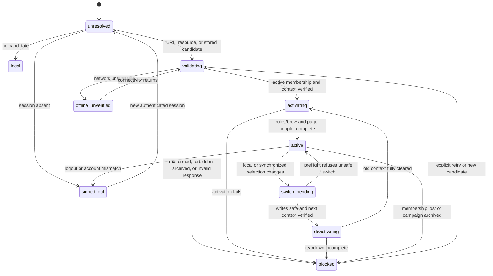

# ADR 0013: Active campaign context is device- and account-scoped

Status: Accepted contract; production implementation pending

Date: 2026-09-01

## Context

Campaign-aware pages currently require explicit URL context:

- `campaign.html?id=<campaignId>` opens a Campaign Hub detail page;
- `charactersheet.html?...&hubCampaign=<campaignId>` selects the Hub character repository, activates
  `HubCampaignContext`, and applies the returned rules before rendering the character;
- `dmscreen.html?hubCampaign=<campaignId>` verifies DM access, activates `HubCampaignContext`, creates the
  campaign workspace repository, and only then initializes the Board and realtime projection stream.

`HubCampaignContext` verifies a signed-in session and reads
`GET /api/campaigns/:campaignId/context`. `HubBrewContext` installs the immutable campaign brew as a temporary,
content-addressed `BrewUtil2` overlay. It never writes personal brew. The Character Sheet stores campaign rules
as a non-serialized settings overlay. The DM Screen starts campaign brew before Board initialization, but does
not yet retain and apply the returned rules version.

This explicit-only model is safe but incomplete. Following an ordinary `navigation.js` link loses campaign
context unless each caller manually copies `hubCampaign`. The lightweight `hub.html` and `campaign.html` pages
cannot solve that by importing `navigation.js`, `BrewUtil2`, the renderer, filters, or data loaders: their
dedicated boot graph is an intentional performance and privacy boundary.

The service worker adds another boundary. Same-origin `/api`, `/auth`, Hub shells, and `js/hub/` are
`NetworkOnly`; ordinary content pages and their static data may be precached. An active-campaign preference may
survive offline, but authenticated membership, rules, brew, character, workspace, and projection responses must
never be restored from service-worker or application caches as authority.

Finally, campaign context owns live and viewer-shaped resources. Changing the selection without closing the old
WebSocket, repositories, rules, brew, and projections can leak one campaign into another. ADR 0011 defines the
viewer-scoped realtime/projection privacy boundary; this ADR requires that state to be torn down during a
context switch.

This ADR defines the browser contract only. It deliberately does not implement production behavior.

## Definitions

- **Device** means one browser profile and storage partition for this origin. Two browsers, profiles, private
  windows, or devices are independent even when they authenticate as the same account.
- **Selection** means the account-bound campaign preference used as the default for later navigation.
- **Effective context** means the campaign actually applied to the current page after URL, resource, session,
  membership, and lifecycle validation.
- **Resource-pinned page** means a page whose primary cloud resource belongs to one campaign, such as an open
  campaign character or DM workspace. It cannot be rebound to a different campaign merely because another tab
  changes the device selection.
- **Local mode** means the existing signed-out or campaign-neutral Character Sheet, DM Screen, and content
  behavior. It is a supported mode, not an error fallback.

## Decision

The active campaign selection is stored locally per browser storage partition and is bound to the currently
signed-in account. It is not stored on the server and is not synchronized between devices.

The selection:

1. survives same-account navigation, reloads, browser restarts, and service-worker updates;
2. synchronizes between same-origin tabs through `BroadcastChannel`, with the `storage` event as the fallback;
3. is overridden by an explicit, valid campaign URL for that navigation;
4. is updated after an explicit or resource-canonical campaign is verified active and accessible;
5. is cleared on logout, account mismatch, authoritative membership loss, or campaign archive;
6. remains only a non-authoritative hint until the BFF validates session, membership, and campaign lifecycle;
7. never contains campaign names, roles, rules, brew, character data, workspace data, or projections.

There is one device selection, but an already-open resource-pinned page may temporarily have a different
effective context. The selection still synchronizes to that tab for its chrome and future navigation; the
resource remains pinned until the user safely leaves, moves, clones, or closes it. This prevents a background
tab from applying Campaign B rules to a Campaign A character.

## Persistence contract

The browser stores one JSON record under the versioned origin-local key `hub.activeCampaign.v1`:

```json
{
  "schemaVersion": 1,
  "accountId": "account-uuid",
  "campaignId": "campaign-uuid",
  "revision": 7,
  "updatedAt": 1788271737000,
  "writerId": "tab-uuid"
}
```

Rules:

- `accountId` and `campaignId` are opaque identifiers and must pass the same UUID validation as API paths.
- The record is ignored until `GET /api/session` returns the same active `account.id`.
- A signed-out session or a different `account.id` removes the record before any campaign activation.
- Every write reads the latest record and increments `revision`. Concurrent equal revisions are ordered by
  `updatedAt`, then `writerId`, so all receiving tabs converge deterministically.
- Unknown schema versions, malformed JSON, missing fields, impossible revisions, and records larger than
  1 KiB are removed and treated as no selection.
- Clearing writes a broadcast tombstone before removing storage, so open tabs deactivate even though
  `localStorage.removeItem()` carries no account payload.
- A logout intent clears the local selection immediately, then calls `POST /api/logout`. A network failure may
  leave the server session alive, but it must not leave campaign context active in that browser.
- The record is preference metadata, not an authorization cache. JavaScript or a user may edit it without
  gaining access.

No campaign response body is persisted alongside this record.

## Context precedence

Resolution occurs once during page startup and again only for an explicit switch or a synchronized selection
change.

| Priority | Candidate | Behavior |
|---:|---|---|
| 1 | Authoritative campaign of the requested cloud resource | Character canonicalization may correct a stale or absent `hubCampaign`; the corrected campaign becomes the selection after validation. |
| 2 | Explicit page URL | `campaign.html?id` and `hubCampaign` override the persisted selection for this navigation and update it after validation. |
| 3 | Account-matching persisted selection | Used only when the page supports campaign context and has no explicit/resource-pinned candidate. |
| 4 | No candidate | Preserve local mode; do not guess from campaign list order, recent server activity, or another device. |

An explicit parameter is a candidate, not proof. A malformed, inaccessible, or archived candidate must not fall
through to a different persisted campaign on the same navigation. The page reports why the requested context
was not activated.

`campaign.html` may continue to render an archived campaign through its existing read-only lifecycle route, but
an archived campaign never becomes the active selection. Viewing an archive and selecting an active campaign
are separate operations.

## URL and navigation contract

The canonical URL forms remain:

| Surface | Campaign parameter | Notes |
|---|---|---|
| Campaign detail | `id` | Explicit campaign candidate; active campaigns update selection. |
| Character Sheet Hub mode | `hubCampaign` | Paired with `id` for a campaign character; authoritative character ownership corrects mismatch. |
| DM Screen Hub mode | `hubCampaign` | Opens the caller's private campaign workspace when the role permits it. |
| Other heavy content pages | `hubCampaign` | Optional effective context for campaign brew and any supported rule adapters. |

The implementation must preserve unrelated query parameters and fragments. It must not decorate external URLs,
downloads, OAuth/auth routes, hash-only links, or local-only resource URLs.

`navigation.js` remains the navigation owner on ordinary heavy pages. It may decorate campaign-capable links
from an already-validated effective context, but it must not perform authenticated fetches, activate brew, or
own campaign lifecycle.

`hub.html` and `campaign.html` keep their hand-authored lightweight navigation. Their existing `hub-page.js`
controller may import a dependency-light selection coordinator and rewrite the Character Sheet/DM Screen links
directly. They MUST NOT load `navigation.js`, `BrewUtil2`, renderer, filter, search, font, or general data-loader
dependencies to propagate selection.

Copying or opening an explicit URL on another device establishes that campaign there only after that device
authenticates and validates access. It does not copy the originating device's preference by server side effect.

## State machine



State meanings:

| State | Contract |
|---|---|
| `unresolved` | No campaign-owned loader, repository, or realtime client may start. |
| `local` | Existing local behavior is active; no Hub context is implied. |
| `validating` | Session and candidate are being checked; the candidate is not yet persisted as active. |
| `activating` | Verified context is being applied before campaign-owned data loads. |
| `active` | One verified effective context owns rules, brew, repositories, and realtime for the page. |
| `switch_pending` | A newer selection exists, but the current page must finish or refuse write-safety preflight. |
| `deactivating` | New campaign-owned work is fenced while every old-context resource is cleared. |
| `offline_unverified` | The preference remains, but a cold page may not activate authenticated context from it. |
| `blocked` | Fail closed with an actionable reason; personal brew and local documents remain untouched. |
| `signed_out` | Selection and campaign runtime state are absent. |

Each resolve/switch operation owns a generation token and `AbortController`. A completion from an older
generation may populate neither persistence nor runtime state.

## Startup and API sequence

A campaign-capable page performs:

1. Call `GET /api/session`, or reuse the page's one already-completed session bootstrap.
2. Clear account-mismatched storage before reading a candidate.
3. Resolve resource, explicit URL, then stored precedence.
4. For a candidate, read `GET /api/campaigns/:campaignId` and
   `GET /api/campaigns/:campaignId/context`. These may run in parallel after session validation.
5. Require active campaign status and active membership. A role check may further restrict a surface, as the
   DM Screen already restricts workspaces to DM/co-DM.
6. Persist a verified explicit/resource candidate, or reconcile the verified stored record.
7. Activate `HubCampaignContext` and the page's rules adapter before campaign-owned repositories or heavy data
   render.
8. Start repositories, viewer-scoped projections, and `HubRealtimeClient` only after activation succeeds.

`HubCampaignContext` remains the campaign-specific context loader and `HubBrewContext` remains the only campaign
brew overlay owner. The selection layer must reuse them rather than duplicate brew processing. Implementation
may extend `HubCampaignContext` to accept an already-verified session/context and to return an idempotent cleanup
handle; it must not add duplicate bootstrap requests merely to preserve the current method signature.

`GET /api/campaigns` is for rendering a picker or recovering from a cleared selection. It is not required on the
single-candidate startup path, and list order must never choose a campaign implicitly.

No new server endpoint or server-side "last campaign" column is introduced by this decision.

## Mandatory switching and teardown order

Before teardown, `switch-preflight` must stop new mutations and determine whether repository writes can be
flushed, cancelled, or safely left with their current resource. If preflight cannot guarantee data safety, the
switch remains pending and the old effective context stays active.

After the next candidate is verified, a committed switch executes these markers in order:

1. `teardown-generation`: invalidate the old generation and abort its in-flight reads/resyncs.
2. `teardown-realtime`: call `HubRealtimeClient.close()`, close campaign-scoped `HubBroadcastSync` instances,
   cancel reconnect/resync timers, and unsubscribe listeners.
3. `teardown-projections`: detach repositories/controllers and clear viewer-scoped snapshots, Party Tracker
   projections, presence, roll adapters, pending refreshes, and DOM/model references required by ADR 0011.
4. `teardown-rules`: remove the prior campaign rules through the host's existing overlay/settings adapter.
5. `teardown-brew`: call `HubBrewContext.clear()` so only personal/site/prerelease content remains.
6. `activate-next`: activate the next `HubCampaignContext`, then rules, repositories, projections, and realtime.

All teardown methods must be idempotent. If one throws, the coordinator attempts the remaining cleanup, records
the failure, and does not run `activate-next`. Reload is the recovery path for an incompletely understood host.
There is never a supported mixed state with old rules or brew and new repositories.

Normal cross-document navigation uses the same logical lifecycle. `beforeunload` cleanup remains a final guard,
not the sole switching mechanism.

## Same-browser synchronization

The selection coordinator uses the origin-wide channel `hub:active-campaign:v1`. It does not reuse
`HubBroadcastSync`'s `hub:<campaignId>` lease channel because selection changes must be visible before the
receiver joins the destination campaign.

Messages contain only:

```json
{
  "type": "selection_changed",
  "schemaVersion": 1,
  "accountId": "account-uuid",
  "campaignId": "campaign-uuid",
  "revision": 8,
  "updatedAt": 1788271738000,
  "writerId": "tab-uuid"
}
```

Clears use `type: "selection_cleared"` and the same ordering fields. Receivers:

- ignore their own `writerId`;
- ignore a message for a different authenticated account;
- compare ordering before applying;
- reread storage on every `storage` event instead of trusting event payload alone;
- update the source tab synchronously because `storage` does not fire there;
- validate a newly selected campaign before applying it as effective context.

A campaign-neutral heavy page may switch or reload after safe teardown. A resource-pinned page updates its
device selection but does not rebind the open resource; it exposes that the default changed and applies it on
the next compatible navigation. Logout/account-clear messages always tear down immediately.

Selection events are browser coordination only. They are not domain events, WebSocket messages, audit entries,
or evidence of membership.

## Rules and brew application

Campaign content remains an overlay:

```text
site/prerelease + personal brew + one temporary campaign bundle -> existing processed loaders
```

- Heavy content pages use existing `BrewUtil2`/`DataUtil` processing after `HubCampaignContext` activation. No
  second campaign catalog or renderer is created.
- The Character Sheet keeps using `CharacterSheetState.setCampaignSettingsOverlay()` and
  `clearCampaignSettingsOverlay()`. Campaign settings remain absent from serialized character JSON.
- The DM Screen keeps activating context before `Board.pInitialise()`. Its implementation must retain the
  returned rules and pass them through existing panel/settings initialization before campaign projections
  start; it must not persist campaign rules into the private Board blob.
- Pages without a rule consumer may ignore the rules payload after validation, but must still clear any host
  adapter during teardown.
- Lightweight Hub pages display rules/brew metadata from API responses only. They do not activate render-time
  brew or rules.

## Cache and offline behavior

Authenticated Hub responses keep their existing `Cache-Control: no-store` contract. The service worker keeps
`/api`, `/auth`, `hub.html`, `campaign.html`, `css/hub.css`, `js/hub/`, its own scripts, and the manifest
`NetworkOnly`. WebSockets remain outside service-worker interception.

The active selection record is the only durable client context cache. In particular:

- never put session, campaign, membership, context, brew, rules, projection, character, or workspace responses
  in `CacheStorage`, IndexedDB, localStorage, or the service-worker precache for active-context recovery;
- in-memory deduplication may key verified context by account, campaign, brew content hash, and rules version
  for the lifetime of one page generation only;
- a cold/reloaded offline page enters `offline_unverified`, retains the selection record, and does not activate
  campaign brew/rules or open cloud repositories;
- a page that was already verified before going offline may keep its in-memory rules, brew, and last authorized
  data visibly marked stale/read-only, matching the existing Campaign Hub and DM Screen degraded behavior;
- transient network, 5xx, and protocol failures do not erase the preference because they do not prove access
  loss;
- an offline tab cannot commit a switch to a context it has never validated.

Ordinary heavy static pages may still load from their existing precache in local mode. The failure of campaign
bootstrap must not make local tools or personal brew unavailable.

## Failure and recovery contract

| Failure | Selection action | Effective-context action | User recovery |
|---|---|---|---|
| Signed out or logout intent | Clear | Full immediate teardown | Sign in and choose/open a campaign |
| Account id differs from stored record | Clear mismatched record | Do not activate | Select for the current account |
| Malformed/oversized record | Clear | Local/blocked according to URL | Select again |
| Malformed explicit campaign id | Do not overwrite stored record | Block this explicit navigation; no fallback activation | Correct URL or return to Hub |
| `FORBIDDEN`, `CAMPAIGN_NOT_FOUND`, or `MEMBERSHIP_NOT_FOUND` | Clear if it names the candidate | Teardown matching context | Return to Hub or request access |
| Campaign is archived | Clear matching selection | Teardown; detail page may remain read-only | Select an active campaign |
| DM role is lost | Keep selection if membership remains | Close DM workspace/projections; campaign may remain selectable elsewhere | Return to campaign detail |
| WebSocket close 1008/access loss | Revalidate; clear on authoritative loss | Stop realtime immediately | Reload/sign in; never keep private controls live |
| `NETWORK_UNAVAILABLE` or 5xx on cold boot | Retain | `offline_unverified`; no authenticated activation | Retry online or use local mode |
| Protocol update required | Retain | Block activation | Reload/update client |
| Invalid context payload or overlay failure | Retain for retry | Clear partial rules/brew; no repository/realtime start | Reload; report request id |
| Unsafe pending writes | Retain newer device selection | Keep old resource-pinned context in `switch_pending` | Finish/retry save, then leave |
| Teardown failure | Keep selected destination preference | Fail closed with no next activation | Reload before opening destination |

Personal brew and local documents are never cleared by a campaign-context failure.

## Observability

The coordinator exposes one bounded transition event to page adapters and optional client telemetry:

```json
{
  "name": "hub_active_context_transition",
  "from": "validating",
  "to": "active",
  "trigger": "explicit_url",
  "result": "success",
  "durationMs": 184,
  "errorCode": null,
  "requestId": null
}
```

Allowed `trigger` values are `startup`, `explicit_url`, `resource_canonical`, `picker`,
`broadcast_channel`, `storage_event`, `logout`, `access_loss`, and `retry`. State/result/error labels must be
bounded; campaign/account ids, names, URLs, rules, brew, characters, workspace data, cookies, and tokens are
not telemetry fields. API failures may include the server's `X-Request-Id` for correlation.

Required development diagnostics:

- one transition event per terminal resolve/switch result;
- elapsed time for local resolution, validation, teardown, and activation;
- the stable `HubApiError.code`, never raw response content;
- a teardown marker showing the last completed cleanup stage;
- a count of ignored stale-generation completions.

If metrics are exported, they use bounded labels such as
`hub_active_context_transitions_total{trigger,result}` and a duration histogram. Campaign id must not be a
metric label. This ADR adds no telemetry endpoint and does not weaken the existing server redaction contract.

## Performance budget

The implementation must satisfy all existing Hub budgets and additionally:

| Work | Budget |
|---|---:|
| Persisted selection record | <=1 KiB |
| Synchronous parse/precedence work | <=10 ms p95 on a normal desktop test run |
| Same-browser selection propagation | <=250 ms p95 while tabs are active |
| Session bootstrap | Reuse the page bootstrap; no duplicate `GET /api/session` |
| Single-candidate validation | At most one campaign metadata read plus one context read, in parallel |
| Active-context selection/sync module | <=8 KiB minified + gzip, excluding existing `HubApiClient` |
| Hub shell first-party script tags | Exactly `js/styleswitch.js` and `js/hub/hub-page.js` |
| Hub shell general data/brew/render/search/font requests | 0 |
| Context validation/activation | <=500 ms p95 excluding heavy page data and under normal API SLO conditions |

Broadcast/storage handling must debounce duplicate notifications into one validation generation. Navigation
decoration is linear in rendered navigation links and performs no network request.

## Security and privacy consequences

- Local storage is readable by same-origin script, so it contains identifiers only and grants no capability.
- Server validation remains mandatory after every startup, explicit URL, cross-tab selection, and access-loss
  signal.
- A campaign cannot become active because another tab wrote storage while signed into a different account.
- No device list or server account export treats the local preference as authoritative account data.
- Cross-device independence avoids surprising a live table on one device when a user researches another
  campaign elsewhere.
- Full teardown prevents stale viewer-shaped data from surviving an account, membership, role, or campaign
  boundary.

## Acceptance tests

### Contract tests in this change

1. ADR status, persistence scope, precedence, state machine, teardown order, offline rules, observability, and
   budgets are machine-checked.
2. Current URL seams remain `campaign.html?id`, Character Sheet `hubCampaign`, and DM Screen `hubCampaign`.
3. Character Sheet and DM Screen context activation remains before their heavy data/Board initialization.
4. `HubCampaignContext`, `HubBrewContext`, `HubRealtimeClient.close()`, and DM controller detach/clear seams
   remain available to the future coordinator.
5. Hub pages retain exactly the two-script boot graph and do not import generic navigation/data/brew/render
   dependencies.
6. Authenticated Hub routes and Hub-owned shells remain `NetworkOnly`.

### Required implementation tests

1. A verified selection survives navigation, reload, and browser restart for the same account/profile.
2. The same account on another browser profile/device keeps an independent selection.
3. BroadcastChannel propagation and storage-event fallback converge, including concurrent writes and clears.
4. An explicit URL overrides stored selection only after validation and then updates the selection.
5. A cloud character's authoritative campaign corrects a stale URL and becomes the verified selection.
6. No candidate preserves local mode; campaign list order never auto-selects.
7. Logout, account switch, removed membership, and archive clear selection and all runtime context.
8. DM role loss closes the workspace while preserving a still-valid general campaign selection.
9. Cold offline boot retains the hint but activates no private context; an already-loaded offline page is stale
   and read-only.
10. Rapid A -> B -> C switching cannot let late A/B reads, events, projections, rules, or brew win over C.
11. Teardown ordering proves realtime, projection/repository, rules, and brew cleanup before next activation.
12. A teardown failure attempts remaining cleanup and never activates the next campaign.
13. A resource-pinned tab receives the new device selection without applying destination rules to its open
    resource or losing unsaved data.
14. Hub lightweight request/script budgets and active-context timing/size budgets remain green.
15. Service-worker and application caches contain no authenticated campaign response.

## Consequences

Positive:

- ordinary navigation can retain table context without server-side preference state;
- explicit links remain deterministic and shareable;
- same-browser tabs converge quickly while other devices remain independent;
- existing campaign brew/rules and page repository seams remain authoritative;
- account and viewer boundaries receive a single mandatory teardown protocol.

Costs:

- selection and effective context are distinct concepts that UI and tests must name correctly;
- resource-pinned tabs may temporarily show a different default selection from their current resource;
- cold offline startup cannot restore campaign-specific rules or brew;
- implementation must add a small coordinator and cleanup surface around existing context classes;
- DM Screen must finish its existing rules-overlay integration before it can claim complete active-context
  support.

## Rejected alternatives

- **Server-side last-campaign preference:** synchronizes devices contrary to the decision, adds account
  lifecycle/export surface, and makes an ephemeral navigation preference authoritative.
- **Tab-only/sessionStorage selection:** does not survive restart and cannot coordinate tabs.
- **Trust localStorage without API validation:** turns editable client state into an authorization decision.
- **Cache the last context for offline activation:** can expose revoked, removed, archived, or cross-account
  content.
- **Import generic 5etools navigation/loaders into Hub pages:** regresses the lightweight shell and increases
  unauthenticated requests.
- **Hot-rebind every open tab immediately:** can apply the wrong rules to resource-pinned pages and lose
  in-flight edits.
- **Let each feature own cleanup independently:** permits mixed old/new context and makes access-loss behavior
  untestable.
