# ADR 0016: Atomic source-cost binding for peer character operations

Status: Accepted; first protocol-4 Cure Wounds client/server slice implemented (2026-09-04)

## Context

[ADR 0012](0012-idempotent-semantic-character-operations.md) defines source-derived peer proposals, explicit
target-owner approval, stable command/operation/event identity, and operation-aware Character Sheet
reconciliation. Its original protocol-v3 substrate deliberately admitted only `cost=none` test templates and
rejected PHB/XPHB Cure Wounds with `SOURCE_COST_UNSUPPORTED`: consuming a source spell slot separately from
applying target healing could double-spend, charge without effect, or apply free healing. This ADR defines the
protocol-4 transaction which makes that first cost-bearing template safe.

The current authority also has adjacent but different mechanisms:

- character state is a revisioned JSONB document protected by aggregate advisory/row locks;
- `hub.inventory_entries` is authoritative for party inventory, while character inventory, item charges, spell
  slots, and feature resources still live in the character document;
- transfers remove value into escrow before recipient acceptance;
- semantic target effects commit the target document, operation lifecycle, audit, events, outbox, command result,
  and operation watermark in one PostgreSQL transaction;
- [ADR 0011](0011-authorization-scoped-character-projections.md) forbids source/target state, resource values,
  internal item ids, document paths, and eligibility facts from leaking through peer projections or errors;
- [ADR 0015](0015-campaign-rules-policy.md) requires policy-sensitive writes to pin and recheck the active immutable
  rules/content context.

A transfer reservation is not the right default for a spell or ability. A target may reject or ignore a request
for up to 24 hours, and freezing the caster's slot, item, or class resource during that period would mutate the
source before consent and create release/recovery work for every non-applied outcome. Conversely, checking a cost
only in the browser or only when the proposal is created cannot prevent another cast from spending it first.

This ADR extends ADR 0012 for one source character, one target character, one closed source-cost bundle, and one
semantic target operation. It explicitly supersedes ADR 0012's earlier follow-up requirement for an atomic
reservation/release contract. For every cost-bearing peer proposal, this newer ADR is normative: there is no
pre-approval reservation, and only the acceptance transaction may consume the source cost. ADR 0012 remains
normative for the protocol-3 `cost=none` substrate and its command, approval, operation, event, and reconciliation
semantics. Transfer escrow is unaffected because it moves ownership of an asset rather than paying a deferred
spell/ability cost.

The first implementation slice includes migration `0007`, memory/PostgreSQL authority, operation-leg
reconciliation, and campaign Character Sheet targeting/approval for one source-derived Cure Wounds cast against
one player-owned target. Multi-target orchestration, party/NPC targets, generic effects, and broader
resource-template rollout remain outside the slice.

The production Cure Wounds template in this slice binds only a selected standard spell slot. Pact-slot casting is
fail-closed until the canonical cast flow persists an unambiguous standard-versus-pact selection the authority can
pin and rederive; the shared version-1 cost handler can apply a pinned pact descriptor, but the production registry
does not guess one.

## Decision

### Scope and non-goals

The first implementation governed by this contract supports:

- exactly one active campaign source character owned by a proposing account whose membership role is `player`;
- exactly one active campaign target character selected by its opaque `targetRef` and owned by another active
  `player` membership (or the same active player for self-targeting);
- exactly one server-registry source entity/template/choice;
- one server-resolved source-cost bundle containing one or more supported persistent resource components;
- exactly one ADR 0012 versioned target semantic operation;
- explicit target-owner approval, including self-targeting;
- one authoritative applied outcome which consumes every cost component and applies the target operation, or does
  neither.

Monster/NPC sources, party-inventory sources, area/multi-target operations, partial target completion, currency,
material-component interpretation from prose, concentration, action/bonus-action/reaction economy, ammunition
selection, and synthetic/bespoke resource fields are outside source-cost version 1. They fail closed rather than
being approximated. A later contract may add them only with canonical state, authorization, privacy, and
reconciliation semantics.

### Identities and persisted authority

No new approval entity or client-authored cost identity is introduced.

| Identity | Owner and lifetime | Contract |
|---|---|---|
| `proposalCommandId` | Client UUID; one proposal attempt | Equals `Idempotency-Key`; actor/body bound; retained in `semantic_operation_commands` |
| `operationId` | Server UUID; peer request and whole atomic outcome | The `semantic_operations.id`; stable from `proposed` through one terminal state; also the target semantic operation id |
| `resolutionCommandId` | Client UUID; one accept/reject/cancel decision | Equals `Idempotency-Key`; distinct from the proposal command; actor/body/operation/decision bound |
| `sourceCharacterId` | Canonical server UUID | Stored internally and visible only to source owner and DM/co-DM authority |
| `targetCharacterId` | Canonical server UUID resolved from `targetRef` | Stored internally; the opaque `targetRef` is also pinned and must still name this active character at apply |
| `targetOwnerAccountIdAtProposal` | Canonical server UUID | Internal immutable participant identity used for authorization/event retention; ownership is still revalidated at accept |
| `sourceCost` | Server-resolved immutable value | Closed versioned descriptor derived from the pinned template; never accepted as client input |
| `targetOperation` | Server-resolved immutable value | ADR 0012 normalized `{operationId,kind,version,targetCharacterId,arguments}` |
| `effectResolutionSeed` | Server-generated 256-bit value | Internal immutable input for deterministic template rolls; never accepted, projected, or logged |
| `eventId` | Server UUID per lifecycle/mutation event | Stable domain-event/outbox identity; outbox retry never mints another id |
| `operationLegKey` | Derived stable string | `operationId/source`, `operationId/target`, or `operationId/combined`; client per-character dedupe identity |

The semantic operation row is the request. Approval is the successful `accept` resolution command recorded in
`semantic_operation_commands`; there is no mutable `approvalId` or intermediate `accepted` state. This avoids an
accepted-but-not-applied state which could strand consent between two transactions.

The immutable proposed record contains at least:

```json
{
  "operationId": "uuid",
  "status": "proposed",
  "originActorAccountId": "server-only account uuid",
  "sourceCharacterId": "server-only character uuid",
  "targetCharacterId": "character uuid",
  "targetOwnerAccountIdAtProposal": "server-only account uuid",
  "targetRef": "opaque uuid",
  "sourceEntity": {"type": "spell", "uid": "cure wounds|phb", "version": "phb-2014-v1"},
  "effectTemplateId": "spell.cure-wounds.heal",
  "choice": {"castLevel": 1},
  "sourceCost": {
    "version": 1,
    "components": [{"kind": "spell_slot", "pool": "standard", "level": 1, "amount": 1}]
  },
  "targetOperation": {
    "operationId": "same operation uuid",
    "kind": "hp.heal",
    "version": 1,
    "targetCharacterId": "character uuid",
    "arguments": {"amount": 5}
  },
  "rulesPin": {
    "rulesVersionId": "uuid",
    "rulesVersion": 7,
    "rulesSchemaVersion": 2,
    "catalogVersion": 1,
    "brewBundleVersionId": "uuid-or-null",
    "brewContentHash": "sha256"
  },
  "templateRegistryVersion": "peer-effects-v1",
  "effectResolutionSeed": "server-only 32-byte value",
  "sourceRevisionObserved": 12,
  "targetRevisionObserved": 8,
  "expiresAt": "bounded timestamp",
  "sourceDisplaySnapshot": {},
  "targetDisplaySnapshot": {},
  "effectDisplaySnapshot": {}
}
```

Observed revisions explain what was checked at proposal time; they are not apply preconditions. Unrelated source
or target writes may occur before approval. Application always revalidates current locked truth.

An applied row additionally records `resultingSourceCharacterRevision`,
`resultingTargetCharacterRevision`, `sourceCostEventId` when distinct, `appliedEventId`, and the exact terminal
time. For self-targeting, the two resulting revision fields are equal, `sourceCostEventId` is null, and the one
combined applied event is `appliedEventId`.

### State machine and terminal outcomes

```mermaid
stateDiagram-v2
  [*] --> proposed: proposal transaction
  proposed --> applied: target owner accepts; cost and effect commit
  proposed --> rejected: target owner rejects
  proposed --> cancelled: proposer or DM/co-DM cancels; lifecycle cancellation
  proposed --> expired: deadline wins
  proposed --> failed: authoritative acceptance validation fails
  applied --> [*]
  rejected --> [*]
  cancelled --> [*]
  expired --> [*]
  failed --> [*]
```



Every state except `proposed` is terminal. `failed` means an authorized acceptance reached the request but current
authoritative source, target, policy, capability, or applicability no longer permitted the atomic outcome. It is
distinct from an infrastructure error: expected domain invalidity commits only terminal workflow evidence;
database/process failure rolls the transaction back and leaves the request `proposed`.

Proposal creation failure creates no semantic-operation row. There is no `reserved`, `accepted`, `partially
applied`, `cost_consumed`, or compensating state.

### Authorization and privacy

The existing ADR 0012 role policy remains:

| Action | Authorized actor |
|---|---|
| Create peer proposal | Active player who owns the active source character and selects an active player-owned target |
| Inspect pending/terminal request | Proposer, target owner, DM/co-DM |
| Accept | Active target owner in a DM/co-DM/player role; self-target still needs this distinct command |
| Reject | Target owner or DM/co-DM |
| Cancel | Proposer or DM/co-DM; lifecycle authority may cancel automatically |
| Expire | Server deadline worker, or the first otherwise-authorized request that observes the elapsed deadline |

The first shipped cost-bearing slice is player-character to player-character only. DM/co-DM/spectator-owned
characters, NPCs, and monsters fail proposal creation through the same non-enumerating source/target outcome, and
both pinned owner memberships are rechecked as active `player` roles before acceptance. DM/co-DM authority still
does not approve a peer proposal on somebody else's behalf. A DM who wants the effect
issues a direct ADR 0012 operation under the DM's own command identity. Character ownership, not campaign role,
authorizes source spending and target-owner acceptance. A role change, membership removal, campaign archive,
character move/archive, target-ref rotation, or ownership change is rechecked in the winning transaction.

Views are authorization-shaped:

- **Source owner:** safe request/effect snapshots, own source-cost kind/amount/display label, both resulting
  revisions, and an own-resource failure class when applicable; target-side failures remain generic, and hidden
  target state or effective/clamped delta is never returned.
- **Target owner:** safe request/effect snapshots and target result/revision, plus a target-applicability failure
  class when applicable; source-side failures remain generic. Source cost is only
  `pending`, `consumed`, or `not_consumed`, with no kind, amount, pool, item/resource id, current/max value, or
  source revision.
- **DM/co-DM:** both authorized views for support/audit, still without client secrets or raw document paths.
- **Other members:** no request or source-cost detail; only independently authorized ADR 0011 projection
  invalidations and generic activity.

For a cost-bearing protocol-4 request, the multi-recipient `character.operation.proposed` event contains only
`operationId`, `status`, `expiresAt`, and the safe target/effect display snapshots. Unlike the protocol-3 cost-free
shape, it omits `sourceEntity`, `choice`, `sourceCost`, source identifiers, and source revision because a raw
choice such as cast level can itself reveal the cost. The source owner and DM/co-DM may fetch the richer
authorization-shaped request view over the no-store API. The applied target event keeps ADR 0012's safe target
operation, while a separate source-cost mutation event is visible only to the source owner and DM/co-DM.

The target owner cannot infer whether failure was caused by a missing source, empty slot, changed item, hidden
target fact, policy change, or disabled capability. Multi-recipient rejected/cancelled/expired/failed events carry
only `reason: "unavailable"` and the safe display snapshots.

Proposal creation returns the existing non-enumerating `SOURCE_OR_TARGET_UNAVAILABLE` when any source/target
identity, ownership, membership, targetability, source presence, or template applicability predicate fails. A
recognized but unsupported cost may return `SOURCE_COST_UNSUPPORTED` to the source owner because it describes
their own selected source, but no current/max resource value is returned.

No client request may contain:

- an operation `kind`, effect arguments, source-cost descriptor, resource kind, JSON Pointer/path, item/resource
  id, amount, current/max value, or resulting revision;
- a source or target profile copied from browser state;
- an asserted edition, policy result, cost-free flag, or eligibility result.

Template-defined `choice` may contain only closed selectors such as cast level or a server-resolvable item choice.
The server treats those as untrusted selectors, resolves them against locked canonical truth, and derives every
cost kind, binding, and amount itself.

### Source-cost catalog

Source cost is a **versioned discriminated union**, implemented by a server-owned handler registry. The wire and
persisted shape is not an open plugin registry: source-cost version 1 has exactly the kinds below, closed schemas
with `additionalProperties: false`, and unknown kinds/versions fail with `SOURCE_COST_UNSUPPORTED`. Handler
registration is an implementation technique, not permission to add wire kinds without a new contract version.

This choice keeps stored proposals replayable and prevents a newly deployed plugin from silently changing the
meaning of an existing descriptor. Adding a kind or changing resolution/mutation semantics requires source-cost
version 2, retained version-1 handlers for unexpired/history reads, capability negotiation, fixtures, and a
protocol review.

The version-1 envelope is:

```json
{
  "version": 1,
  "components": [
    {"kind": "spell_slot", "pool": "standard", "level": 1, "amount": 1}
  ]
}
```

`components` contains 1-8 entries. Amounts are positive safe integers. The server canonicalizes order by
`kind + binding identity`, combines duplicate bindings before persistence, and rejects overflow or a component
which would spend the same canonical resource through two aliases.

| Kind | Closed fields | Canonical Character Sheet resolution and mutation |
|---|---|---|
| `spell_slot` | `pool: "standard" \| "pact"`, `level: 1..9`, `amount` | Standard resolves `data.spellcasting.spellSlots[level].current/max`; pact resolves `data.spellcasting.pactSlots.current/max/level`. Values must be integral and bounded; decrement exactly `amount`. |
| `item_charge` | server-resolved `inventoryEntryId`, canonical `itemRef`, `amount` | Resolve one `data.inventory[]` wrapper by stable id; verify its item identity/provenance and template binding; current is `item.chargesCurrent ?? item.charges`, max is `item.charges`; set `chargesCurrent = current - amount`. |
| `inventory_quantity` | server-resolved `inventoryEntryId`, canonical `itemRef`, `amount` | Resolve one wrapper and identity/provenance; decrement wrapper `quantity`. Reaching zero is allowed only when the shared cost-safe removal predicate proves no equipment, attunement, container, host/Ioun, ammunition, modifier, active-state, favorite, or other identity linkage requires Character Sheet cleanup; otherwise fail closed. |
| `feature_use` | server-resolved `resourceId`, canonical `featureRef`, `amount` | Resolve one persisted `data.resources[]` entry bound to the source feature; validate integral `current/max`; decrement `current` and update the already-canonical linked `features[].uses.current` and `innateSpells[].uses.current` mirrors through the shared handler. |

`itemRef` and `featureRef` are server-normalized identity/provenance records. They include stable `name|source`
identity plus the pinned campaign brew bundle/version when applicable; they are not peer projections. Custom
items/features without a server-verifiable content/template binding are unsupported. A bare matching display
name is never enough.

Synthetic combat resources and bespoke fields are not silently mapped to `feature_use`. They must first gain a
canonical persisted binding and a new supported resolver. Likewise, `useItemCharge()`'s current partial-spend
behavior is not authoritative here: an insufficient cost fails the whole outcome instead of spending what
remains.

The implementation must add one pure shared source-cost module beside
`js/hub/hub-semantic-operations.js`. Server and Character Sheet reconciliation use the same normalize, resolve,
apply, and mutation-footprint functions. It returns a cloned document and exact changed/not-changed metadata; it
does not fetch, log, mutate input, inspect DOM state, or infer prose. Character Sheet resource methods remain the
behavioral reference, and golden fixtures prove the shared handlers preserve their storage/mirror invariants.

### Template derivation and version pinning

The server template registry entry declares:

- exact source entity identity/version and `effectTemplateId`;
- closed choice schema;
- source-cost contract version and a deterministic cost builder;
- deterministic target-operation builder;
- source/target applicability predicates;
- mutation footprints for cost components and target operation;
- fixed no-op policy.

Any dice or other variable template result is resolved once during proposal creation. The server generates and
persists `effectResolutionSeed` before derivation; the pinned template uses it through the shared deterministic
roller to produce the exact `targetOperation`. Acceptance reruns that derivation with the same seed and current
locked deterministic inputs, then requires canonical byte equality with the stored operation. It never rerolls,
accepts a client roll, or stores only a formula to be resolved after consent. If a deterministic source input such
as the relevant casting modifier changed, equality fails and fresh consent is required.

For source-cost version 1, target effects must change the locked canonical target. A heal already at its applicable
maximum, adding an already-present condition, or removing an absent condition is `TARGET_EFFECT_UNAVAILABLE`:
the request becomes `failed`, cost is not consumed, and target peers receive only `unavailable`. Templates cannot
opt into "pay for a no-op" under version 1.

Proposal creation derives and persists the normalized cost and operation under the active rules/content/template
tuple. Acceptance loads the pinned tuple, re-derives both from current locked truth, and requires canonical
byte-for-byte equality with the stored descriptors. It does not silently select a replacement slot, item, stack,
or feature pool.

The active rules pin must still exactly equal the proposal pin at acceptance. Any active rules version, catalog
version, brew bundle/content hash, source-entity version, or template-registry change makes the proposal
terminally `failed`; the actor creates a new request under the new context. This is intentionally stricter than
allowing a semantically similar policy to float, because target consent was shown text and behavior derived under
the pinned tuple.

Implementations retain every template/source-cost handler version needed by a live proposal for at least the
24-hour proposal TTL plus deployment clock skew. Deployment preflight refuses to remove a version referenced by
a `proposed` row.

For self-targeting, cost and target-operation mutation footprints must be disjoint under source-cost version 1.
Overlap is a server template error and fails closed with `SOURCE_COST_UNSUPPORTED` before proposal creation.
This removes order-dependent templates such as "spend and restore the same slot" from version 1.

### No reservation before acceptance

Proposal creation checks that every source cost is currently valid and available, but it mutates no character,
inventory, resource, revision, lease, or watermark. The check is advisory to avoid knowingly impossible
requests; acceptance is authoritative.

The first committed source spend wins. If the proposer uses the slot, charge, item quantity, or feature use before
the target accepts, acceptance terminates the request as `failed` and changes neither character. Replenishing the
resource does not revive that operation; a new proposal and new target consent are required.

This deliberately rejects transfer-style escrow. No release transaction, reservation timeout, or capacity hold is
needed for reject/cancel/expiry. The tradeoff is that an approval may fail because the source changed, which is
preferable to locking player resources before consent.

### PostgreSQL transaction and lock order

All Hub mutations which can race with this outcome must follow one total lock order. The source-cost
implementation must first align rules activation and semantic/lifecycle paths that currently omit or invert any
step; adding a new transaction without that alignment is not conformant.

1. Acquire the semantic command advisory lock (current seed 9) for `resolutionCommandId`, validate
   `resolutionCommandId === Idempotency-Key`, and read any prior payload-aware command result.
2. Lock/revalidate the authenticated session and active account.
3. Acquire the campaign lifecycle advisory lock (current seed 6), then lock the active campaign row.
4. Read only the request's immutable participant ids without a lock to discover the complete lock set; reveal no
   operation data from this read. Lock the resolver, original proposer/source owner, and pinned target-owner
   membership rows in ascending account UUID order, then revalidate status, roles, and campaign tenancy.
5. Lock the `semantic_operations` request row `FOR UPDATE` and require its immutable participant ids to equal the
   discovery read. If absent or different, return the non-enumerating `ACTION_NOT_FOUND`. Recheck actor authority
   before returning any view. If the deadline elapsed, expiry wins here. If already terminal, return its
   privacy-shaped terminal result and record/replay the authorized resolution command without another lifecycle
   event.
6. Resolve the pinned source/target ids from the request. Acquire character aggregate advisory locks (current
   seed 2) once each in ascending character UUID order, then select those character rows `ORDER BY id FOR UPDATE`.
7. Lock any separately persisted resource/inventory rows in ascending `(resource kind, row UUID)` order. Under
   the current character schema, slot/charge/quantity/feature costs are inside the already-locked source JSONB
   row, so no parallel `inventory_entries` character ledger is read or written.
8. Lock/read character lease rows in the same character order. A semantic outcome neither requires, steals,
   releases, nor increments an editor lease; the check confirms that no lease assertion from the client is being
   used as authority and preserves the epochs active editors must reconcile against.
9. Read the immutable pinned rules/brew/template versions after the campaign pointer is locked. Revalidate exact
   active pins, capability, source ownership/entity/usability, target ref/current ownership/targetability/
   applicability, current target-owner membership, deterministic effect derivation, canonical descriptor
   equality, resource availability, document schema/size, and mutation footprints.
10. Compute every next document in memory before issuing a write. For distinct characters, apply source cost to a
    source clone and target operation to a target clone. For self-targeting, validate both against the same
    locked pre-state, then apply cost followed by target effect to one clone.
11. Write canonical character data and revisions. Distinct characters each increment exactly once. A
    self-target increments its one aggregate exactly once and records that same result as source and target.
12. Transition the request to `applied`; store resulting revisions and stable mutation-event ids; append audit,
    domain events, metadata-only projection invalidations, outbox rows, per-character watermarks, and the
    resolution command result in the same transaction.
13. Commit once and return the stored authorization-shaped result.

Proposal creation uses the same command/session/campaign/membership/character/rules order, validates the current
target owner's membership under the campaign lifecycle lock, pins that participant id, derives descriptors,
inserts the `proposed` request, audit/domain/outbox rows, and proposal command result, and commits once. It has no
cost/resource write.

Reject/cancel/expiry lock through the request row in the same prefix order and do not take character/resource
locks because they cannot mutate either aggregate. Reject authorization uses the pinned target-owner participant;
every ownership-change path must first cancel pending requests while holding the same campaign lock. The request
row serializes those decisions against accept.

The campaign lock makes rules activation, membership/lifecycle cleanup, move/archive, expiry, and acceptance
linearizable. Character advisory/row locks serialize owner patches, transfers, source spending, and target
effects. A database deadlock/serialization/statement-timeout error is an infrastructure failure: roll back and
retry the same command id. No branch catches it and emits a success-shaped result.

### Exact failure semantics

| Case | Request outcome | Character/revision/event behavior |
|---|---|---|
| Reject | `rejected` | No source/target mutation or revision; one terminal workflow event |
| Proposer/DM/lifecycle cancel | `cancelled` | No source/target mutation or revision; one terminal workflow event |
| Deadline before resolution lock | `expired` | No source/target mutation or revision; one stable expiry event |
| Source cost missing, malformed, insufficient, spent, replaced, or unsupported at accept | `failed` | Neither character changes; no mutation/invalidation event; terminal workflow evidence only |
| Source entity no longer present/usable or proposer no longer eligible | `failed` unless lifecycle already cancelled | Neither character changes |
| Target effect invalid, inapplicable, or a version-1 no-op | `failed` | Cost is not consumed and target does not change |
| Active campaign/rules/brew/template/capability pin changed | `failed` | Neither character changes; no fallback to new semantics |
| Unrelated source/target revision changed | Still eligible for apply | Current truth is revalidated; observed proposal revisions are not equality gates |
| Source and target are the same character | `applied` or all-or-none failure | One row/write/revision; cost then effect; one combined mutation event |
| Source/target moved, detached, archived, deleted, or target ref rotated first | Usually `cancelled` by lifecycle; otherwise `failed` | No mutation; lifecycle and accept serialize on campaign/request locks |
| Accept commits before a move/archive | `applied` | Both resource/effect changes are canonical; later lifecycle sees the new revision |
| Two accepts or accept vs reject/cancel/expiry | First campaign/request lock winner decides | One transition/mutation event set; loser receives stored terminal state and cannot emit/apply again |
| Same command id and same canonical payload | Replay | Byte-equivalent stored result and same operation/event ids; no writes/events |
| Same command id with changed actor, operation, decision, or payload | No state change | `409 IDEMPOTENCY_KEY_REUSED` |
| Duplicate operation/event/outbox delivery | No new authority write | Unique constraints plus client `eventId`/leg dedupe prevent reapplication |
| Commit succeeds but HTTP response is lost | `applied` or terminal as committed | Retry returns stored command result; replay events retain ids |
| Process crash, connection loss before commit, statement timeout, or database error | Transaction rolls back; request remains prior state | Neither side, workflow, audit, event, outbox, watermark, nor command result partially commits |
| Outbox publish fails after commit | Canonical result remains committed | Durable row retries same event id; reconnect snapshot/replay recovers |

Expected acceptance invalidity commits `failed` in the same transaction as its terminal audit/event/outbox/command
result. It never writes a source or target document. Unexpected handler/configuration corruption and unavailable
pinned code are not converted into `failed`; they roll back, return `503 SOURCE_COST_HANDLER_UNAVAILABLE` or
`INTERNAL_ERROR`, alert operators, and leave the proposal resolvable after repair or expiry.

No case uses a best-effort compensating heal, refund, reverse patch, or second transaction to repair a half
outcome.

### Revisions, events, watermarks, and client reconciliation

For two different characters:

1. source data changes and source revision increments by one;
2. target data changes and target revision increments by one;
3. `character.operation.source_cost_consumed` is emitted first, aggregated on the source character and visible
   only to source owner plus DM/co-DM;
4. existing `character.operation.applied` is emitted second, aggregated on the target character with ADR 0012's
   normalized target operation and target resulting revision;
5. one `character.projection.invalidated` is emitted for each unique character whose peer profile could change,
   in ascending character-id order;
6. source `operationWatermark` is the source-cost event sequence and target `operationWatermark` is the target
   applied-event sequence.

The source event payload is:

```json
{
  "operationId": "uuid",
  "leg": "source",
  "sourceCost": {
    "version": 1,
    "components": [{"kind": "spell_slot", "pool": "standard", "level": 1, "amount": 1}]
  },
  "resultingSourceCharacterRevision": 13
}
```

The target event retains ADR 0012's payload and adds `leg: "target"`:

```json
{
  "leg": "target",
  "operation": {
    "operationId": "uuid",
    "kind": "hp.heal",
    "version": 1,
    "targetCharacterId": "uuid",
    "arguments": {"amount": 5}
  },
  "resultingCharacterRevision": 9
}
```

For self-targeting, one `character.operation.applied` event has `leg: "combined"`, contains both `sourceCost` and
`operation`, and carries the single resulting revision. It is visible only to that owner plus DM/co-DM. One
invalidation and one watermark are written.

The existing `character.operation.rejected`, `.cancelled`, and `.expired` lifecycle events are joined by
`character.operation.failed`. Each carries the stable `terminalEventId`, `operationId`, terminal status,
`reason: "unavailable"`, and safe display snapshots. These events never include source-cost details, character
documents, private failure classes, or target effective deltas. The applied event ids and terminal event id are
mutually exclusive for a cost-bearing request.

These shapes require Hub protocol 4. Protocol 3 clients must not ignore the source leg and then save its spent
resource back. Cost-bearing mutations, outgoing reads, and protocol-4 event delivery return
`PROTOCOL_UPDATE_REQUIRED`; shared inbox reads retain legacy compatibility by omitting cost-bearing rows while
preserving cost-free protocol-3 actions.

The shared source-cost module defines `C`; ADR 0012 defines target effect `E`. Reconciliation is:

```text
distinct source: sourceAccepted := C(sourceB); sourceLive := C(sourceL)
distinct target: targetAccepted := E(targetB); targetLive := E(targetL)
self target:     accepted := E(C(B)); live := E(C(L))
next save:       diff(new accepted, new live)
```

Each document track uses `operationLegKey`, resulting character revision, and event sequence. Recovery coverage
evolves additively from `appliedOperationIds` to `appliedOperationLegIds`; protocol-3 records are read as target
legs only. A duplicate event id or already-covered leg updates history/cursor but never transforms state again.

The current ADR 0012 prepare/adopt/commit rule applies independently to each open sheet. An actor with the source
sheet open consumes the cost on both accepted and live tracks. A target owner with the target sheet open applies
the effect on both tracks. If source and target are the same open sheet, the combined transform runs once. Two
tabs use existing generation/broadcast fencing and the same durable leg identity.

If `C(sourceL)` cannot spend because an unsaved local action already spent the last unit while `C(sourceB)`
succeeded on the server, the client does not clamp, skip, refund, or overwrite. It blocks cloud autosave and
preserves source `B/L/R`, the cost event, and the local draft in explicit resource-conflict recovery. This is a
real double-spend conflict. The same rule applies if `E(targetL)` or `E(C(L))` cannot be evaluated. Authoritative
reload plus export remains available; no blind snapshot write is permitted.

Clients use campaign sequence/replay, not WebSocket arrival time, for ordering. Owner/DM canonical fetches carry
per-character watermarks. A fetched revision at/above the event's resulting revision with a covering watermark
does not apply that leg again. If an event gap exists, fetch canonical truth and ordered visible history before
changing accepted/live state.

### API and projection contract

The existing action routes remain; cost-bearing support is additive under protocol 4.

Proposal request:

```json
{
  "contractVersion": 1,
  "commandId": "uuid equal to Idempotency-Key",
  "sourceCharacterId": "actor-owned uuid",
  "sourceEntity": {"type": "spell", "uid": "cure wounds|phb", "version": "phb-2014-v1"},
  "effectTemplateId": "spell.cure-wounds.heal",
  "choice": {"castLevel": 1},
  "targetRef": "opaque uuid",
  "rulesVersionId": "active pinned uuid"
}
```

There is no `sourceCost` or generic target operation in this request. Unknown properties fail schema validation.

Resolution request:

```json
{
  "contractVersion": 1,
  "commandId": "new uuid equal to Idempotency-Key",
  "decision": "accept"
}
```

`decision` is exactly `accept`, `reject`, or `cancel`, subject to the authorization matrix. The operation id is
the route parameter and part of the canonical request hash.

Successful proposal returns `201`; resolution returns `200`, including terminal `failed` because the workflow
transition itself committed successfully. Every response includes the stable `operationId`, status, safe
snapshots, expiry/terminal metadata, event ids in campaign-sequence order, and an actor-shaped result:

```json
{
  "operation": {
    "operationId": "uuid",
    "status": "applied",
    "targetCharacterId": "uuid",
    "sourceCostState": "consumed",
    "resultingTargetCharacterRevision": 9
  },
  "sourceResult": {
    "sourceCharacterId": "source-owner/DM only",
    "sourceCost": {
      "version": 1,
      "components": [{"kind": "spell_slot", "pool": "standard", "level": 1, "amount": 1}]
    },
    "resultingSourceCharacterRevision": 13
  },
  "eventIds": ["uuid", "uuid", "uuid", "uuid"],
  "watermarks": [
    {"characterId": "authorized character uuid", "sequence": 41}
  ]
}
```

Target-owner projection omits `sourceResult`, source revision, and cost descriptor. Its `sourceCostState` is
coarse and independently authorized by the terminal outcome. Self-target owner receives the combined result.
Responses are `Cache-Control: no-store` and vary by authenticated authorization; a stored internal command result
is projected at read/retry time rather than persisting one actor's broader response for another actor.

The protocol-4 source-owner status surface is
`GET /api/campaigns/:campaignId/characters/:characterId/outgoing-actions`. It returns at most 100 recent
cost-bearing actions for that owned character, each shaped exactly as
`{actionId,status,expiresAt,presentation:{effectLabel,targetName,outcomeLabel},sourceCostState,capabilities:{canCancel}}`.
It contains no target id/ref, character state, cost descriptor, or failure detail. Campaign character roster
entries carry the independently authorized opaque `targetRef` only while their owner has an active `player`
membership; other visible roster entries omit it. The owner/DM/peer visibility filter remains the ADR 0011
targetability boundary.

Stable errors/statuses are:

| HTTP/code | Meaning |
|---|---|
| `400 INVALID_REQUEST` | Closed schema, UUID, bounds, or unknown-property failure before request lookup |
| `401 AUTH_REQUIRED` | Session/account unavailable |
| `403 OPERATION_FORBIDDEN` | Authenticated actor lacks create/decision authority where revealing that fact is safe |
| `404 SOURCE_OR_TARGET_UNAVAILABLE` | Non-enumerating proposal source/target/template/eligibility failure |
| `404 ACTION_NOT_FOUND` | Request absent or not inspectable by this actor; same response for both |
| `409 SOURCE_COST_UNSUPPORTED` | Source owner's recognized template uses an unsupported descriptor/version |
| `409 IDEMPOTENCY_KEY_REUSED` | Command id/header/payload/actor mismatch |
| `409 CAPABILITY_UNAVAILABLE` | Feature flag/protocol/template capability absent before proposal creation |
| `426 PROTOCOL_UPDATE_REQUIRED` | Client is not protocol 4 |
| `503 SOURCE_COST_HANDLER_UNAVAILABLE` | A pinned handler/template version required by a live proposal is temporarily unavailable; transaction rolled back |
| `503 DATABASE_UNAVAILABLE` | Transaction could not run/commit; safe to retry same command |

`SOURCE_COST_UNAVAILABLE`, `TARGET_EFFECT_UNAVAILABLE`, and `POLICY_VERSION_STALE` are internal/private failure
classes stored on a terminal `failed` operation. The source owner may receive `SOURCE_COST_UNAVAILABLE` for their
own resource and policy/version failures already visible to that member, but receives only `unavailable` for
target-side failures. The target owner may receive `TARGET_EFFECT_UNAVAILABLE` for their own character, but
receives only `unavailable` for source-side failures. DM/co-DM management projections may receive the closed
class. No view includes current/max values, paths, or hidden target facts, and every multi-recipient event uses
only `unavailable`.

### Schema and migration contract

The implementation uses the next available immutable `NNNN_peer_source_costs.sql` migration after rebasing. It
must:

1. extend `semantic_operations.status` with terminal `failed`;
2. add nullable `target_owner_account_id_at_proposal`, `source_cost_version`, `source_cost`, `rules_version_id`,
   `rules_pin`, `template_registry_version`, `effect_resolution_seed`, `source_revision_observed`,
   `target_revision_observed`, `resulting_source_character_revision`, and `source_cost_event_id`;
3. retain existing `resulting_character_revision` as the target resulting revision for backward compatibility;
4. add `private_failure_code` constrained to the closed internal catalog;
5. add foreign keys from rules/event ids using the existing campaign-scoped event relationship;
6. require source-cost fields together for cost-bearing source proposals and prohibit them on direct DM
   operations;
7. require both resulting revision fields for distinct applied cost-bearing outcomes, equal source/target result
   fields for self-targets, and no resulting revisions for non-applied outcomes;
8. extend semantic command types/results so a losing concurrent resolution can persist/replay the observed
   terminal result without emitting another lifecycle event;
9. preserve existing no-cost/direct rows with null source-cost fields and unchanged meaning;
10. replace source/target character `ON DELETE CASCADE` references with retention-safe `ON DELETE RESTRICT`;
    lifecycle/purge code must terminalize pending requests and explicitly delete retention-expired history before
    hard deletion;
11. add bounded indexes needed for proposed-expiry and pinned-template deployment preflight, without indexing
    private JSON values.

Application validation owns the closed JSON schemas; PostgreSQL constraints own nullability/status/revision/event
relationships. Neither layer accepts a raw document path.

The migration is additive and expand-first. Protocol-3 servers may read old rows but must not be deployed after
the capability admits cost-bearing rows unless they can fail closed on the new status/fields. No rollback drops
columns or rewrites applied character data. A later cleanup migration is allowed only after the compatibility
window and backup/restore fixtures cover the new fields.

### Capability, rollout, and rollback

The server advertises campaign-scoped capability metadata:

```json
{
  "peerSourceCosts": {
    "enabled": false,
    "contractVersion": 1,
    "protocolVersion": 4,
    "operationVersion": 1,
    "resourceKinds": ["spell_slot", "item_charge", "inventory_quantity", "feature_use"],
    "templateRegistryVersion": "peer-effects-v1"
  }
}
```

The capability defaults off globally and per campaign. UI renders a cost-bearing target flow only when the
server advertises the exact contract/protocol/template/resource-kind tuple. The API checks the same flag during
proposal creation and acceptance under the campaign lock; stale UI cannot bypass it.

Rollout order is:

1. additive migration and read-compatible server code;
2. memory/PostgreSQL/shared-module tests and protocol-4 clients;
3. capability advertisement still disabled;
4. one allowlisted template/campaign canary;
5. two-player real-stack evidence;
6. bounded expansion by template/resource kind.

Disabling the flag blocks new proposals immediately. Reject, cancel, inspect, and expire remain available.
Acceptance which reaches an otherwise-readable proposal after the campaign capability was deliberately disabled
terminalizes it as `failed`/`unavailable`, consuming nothing. A server binary rollback is permitted only if it can
read all stored version-1 rows and keep reject/cancel/expiry safe; otherwise first disable, drain/terminalize live
proposals, verify zero unsupported `proposed` rows, then roll back. Applied character state is never reversed.

### Retention, cleanup, and observability

Cost-bearing semantic operations and commands use ADR 0012/ADR 0006 domain-history retention, not the 24-hour
technical receipt cleanup. Terminal rows remain visible to authorized participants through bounded pagination;
the default inbox may filter to `proposed`, but terminal status remains fetchable for retry/history. Expiry scans
lock campaigns and request rows in the normative order and process bounded batches.

Lifecycle cleanup terminalizes proposed rows before a referenced source/target character is detached, moved,
archived, or hard-deleted. Existing foreign-key cascade behavior is not used as a workflow transition. Account
and campaign purge may delete retained rows only under the documented data-lifecycle policy after pending work is
terminal.

Audit records operation id, actor, status, contract/template/rules versions, source/target ids where authorized,
resulting revisions, and a closed failure class. It does not record character documents, resource current/max
values, item/feature names not already in safe snapshots, source-cost JSON, target operation arguments, request
bodies, or client choices.

Metrics use low-cardinality labels only:

- proposal/apply/failed/reject/cancel/expire counts;
- source-cost contract version and kind, never resource id/name/amount;
- transaction latency/retry/deadlock/timeout counts;
- reconciliation success/resync/conflict counts by source/target/combined leg;
- age/count of proposed rows and missing pinned-handler preflight failures.

Logs retain request/correlation/operation ids only where existing redaction policy permits, plus closed status and
error code. They never log private payloads, source-cost descriptors, target operations, effect-resolution seeds,
character ids in route labels, or document paths.

## Verification plan

Any release implementing this ADR must pass all of the following.

### Shared and memory authority

1. Golden source-cost normalize/resolve/apply fixtures for every kind, composite canonical ordering, duplicate
   binding rejection, bounds, mirror fields, immutable input, and unsupported versions.
2. Edition, source entity, campaign brew provenance, active rules pin, source presence/usability, custom content,
   and unsupported synthetic-resource fixtures.
3. Proposal-time availability with zero mutation/revision; accept-time revalidation against current truth.
4. Applied two-character and self-target outcomes with exact before/after data, one increment per unique
   character, event ids, watermarks, audit, outbox, and command records.
5. Reject/cancel/expiry/failed states with no source/target mutation, no invalidation, and one workflow event.
6. Target no-op/inapplicable, source insufficient/replaced/deleted, rules/content/template/capability change, and
   cost-safe item-removal failures.
7. Authorization matrix, DM direct-operation distinction, source/target response projections, hidden target,
   source-cost canaries, non-oracle codes, and no secret values in logs/metrics/events.

### PostgreSQL transaction and concurrency

8. Memory/PostgreSQL byte-equivalent role projections and state transitions.
9. Lock-order tests with opposing source/target UUID order, self-target, concurrent owner patch, source spend,
   transfer, move/archive, rules activation, membership removal, accept/reject/cancel, and expiry.
10. Two concurrent accepts: exactly one applied outcome, one source event, one target/combined event, one
    invalidation per unique character, and stable losing terminal result.
11. Source resource race: independent spend first causes terminal `failed` and no target write; acceptance first
    causes the independent spend to revalidate against the new revision/resource.
12. Fault injection after each computed/write/audit/event/outbox/command step proves rollback leaves no half
    outcome. Outbox failure after commit proves stable retry and replay.
13. Lost HTTP response and exact retry, mutated payload/key reuse, duplicate command/operation/event/outbox,
    expired command result, and process restart.
14. Constraints/backfill, migration rerun refusal, backup/restore, expand/rollback preflight, and old no-cost/direct
    operation compatibility.

### Client and real stack

15. Source `C(B)/C(L)`, target `E(B)/E(L)`, and self `E(C(B))/E(C(L))` on clean, dirty, in-flight, conflict, and
    recovery tracks.
16. Source local double-spend conflict blocks autosave without clamping, refunding, or blind snapshot save.
17. Duplicate/out-of-order live delivery, response plus event, reconnect, replay gaps, watermark-covered fetch,
    two tabs, one browser with source then target sheets, and two simultaneous open browsers.
18. Target owner never receives cost kind/amount/id/revision; unrelated peers receive only metadata invalidation;
    source owner never receives hidden target state/effective delta.
19. Capability absent/disabled/skewed, protocol-3 client, template-version rollback, offline approval, access loss,
    and pending-row expiry.
20. Real-stack acceptance matrix for standard and pact slots, item charges, partial and zeroing quantities,
    feature uses, composite cost, self-target, rejection/cancel/expiry, stale cost, changed policy, lost response,
    concurrent approval, and outbox/realtime recovery.

The implementation PR must update API reference, event catalog, realtime protocol, permission matrix, domain
model/state machine, data lifecycle/retention, security, observability, migrations, Character Sheet architecture,
and traceability. It must name the exact tests satisfying each item above. Documentation or UI behavior alone is
not implementation evidence.

## Consequences

- Target consent and source payment become one PostgreSQL outcome without freezing resources while a request is
  pending.
- A resource can be spent normally while a proposal waits; the tradeoff is a visible generic approval failure
  and a required new proposal.
- Distinct source/target mutation events preserve privacy and let each open sheet reconcile only its own
  authoritative change.
- Self-targeting needs a combined transform/event but only one aggregate revision.
- Protocol 4 and additive per-leg recovery metadata are required; pretending protocol 3 can safely ignore the
  source mutation is forbidden.
- The closed resource union initially supports only canonical persisted state. Bespoke mechanics remain
  unavailable instead of receiving fragile JSON-path adapters.

## Rejected alternatives

- **Reserve/escrow cost at proposal:** mutates before consent, strands ordinary play resources for up to 24 hours,
  and requires release transactions for every non-applied outcome.
- **Check cost only at proposal:** another cast can spend it before approval.
- **Consume cost and then call target apply:** response loss or target failure can charge without effect; a refund
  is not equivalent to atomicity.
- **Apply target then consume cost:** can grant a free effect on source failure.
- **Compensating best-effort transactions:** expose half outcomes and can themselves fail or race.
- **Let the client send a cost path/amount:** the browser is untrusted and arbitrary paths can spend or disclose
  unrelated state.
- **Open/plugin-defined persisted descriptors:** a deployment could silently redefine historical proposals.
- **Reuse transfer escrow:** transfer value ownership and delayed spell/ability consent have different UX,
  privacy, and mutation semantics.
- **Increment a self-target twice:** invents an externally unobservable intermediate revision and complicates
  replay; one aggregate write gets one revision.
- **Send one two-character event to all participants:** target owners would receive source resource details or
  source clients would lack the mutation needed for reconciliation.
- **Emit two self-target events at one/two revisions:** either creates ambiguous same-revision leg coverage or an
  artificial intermediate canonical state.
- **Treat apply-time business failure as transient forever:** retries could later change a decision's meaning and
  leave accepted requests indefinitely actionable; `failed` is stable and requires fresh consent.
- **Silently rebind a changed slot/item/resource or float rules/template versions:** target consent would apply to
  behavior other than the reviewed request.
- **Spend partial available cost:** source-cost components are exact; insufficiency mutates nothing.
