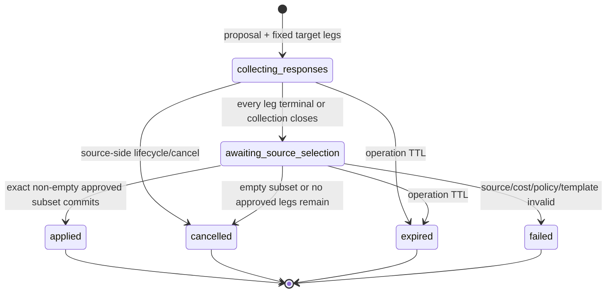

# ADR 0020: Consented multi-target semantic operations

Status: Accepted design contract; Wave A0 proof only, not implemented (2026-09-21)

> **Extends and supersedes narrow prior rules:** This ADR extends
> [ADR 0012](0012-idempotent-semantic-character-operations.md) from one target to one immutable bounded target
> set. It supersedes ADR 0012's self-target rule: the source owner's finalization is consent for source-owned
> target legs, so no separate self-approval command exists; deselection terminally declines that leg. It extends
> [ADR 0016](0016-atomic-peer-source-costs.md) from one source plus one target to one source plus N selected
> targets while preserving no reservation, one source cost, deterministic derivation, and one all-or-none
> transaction. It also narrowly supersedes ADR 0016's blanket prohibition on paying for a target no-op: a
> reviewed multi-target healing template with `allowTargetNoOp=true` may record an approved selected target as
> applied with no state delta when already at maximum HP, without disclosing that fact to the source.
>
> **Implementation boundary:** This Wave A0 change records design and executable documentation/query proof only.
> This design-only PR contains no production migration, routes, store methods, protocol 6, capability
> advertisement, events, browser controls, or production state-machine behavior. ADR 0020 nevertheless requires
> future additive migration `0010_multi_target_semantic_operations.sql` in A3. The draft must remain unmerged until the coordinator records the physical game-day GO/NO-GO.

In short, this contract extends ADR 0012 and extends ADR 0016 while superseding only the narrow rules stated
above. It requires future additive migration `0010_multi_target_semantic_operations.sql`.

## Context

The current semantic-operation authority is singular:

- migration `0005_semantic_character_operations.sql` stores one target character/ref, operation, result revision,
  and applied event;
- migration `0007_peer_source_costs.sql` stores one target owner, source cost/result, and combined self-target;
- `pCreateStructuredAction()` derives one target operation;
- `pResolveStructuredAction()` combines one target's consent and application in one `accept` command;
- `pListPendingActions()`, `pListCharacterPendingActions()`, `_pExpireSemanticOperations()`,
  `_pCancelSemanticOperationsForLifecycle()`, and PostgreSQL resolution discovery all read singular target columns;
- reconciliation recognizes only `operationId/source`, `operationId/target`, and `operationId/combined`.

Repeating the singular operation would charge once per target, permit partial commits, split one cast across
unrelated command identities, and make reconnect unable to prove the full selected set. Overloading the parent
JSON would not give PostgreSQL enforceable uniqueness, ownership, lifecycle, response, finalization, or cleanup
relationships.

The accepted product flow fixes 1-8 player-character candidates at proposal. Every target owner independently
responds for each owned character. After all pending target legs respond or reach the collection deadline, the
source chooses one exact ordered approved subset and finalizes once. The server spends one source cost and
applies every selected leg atomically, or none.

## Decision

### Scope, limits, and deferrals

Version 1 supports:

- one active player-owned source character;
- a minimum of 1 and maximum of 8 ordered, unique, active player-owned target characters;
- one closed server template and one closed source-cost bundle;
- one target-leg response per character;
- source-owned targets which need no separate response command but remain deselectable;
- one exact ordered final selected subset;
- zero selected targets as explicit cancellation;
- one source cost plus all selected target legs in one atomic transaction;
- at most 20 concurrently live collection operations per source character;
- inbox reads capped at 100 rows and expiry/cleanup batches capped at 100 operations.

The candidate set is immutable. A roster, party, visibility, or targetability change may revoke a leg but never
adds or substitutes a target. Proposal creation resolves every opaque target ref and rejects duplicate resolved
character ids, even when different refs or repeated browser entries name the same character.

Deferred:

- NPC/monster targets, party aliases, arbitrary prose, damage/combat resolution, offline writes;
- adding/replacing targets after proposal;
- incremental/repeated partial commits or per-target source costs;
- more than eight targets without a future measured contract version covering per-leg consent, events, locks,
  query budgets, and reconciliation;
- general no-op payment outside reviewed templates;
- collaborative document editing.

### Identity and addressing

| Identity | Meaning |
|---|---|
| `proposalCommandId` | Actor/body-bound proposal command |
| `operationId` | Parent identity spanning proposal, every leg, finalization, events, recovery, and audit |
| `invitationId` | Opaque, globally unique target-leg address; one owner may own several legs |
| `responseCommandId` | Actor/body/invitation/decision-bound target response |
| `finalizationCommandId` | Actor/body/ordered-subset-bound source finalization |
| `legId` | Stable persisted mutation/reconciliation identity for one unique character |
| `eventId` | Stable domain-event/outbox identity |

The response route and command address `invitationId`, never only `operationId` or account id. Parent identity is
ambiguous when one owner owns two candidate characters.

Derived reconciliation keys are:

```text
operationId/source
operationId/target/targetCharacterId
operationId/combined/sourceCharacterId
```

There is exactly one character update and one mutation leg per unique character id. If the source is selected as
a target, cost then effect run on one clone and produce one combined leg/event/revision increment. Other selected
targets each produce one target leg.

### Lifecycle and deadlines



Each target leg has response state:

```text
pending -> approved | rejected | expired | revoked | declined
```

All states except `pending` are terminal. Source-owned legs begin `approved_by_source` internally and become
`declined` when omitted from the exact final subset. Other approved legs omitted by the source also become
`declined`; this records that they were intentionally not selected, without changing the owner's historical
approval.

`collection_closes_at` is distinct from the parent `expires_at` operation TTL. Finalization locks the parent,
evaluates elapsed pending legs inline, writes their `expired` responses in ordinal order, and proceeds only when
all legs are terminal. A bounded maintenance sweep and bounded lazy sweep use the same parent-first transition.
Response expiry does not consume cost or expire the whole operation.

Target-side move/removal/archive/ownership/ref/access loss revokes only that leg. Source-side ownership,
membership, character, campaign, or source-template lifecycle change cancels the whole operation. If target-side
revocation leaves no approved leg, the parent becomes `cancelled`. Lifecycle and expiry reach child legs only
through a locked parent.

There is no reservation, refund, `partially_applied`, repeated finalization, or accepted-but-not-finalized cost.

### Consent and source finalization

Each target owner approves/rejects each invitation independently. One owner with two candidates submits two
idempotent response commands. A DM/co-DM may reject/revoke/cancel but never approve for another owner.

Source-owned legs do not create a separate response command. Source finalization is consent for every selected
source-owned leg and explicit decline for every deselected source-owned leg. This supersedes ADR 0012's separate
self-target approval requirement only for this contract.

Finalization is source-owner authority and is allowed only after collection closes and before operation expiry.
The body contains the exact ordered list of selected invitation ids. The selected set must be unique, belong to
the immutable operation, be approved at lock time, and remain current/authorized. The server never silently
drops a submitted leg. If any submitted leg is rejected, expired, revoked, declined, moved, archived,
re-owned, ref-rotated, or otherwise invalid, the entire finalization returns
`FINALIZATION_SELECTION_INVALID` with no workflow, character, audit, event, outbox, watermark, or receipt-shaped
success side effect. The source may refresh and submit a new command/subset.

An empty list commits `cancelled`/`empty_selection` and no character mutation. A non-empty valid list rederives
current source, cost, rules/content/template pins, memberships, target authorization, applicability, normalized
effects, and document safety under locks. Source/cost/policy/template invalidity commits terminal `failed` with no
character mutation. Target authority invalidity rejects only that finalization attempt; it is never a partial
apply.

Exact response/finalization replay returns the same identities and result. Command reuse with another actor,
invitation, decision, order, or subset returns `IDEMPOTENCY_KEY_REUSED`. A different finalization command after a
terminal parent returns its authorization-shaped terminal outcome without mutation.

### Privacy-preserving permitted target no-op

Multi-target healing templates may opt into `allowTargetNoOp=true` only after template-specific review. At
finalization:

- an approved selected target already at its applicable maximum HP is valid;
- its leg commits as `applied` with `changed=false`, no character update, no revision increment, and no projection
  invalidation for that character;
- the one source cost is still consumed for the exact chosen set;
- the target owner/DM may see their own leg's generic applied/no-change result;
- the source sees only that the selected set applied, never which target was full or which leg changed;
- source-as-target at full HP still commits the source cost through one combined leg; the combined event/revision
  reflects only the cost mutation and does not identify the healing no-op.

This exception applies only to effect inapplicability explicitly allowed by the pinned template. Invalid
authority, policy, character shape, target identity, effect derivation, or unsupported state remains fail-closed
and atomic. A non-healing template or a template without the flag retains ADR 0016's no-op failure rule.

Privacy canaries must prove the source response, audit, events, logs, metrics, timing classes, and reconnect
history cannot distinguish all-changed, some-full, or all-full selected sets.

### Normative PostgreSQL lock order

Every proposal/response/finalization/expiry/lifecycle path uses this total order:

1. command advisory lock (seed 9) and payload-aware replay lookup;
2. authenticated session/account rows;
3. campaign advisory lock (seed 6) then active campaign row;
4. parent semantic operation `FOR UPDATE`;
5. target child rows ordered by `(operation_id, target_character_id)`;
6. required membership rows in ascending account UUID order;
7. unique character advisory locks (seed 2) in ascending character UUID order;
8. character rows in ascending UUID order `FOR UPDATE`;
9. separately persisted resources in ascending `(kind,row UUID)` order;
10. character lease rows in the same character order;
11. pinned rules/brew/template reads;
12. compute every next document/leg/event before any canonical write;
13. write workflow, unique character updates, audit, events/outbox, watermarks, and command result; commit once.

Discovery may read immutable ids before the parent lock only to identify the parent; after locking, all ids must
match. Lifecycle/expiry reaches children only through the locked parent. No path locks a child before its parent
or upgrades from character locks back to operation/campaign authority.

Response paths stop after the child/membership rows. Reject/cancel/expiry take no character locks. Finalization
dedupes source plus selected target ids before acquiring character locks.

The read-only proof at `test/fixtures/hub/adr-0020-multi-target-lock-proof.sql` demonstrates resolved-target
uniqueness, subset membership, source/target deduplication, and ascending UUID lock order. It creates no schema
and is not implementation evidence.

### Concurrency and hazard outcomes

| Hazard | Winner | Loser/result | Accepted/latest/live/durable/visible tracks |
|---|---|---|---|
| Two owners respond concurrently | Both distinct child rows may commit | Parent becomes ready only after last terminal leg | Each response/event durable once; source refreshes coarse status |
| Same owner, two targets | Each invitation command is independent | Parent account identity cannot collapse responses | Two child responses; owner sees two cards |
| Two responses for one invitation | First child-row lock commit | Exact retry replays; changed command returns stored terminal state/error | No latest-click overwrite |
| Response vs collection expiry | First parent/child lock before DB deadline | Expiry wins after deadline; late response sees `expired` | Pending visible card is replaced from authority |
| Finalize vs late response | Finalize expires pending legs inline then validates | Late response either won first or sees terminal leg | No inferred approval |
| Target move/removal/archive | Parent-first lifecycle transaction | Leg becomes `revoked`; operation survives if approved legs remain | Hidden label removed; neutral unavailable ordinal remains |
| Source lifecycle loss | Parent-first lifecycle transaction | Whole operation cancels | All private UI concealed before stale callback |
| Source cost spent/restored | First bound-resource mutation trips ABA fence | Finalization terminally fails; restoration does not revive | No target legs/events |
| Duplicate finalization | First valid parent-lock commit | Exact replay returns same leg/event ids; different command sees terminal | One source/combined leg and selected target legs |
| Source-as-target | One unique source character lock/update | No second source or target update | One combined leg/event/revision; other targets independent |
| Duplicate resolved target | Proposal validation | Whole proposal rejected | No workflow row/event |
| Rules/template change | Finalization revalidation | Whole operation terminal `failed` | No character/leg/invalidation |
| Permitted full-HP target | Successful finalization | No target state delta/revision/invalidation for that leg | Source sees no difference; target owner sees bounded own outcome |
| Rejected finalization | Validation | Source may retry new subset/command | No workflow/audit/event/outbox/character side effect |
| Reconnect/replay | Canonical rows, event ids, leg ids, watermarks | Duplicate delivery suppressed | Accepted base, live, latest submitted, durable recovery, visible sheet converge per leg |

Database clock/lock order determines winners, never browser time or WebSocket arrival.

### Canonical writes, events, privacy, and reconciliation

For a successful finalization:

1. insert the finalization and exact ordered selected-leg rows;
2. compute one mutation result per unique character;
3. update each changed unique character exactly once in ascending UUID order;
4. insert one durable leg row per selected unique character plus source-only leg when the source is not selected;
5. append one bounded finalization audit summary;
6. emit a source-owner-only cost/combined event first;
7. emit one target applied event per selected invitation in proposal ordinal order, including no-op legs, visible
   only to that target owner plus DM/co-DM;
8. emit one collapsed metadata-only projection invalidation for the union audience of all changed character
   projections; the payload remains empty and contains no roster/target ids;
9. persist the source-owner finalization result and commit once.

Proposal emits one source-owner event and one target-request event per invitation. Response emits one target-leg
response event to that target owner plus DM/co-DM and a separate coarse source-owner status event. No event
contains the full private roster or selected target list. Events are allocated in deterministic batches:
source event, target events by proposal ordinal, then the collapsed invalidation.

Target events carry operation id, invitation id, leg id, normalized target operation, resulting revision when
changed, and a bounded changed flag visible only to that owner/DM. Source responses/events omit per-leg changed
flags and target state. Unrelated users receive no workflow event.

Reconciliation applies durable legs:

```text
source:   accepted := C(B);      live := C(L)
target i: accepted := Ei(B);     live := Ei(L)
combined: accepted := Ei(C(B));  live := Ei(C(L))
next save: diff(new accepted, new live)
```

No-op target legs mark coverage/history but do not transform document tracks. Each sheet stages every relevant
transform before adopting accepted base, live state, latest-submitted state, durable recovery queue, or visible
state. Unknown coverage triggers serialized canonical resync; it never repeats finalization or guesses from
arrival order.

### Schema decision: additive migration 0010 is required

Migration `0010_multi_target_semantic_operations.sql` is required in A3. The normalized target table is
`hub.semantic_operation_targets`; do not store target/response/selection arrays in JSON.

The existing `semantic_operations` parent remains the shared aggregate:

- add `target_set_version integer`;
- make singular `target_character_id`, `target_ref`, `target_owner_account_id_at_proposal`,
  `target_revision_observed`, `resulting_character_revision`, and singular target/applied event fields nullable;
- add parent collection/finalization deadlines and parent status support;
- add a shape constraint: legacy rows have `target_set_version IS NULL` and all migration-0005/0007 singular
  target fields retain their old requirements; multi-target rows have `target_set_version = 1`, singular target
  fields/results are null, and targets exist only in children.

`semantic_operation_targets` requires:

- PK `(operation_id,target_character_id)`;
- `campaign_id`, globally unique `invitation_id`, unique `(operation_id,ordinal)`, immutable `target_ref`, pinned
  owner, safe snapshot, normalized target operation, observed/result revisions, response state/actor/command/time/
  event, selection state/index, lifecycle invalidation/revoke reason/event, leg id/kind/event, and changed flag;
- unique `(operation_id,target_ref)`, `(operation_id,selection_index)` where selected, and
  `(operation_id,leg_id)` where applied;
- character, rules, event, and command references use retention-safe `ON DELETE RESTRICT`; historical response/
  finalization actor references use `ON DELETE SET NULL`; operation-owned target/finalization rows use
  `ON DELETE CASCADE` only when explicit parent history cleanup is authorized.

Add `semantic_operation_finalizations` with one row per parent, unique command id, exact ordered invitation-id
selection identity, terminal result, actor, event ids, and timestamps. Exact ordered selection may be retained as
bounded JSON only as the immutable command/result fingerprint; normalized selected flags/indexes remain on target
rows and are authoritative.

`semantic_operation_commands` remains the global command namespace. Expand command types for
`create_multi_target_proposal`, `respond_multi_target`, and `finalize_multi_target`; response commands store their
invitation id. Existing one-target commands remain readable unchanged.

There is exactly one finalization row per operation.

Required constraints/triggers:

- 1-8 contiguous unique target ordinals and `candidate_count` equality;
- one invitation/response per target leg and one finalization per parent;
- exact selected subset is unique, child-owned, terminally approved at commit, and contiguous;
- applied parents have one source/combined leg plus every selected target leg, no unselected leg, and no duplicate
  character update;
- no-op changed=false legs have no result revision/invalidation;
- non-applied parents have no mutation legs/results;
- parent/child campaign consistency.

Required indexes:

- parent `(campaign_id,status,collection_closes_at,id)` partial on collection;
- parent `(campaign_id,status,expires_at,id)` partial on finalization-ready/live;
- source `(source_character_id,status,created_at DESC)` for live-collection cap/outgoing list;
- target inbox `(target_owner_account_id_at_proposal,response_state,operation_id)` with `LIMIT 100`;
- target lifecycle `(target_character_id,operation_id)` partial while not revoked;
- invitation unique lookup;
- response/selection/ordinal/leg unique indexes;
- bounded terminal cleanup/retention indexes;
- no indexes on private source-cost/choice/operation/snapshot JSON.

Every current singular read must be explicitly rewritten to union legacy parents with child legs:

- `pListPendingActions`;
- `pListCharacterPendingActions`;
- `_pExpireSemanticOperations`;
- `_pCancelSemanticOperationsForLifecycle`;
- response/finalization discovery and authorization;
- outgoing status, lifecycle move/archive/removal, account purge, campaign purge, export/retention, and
  predecessor compatibility checks.

Purge must delete command/finalization/target rows through explicit parent history cleanup before character hard
delete so `ON DELETE RESTRICT` cannot leave silent orphan rows or permanently block due-account purge. Lifecycle
state changes remain workflow transitions, never FK cascades.

Migration 0010 is `phase: "expand"` and `previousAppCompatible: true` only while the multi-target capability is
disabled: predecessor code reads legacy rows because all legacy singular fields preserve their shape, ignores
new tables/nullable columns, and never creates `target_set_version=1`. Before predecessor rollback, disable
creation, run a drain preflight, terminalize live `collecting_responses`/`awaiting_source_selection`, verify zero
live multi-target parents, and retain all tables/terminal history. No rollback drops columns/tables or reverses
applied character state.

Role grants run after migration: runtime gets CRUD on new tables/sequences, backup gets SELECT, operations gets no
new mutation grant, and no role gets schema create.

### Protocol, capability, API, rollout, and rollback

Implementation requires protocol 6. Protocol 4 and 5 clients fail closed for multi-target inbox/detail/replay and
never receive shapes they could misread. Current one-target protocol-4 routes/events remain unchanged.

Capability:

```json
{
  "multiTargetOperations": {
    "enabled": false,
    "contractVersion": 1,
    "protocolVersion": 6,
    "maxTargets": 8,
    "supportsSourceOwnedFinalizationConsent": true,
    "supportsPartialSelection": true,
    "supportsPartialCommit": false,
    "templateRegistryVersion": "multi-target-effects-v1"
  }
}
```

Planned routes:

- `POST /api/campaigns/:campaignId/multi-target-operations`;
- `POST /api/campaigns/:campaignId/multi-target-operations/:operationId/invitations/:invitationId/respond`;
- `POST /api/campaigns/:campaignId/multi-target-operations/:operationId/finalize`;
- bounded participant detail/inbox/outgoing reads.

Rollout order: A1/A2 foundations, A3 migration/server with capability off, protocol-6 A4 clients, A5 templates,
Memory/PostgreSQL and real-stack proof, one allowlisted campaign/template canary, then measured expansion.
Disabling stops creation; response/reject/cancel/expiry/read remain available. Finalization after deliberate
disablement terminally fails without mutation.

Drain-before-rollback preflight reports live parent count by status, oldest collection/finalization deadlines,
unsupported template versions, and incomplete response/finalization/leg rows without private identities. Rollback
is blocked until live count is zero.

### A1-A5 handoff

| PR | Scope | Required boundary |
|---|---|---|
| **A1 — DM typed effects** | Typed effect catalog used by first templates | No prose; pure fixtures; policy/document validation |
| **A2 — source-cost authority** | Generalized deterministic one-time cost/ABA authority | No reservation; shared Memory/PostgreSQL parity |
| **A3 — server state machine** | Migration 0010, protocol 6, capability/routes, both stores, events, lifecycle, privacy, expiry, locks | Opposing-order deadlock tests, fault injection, purge/rollback drain |
| **A4 — Character Sheet UX and reconciliation** | Proposal, invitation response, exact-subset finalization, per-leg recovery | Same-owner/two-target and source-as-target UX; dirty/in-flight/reconnect/access-loss coverage |
| **A5 — Healing Word and Mass Healing Word templates** | First reviewed production templates | PHB/XPHB semantics and explicit `allowTargetNoOp=true` privacy evidence |

## Verification required before enablement

1. Same owner with two target invitations and independent replay.
2. Source-as-target plus other targets, one combined update/revision/event.
3. Response/finalization and response/collection-expiry races.
4. Expiry without readers via bounded maintenance sweep.
5. Source-cost spend/restore ABA and independent mutation contention.
6. Target move/removal/archive/ref/ownership change and source lifecycle cancellation.
7. Account/campaign purge with no silent orphan/restrict blockage.
8. Protocol 4/5 fail-closed inbox/detail/replay and protocol-6 compatibility.
9. Privacy canaries for hidden targets and all-changed/some-full/all-full allowed-no-op sets.
10. Fault injection after every target write, unique character update, event/outbox, audit, and response/finalization
    receipt step.
11. Memory/PostgreSQL byte-equivalent status, projection, ordering, replay, and failure behavior.
12. Opposing source/target UUID order and concurrent finalizations with zero deadlocks/partial commits.
13. Duplicate resolved target/invitation/ordinal/selection rejection.
14. Rejected finalization zero-side-effect proof.
15. Per-leg accepted/latest/live/durable/visible reconciliation across reconnect/replay.
16. Fresh/0009 upgrade/concurrent/failure/checksum/roles/backup/restore/predecessor-image migration proof.
17. Drain/default-off/disable/rollback preflight.

## Consequences

- Consent remains per owned character while payment remains one source decision.
- Partial approval is usable; partial commit is forbidden.
- Reviewed healing no-ops protect hidden target state without refund or re-proposal oracles.
- Normalized child rows make invitation, response, lifecycle, cleanup, and reconciliation enforceable.
- Existing one-target rows/routes remain readable and unchanged.

## Rejected alternatives

- **Repeat one-target operations:** per-target cost and partial commits.
- **Mutable target JSON on the parent:** weak uniqueness/FK/lifecycle/purge/query authority.
- **Account-addressed responses:** ambiguous when one owner owns multiple candidates.
- **Reserve source cost:** mutates before consent and creates release races.
- **Silently drop invalid submitted legs:** violates exact final selection and hides stale authority.
- **Best-effort loop/compensation:** can charge without every effect or apply free effects.
- **Generic failure and re-proposal for full-HP healing:** creates a source-visible oracle about hidden target
  applicability and forces avoidable repeated consent.
- **Disclose full-HP targets to the source:** violates projection privacy.
- **Allow generic paid no-ops:** hides template bugs and spends costs for unsupported state; only reviewed
  `allowTargetNoOp=true` multi-target healing templates receive the exception.
- **DM approval for another owner:** removes independent consent.
- **Browser applicability checks:** stale private browser state is not authority.
