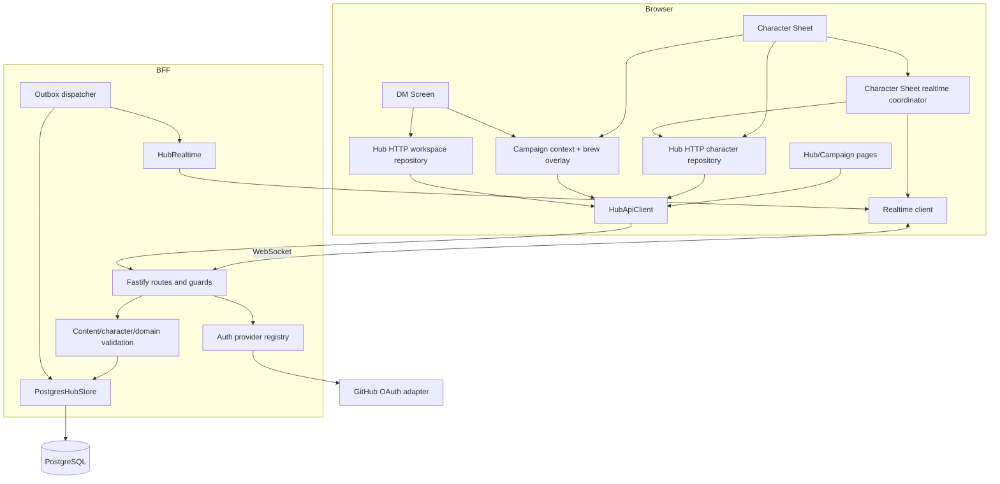
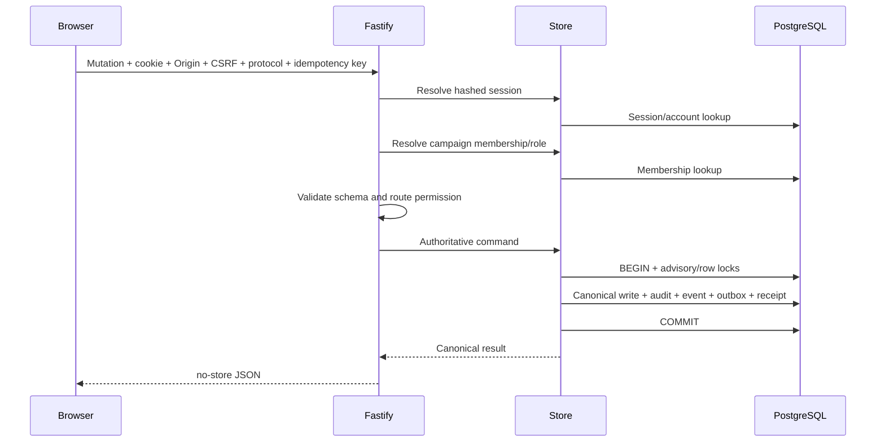
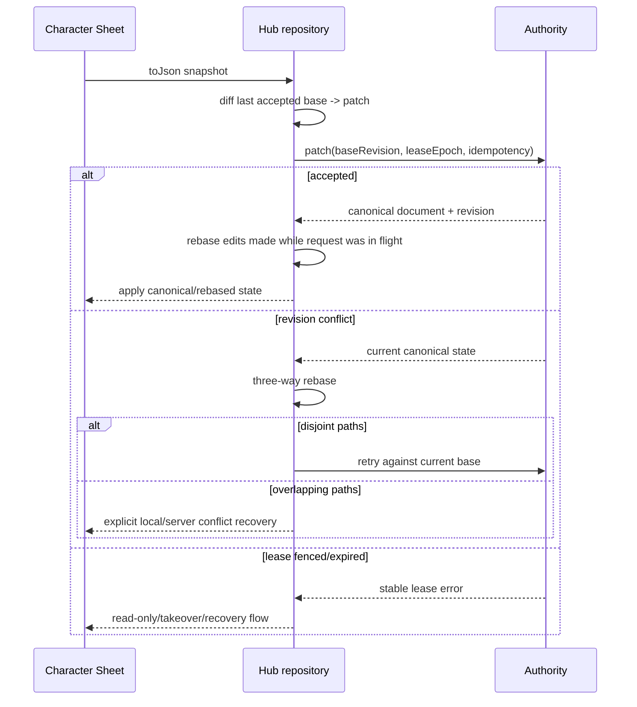
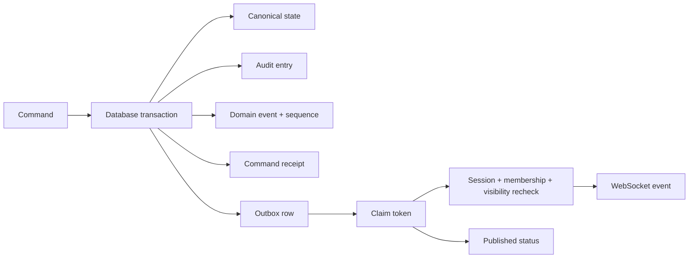

# Campaign Hub architecture

> **Status:** Current architecture with launch gaps called out
> **Last verified:** 2026-09-03
> **Owner:** Campaign Hub maintainers

## Principles

1. Local mode remains a supported product mode, not a degraded fallback.
2. The browser is untrusted and never receives database credentials or durable bearer tokens.
3. PostgreSQL is canonical for Hub data.
4. Full Character Sheet/Board documents remain documents; the system is not fully event-sourced.
5. Multiplayer-relevant changes use semantic commands where blind document patches would be unsafe.
6. Every stale-writer defense combines revision, lease, and monotonically increasing fencing epoch.
7. Campaign content is an overlay and never replaces personal content.
8. Realtime delivery is derived from committed outbox rows; WebSockets are not the source of truth.
9. Tenant and visibility checks are server responsibilities.
10. Private-V1 assumptions cannot silently become public-service policy.

## Components



## Request authorization



Reads require a signed session where the route is private. Mutations additionally require exact Origin, CSRF,
wire protocol, request schema, and an idempotency key. Route-specific store methods repeat ownership and
tenant checks instead of trusting a client-supplied role.

## Character save/rebase



The client never treats an unacknowledged queued snapshot as a new base. Each submitted write retains its own
base so overlapping and disjoint changes are classified correctly. A transport-failed offline write remains a
local recovery draft. When realtime reconnects, the owner sheet refetches the canonical document: disjoint
changes are rebased and retried, while overlapping paths require an explicit local/server choice. Client-only
save timestamps are excluded from overlap detection. `Use Local` is explicit authority to retry the actual
local candidate against the newer server base; server-owned inventory and XP paths keep their stricter
server-wins overlap policy.

## Transactional outbox and realtime



Clients use snapshots and sequence-based replay to recover from disconnects. Presence is ephemeral. Roll and
action history is durable. Visibility is evaluated on the server for both replay and live fanout. Projection
HTTP responses are request-sequence and attachment-generation fenced, so a slower old response or a response
from a detached DM workspace cannot replace newer scoped truth.

An authenticated campaign-backed Character Sheet attaches a focused realtime coordinator only after its
canonical character has loaded. Socket-generation fencing makes stale messages, closes, and watchdog timers
inert. The coordinator routes metadata-only projection invalidations and the frozen
`character.operation.*` lifecycle allowlist through the HTTP repository's existing mutation queue, so a
delivery cannot overtake an in-flight save. Character/campaign switch, canonical-id replacement, detach,
revocation, logout, and terminal page hide all fence the subscription generation.

Applied operations are reconciled in the repository under ADR 0012. `rebaseJsonChanges` treats identical
same-path edits as convergence while preserving unequal and ancestor/descendant overlaps as conflicts. The
character repository additionally removes only deterministic Character Sheet item aliases from all three
comparison inputs before inventory diffs. For non-custom official UIDs only, it also removes fields which exactly
match the immutable pre-enhancement repair catalog. Player-owned fields outside that catalog match remain
significant, while `_isCustom` and `source: "Custom"` items receive no trusted-catalog normalization. A canonical
item and the same sheet-hydrated focus or weapon therefore do not manufacture an `/inventory` overlap around a
server quantity change, while quantity, spent charges, non-empty upgrades/gemstones, custom metadata,
provenance, effects, materials, and wrapper-state changes remain real conflicts. The normalization is
comparison-only: every surviving add/replace patch rematerializes its value from the raw local document and
applies it to the raw canonical document, so neither side's canonical metadata is deleted. The Character Sheet's
final post-save rebase uses this same comparison and rematerialization contract, so save completion cannot
reintroduce the hydration conflict.
Campaign Overview serializes every transfer-state refresh in request-start order. Realtime refreshes enter that
queue when their authorization-scoped character/snapshot requests start, not after those requests finish, so a
pre-transfer response cannot overwrite balances or pending decisions rendered by the transfer's later refresh.
The accepted base and every other base track still advance together with live state so later saves retain exact
coverage and do not need to rediscover already-accepted edits. Delivery is therefore a prepare/adopt/commit
transaction over per-track coverage records, and an unprovable delivery schedules a serialized recovery that
replays ordered visible history instead of forcing a reload.

This delivery layer is intentionally not reconciliation: it does not mutate `CharacterSheetState`, accepted
bases, revisions, leases, conflicts, or recovery storage, and it does not fetch or replace the owner document.
The Character Sheet page owns the subsequent authoritative-document reconciliation, while the later live-apply
layer owns ADR 0012 operation-aware base/live transforms. Party Inventory refreshes its own stash projection
and direct inventory-transfer effects; it does not own generic character-document reconnect recovery.

## Campaign content overlay

```mermaid
flowchart LR
  Site[Site/prerelease content] --> Merge[Processed content]
  Personal[Persisted personal brew] --> Merge
  Campaign[Temporary campaign bundle] --> Merge
  Merge --> Page[Current page renderer]
  Campaign -. never written .->|X| Personal
```

The page activates campaign context before loading character/DM data. Rules exist as a runtime overlay and are
removed by Character Sheet serialization.

## DM workspace and Party Tracker

- Each DM membership owns a private Board workspace.
- The workspace is one revisioned/fenced Board blob.
- Recovery drafts are scoped by account/workspace to prevent cross-account leakage.
- Campaign identity and DM/co-DM authorization are checked before the private Board blob is loaded.
- A focused Campaign DM Screen controller combines workspace save/conflict state with observable realtime
  connection state. Policy closure, role loss, membership removal, and archive block the Board instead of
  silently leaving private controls active.
- Live campaign character projections are injected outside serialized Board state.
- Linked Party Tracker rows use a static read-only detail view, are visually separated from private manual
  rows, and cannot be edited into duplicate local characters.
- Journey Tracker consumes only the Party Tracker projection allowed by existing board integration.

## Deployment boundary

The required production topology is documented, but its portable container implementation is Phase 6D:

- static-site service;
- BFF service;
- PostgreSQL;
- one-shot migrator;
- same-origin TLS edge with WebSocket proxying;
- maintenance/backup scheduling outside the request process.

The existing root `Dockerfile` is the static-site image. It must not be overloaded with BFF runtime or
database credentials.
