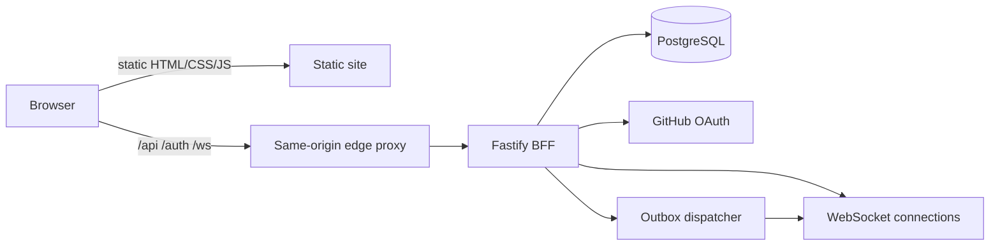

# Campaign Hub current system

> **Status:** Current implementation reference
> **Scope:** Private invite-only V1 through Phase 5
> **Last verified:** 2026-08-24
> **Owner:** Campaign Hub maintainers

This document describes what exists in the repository now. It is not the deployment plan and does not imply
that the Hub is already hosted. Start here when changing Hub behavior, then follow the linked domain,
protocol, security, and operations references.

## Product boundary

The Campaign Hub is an optional online layer over the existing local-first site.

- Without `hubCampaign` in the URL, Character Sheet and DM Screen use their original local repositories.
- With `hubCampaign`, the page activates campaign content and chooses an authenticated HTTP repository.
- The browser never connects directly to PostgreSQL or an OAuth provider.
- PostgreSQL is canonical for online data.
- The Fastify backend-for-frontend (BFF) is the authorization, validation, transaction, and WebSocket boundary.
- Private V1 is allowlisted and invite-only.

## Repository map

| Area | Primary files | Responsibility |
|---|---|---|
| Hub pages | `hub.html`, `campaign.html`, `scss/hub.scss`, `js/hub/hub-page.js` | Session state, campaign list/detail, membership/invite forms, campaign content, actions, grants, transfers |
| Browser API | `js/hub/hub-api-client.js` | Same-origin JSON requests, CSRF/protocol/idempotency headers, stable API errors |
| Character persistence | `js/hub/hub-http-character-repository.js`, `js/hub/hub-character-repository.js` | Cloud snapshots, patches, leases, queued bases, conflict recovery, canonical-id adoption |
| DM workspace persistence | `js/hub/hub-http-dm-workspace-repository.js`, `js/hub/hub-dm-workspace-repository.js` | Private Board blobs, leases, recovery drafts, conflict handling |
| Campaign context | `js/hub/hub-campaign-context.js`, `js/hub/hub-brew-context.js` | Rules and immutable campaign brew activation without personal-brew writes |
| Realtime | `js/hub/hub-realtime-client.js`, `js/hub/hub-broadcast-sync.js` | WebSocket resync/presence/events and same-browser tab coordination |
| Roll bridge | `js/hub/hub-roll-log-adapter.js` | Durable server roll events from Character Sheet rolls |
| BFF routes | `server/src/app.js` | Auth, schemas, roles, CSRF/origin/protocol checks, HTTP and WebSocket endpoints |
| Production authority | `server/src/postgres-hub-store.js` | PostgreSQL queries, locks, transactions, canonical writes, audit/events/outbox/receipts |
| Test authority | `server/src/memory-hub-store.js` | Deterministic behavioral double for domain/API tests; never used by `server/src/index.js` |
| Domain helpers | `server/src/hub-actions.js`, `server/src/campaign-content.js`, `server/src/cloud-data-validation.js` | Structured effects, inventory/escrow, rules, brew validation, character sanitization/quotas |
| Realtime authority | `server/src/realtime.js`, `server/src/projections.js` | Presence, resync, visibility filtering, outbox dispatch |
| Auth/security | `server/src/github-oauth-provider.js`, `server/src/security.js` | OAuth exchange, PKCE, signed state, hashes, tokens, CSRF helpers |
| Schema/operations | `server/migrations/0001_hub_core.sql`, `server/scripts/` | Initial schema, migration, backup, restore, credential-safe libpq environment |
| Character Sheet seams | `js/charactersheet/charactersheet.js`, `charactersheet-state.js`, `charactersheet-rollhistory.js` | Repository selection, context overlay, save/rebase/recovery, campaign roll logging |
| DM Screen seams | `js/dmscreen.js`, `js/dmscreen/partytracker/` | Workspace repository selection and non-persisted live character projections |
| PWA policy | `sw-template.js`, `js/hub/hub-route-policy.js` | Network-only handling for same-origin `/api` and `/auth` |
| Tests | `test/jest/hub/`, selected `test/jest/charactersheet/` and DM Screen suites | Domain, route, auth, concurrency, security, UI contract, and integration-seam regression |

## Current runtime topology

The implemented contract expects one public HTTPS origin:

The repository does not yet contain the dedicated BFF OCI image, reference Compose topology, managed
provider configuration, or production deployment workflow. Those are Phase 6D-6G work.

## Character persistence

### Local mode

- Repository: `LocalCharacterRepository`.
- Canonical local roster key: `charsheet-characters`.
- Synchronous rescue mirror remains enabled.
- No Hub API, session, campaign rules, or campaign brew is required.

### Hub mode

- Repository: `HubHttpCharacterRepository`.
- One canonical server document per character.
- The client holds the last accepted base, computes path patches, and serializes writes.
- A write requires the current `revision` and lease `epoch`.
- Lease takeover increments the epoch; a stale device is fenced even if it reconnects.
- Disjoint local changes may rebase over a server result. Overlapping changes require explicit local/server
  recovery.
- When the server replaces a temporary local id with a canonical UUID, repository maps, recovery keys, live
  state, selector state, and the page URL are migrated.
- Cloud characters do not use the local rescue mirror; unresolved cloud conflicts produce explicit recovery
  artifacts instead of pretending to save locally.

## Campaign content

- Brew bundles are immutable, canonicalized, content-addressed, and dependency-closed.
- Raw HTML/wrapped HTML, blocklists, unsafe URLs, dangerous keys, excessive depth, and excessive size are
  rejected.
- Campaign brew is installed as a temporary page overlay. It never calls `BrewUtil2.pSetBrew()` and therefore
  cannot replace personal brew.
- Rules are typed/versioned runtime overlays.
- Campaign rule overlays are stripped from character serialization.
- Character documents accept the Character Sheet's existing rendered feature HTML only after server-side
  sanitization. Unknown markup is escaped; scripts, active attributes, unsafe URLs, images, inline styles,
  and renderer re-entry attributes cannot remain executable.

## Realtime

- WebSocket upgrade requires exact origin, signed session, active membership, and protocol version.
- The server revalidates session and membership on messages, fanout, and presence broadcasts.
- Client messages are limited to presence and resync in V1.
- Resync returns an authorization-shaped campaign snapshot plus visible events after a sequence.
- Outbox rows are claimed with tokens and stale-claim recovery; events for one campaign are not overtaken
  after an earlier delivery failure.
- Other players receive a fixed limited character projection. DMs/co-DMs receive full authorized snapshots.
- Party Tracker projections are linked, read-only rows and are excluded from saved Board state.

## Multiplayer mutations

- Structured effects support damage, healing, condition add/remove, spell-slot spend, and informational
  requests.
- XP/item grants are audited semantic commands; XP does not perform level-up choices.
- Party currency is denomination-based (`cp`, `sp`, `ep`, `gp`, `pp`).
- Transfers reserve source assets in escrow before acceptance.
- Partial stacks preserve the source wrapper identity.
- A committed cross-container item receives a new destination identity unless it merges with a deeply
  metadata-compatible stack.
- Rejection/cancellation restores the original source identity and index.
- Whole-item transfer is rejected while the item is equipped, attuned, contained, hosting/using Ioun items,
  selected as ammunition, tracked by item effects, or referenced by an active state. This keeps server
  mutations within Character Sheet invariants without duplicating the sheet's calculation engine.

## Security and durability invariants

- Session and OAuth cookies are httpOnly; production cookies are Secure and `__Host-` scoped.
- Session tokens are stored only as SHA-256 hashes.
- Mutations require exact Origin, CSRF HMAC, protocol version, payload schema, role/ownership authorization,
  and idempotency key.
- Campaign-owned relationships carry `campaign_id` and tenant-consistency constraints/triggers.
- Canonical character JSON is limited to 1.5 MB after every resulting mutation.
- HTTP bodies are limited to 2 MB.
- Command receipts are payload-aware, compact character responses to references, expire after 24 hours, and
  can be cleaned in bounded batches.
- Every authoritative mutation writes canonical state, security/admin audit when relevant, domain event,
  outbox row, and command receipt in the same transaction.
- Portable custom-format backups and single-transaction restores have been exercised locally against
  PostgreSQL 17.

## Implemented UI

`hub.html` supports:

- signed-out/session/error/loading states;
- campaign list;
- inline campaign creation;
- invite-fragment preservation across OAuth.

`campaign.html` supports:

- campaign/member/character overview;
- invite creation;
- local-character upload;
- campaign brew and rules publication/activation;
- private DM workspace link;
- effect proposals and pending resolution;
- XP and item grants;
- party inventory summary and item/currency transfers.

Current administrative gaps are launch work, not hidden capabilities: invite listing/revocation, member role
changes/removal, session/device management, and user-requested account deletion are not yet implemented.

## Fixed limits

See [performance.md](performance.md) for the normative table. Important V1 values are:

- request body: 2 MB;
- canonical character: 1.5 MB UTF-8 JSON;
- campaign brew: 1 MB, 100 documents, depth 100;
- character patch: 500 operations, path length 500;
- WebSocket inbound message: 16 KB and 20 messages/second/connection;
- replay: 500 events/request;
- outbox dispatch: 100 rows/batch;
- command receipt: 24 hours.

## Deployment status

The implementation is verified but not production-deployed. Before inviting users, complete Phases 6A-6H
from the continuation plan: lifecycle administration, migration management, portable containers,
operations/observability, real integration/E2E, provider staging, and a private multi-device game day.
