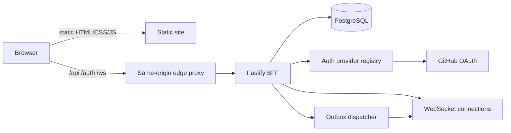

# Campaign Hub current system

> **Status:** Current implementation reference
> **Scope:** Private invite-only V1 plus the protocol-v3 semantic-operation server substrate
> **Last verified:** 2026-09-03
> **Owner:** Campaign Hub maintainers

This document describes what exists in the repository and deployed private Oracle staging now. It is not the
delivery plan. Start here when changing Hub behavior, then follow the linked domain, protocol, security,
operations, and [living roadmap](roadmap.md) references.

## Product boundary

The Campaign Hub is an optional online layer over the existing local-first site.

- Without `hubCampaign` in the URL, Character Sheet and DM Screen use their original local repositories.
- With `hubCampaign`, the page activates campaign content and chooses an authenticated HTTP repository.
- The browser never connects directly to PostgreSQL or an OAuth provider.
- PostgreSQL is canonical for online data.
- The Fastify backend-for-frontend (BFF) is the authorization, validation, transaction, and WebSocket boundary.
- Private V1 is allowlisted and invite-only.

## Repository map

| Area | Primary files | Responsibility |
|---|---|---|
| Hub pages | `hub.html`, `campaign.html`, `scss/hub.scss`, `js/hub/hub-page.js` | Session state, campaign list/detail, membership/invite forms, campaign content, actions, grants, transfers |
| Browser API | `js/hub/hub-api-client.js` | Same-origin JSON requests, CSRF/protocol/idempotency headers, stable API errors |
| Character persistence | `js/hub/hub-http-character-repository.js`, `js/hub/hub-character-repository.js` | Cloud snapshots, patches, leases, queued bases, conflict recovery, canonical-id adoption |
| Party inventory | `js/charactersheet/charactersheet-party-inventory.js`, `js/hub/hub-inventory-contract.js` | Owner-only Character Sheet stash presentation, authoritative transfer coordination, shared eligibility and weight summaries |
| DM workspace persistence | `js/hub/hub-http-dm-workspace-repository.js`, `js/hub/hub-dm-workspace-repository.js` | Private Board blobs, leases, recovery drafts, conflict handling |
| Campaign context | `js/hub/hub-campaign-context.js`, `js/hub/hub-brew-context.js` | Rules and immutable campaign brew activation without personal-brew writes |
| Realtime | `js/hub/hub-realtime-client.js`, `js/hub/hub-broadcast-sync.js`, `js/charactersheet/charactersheet-realtime.js` | WebSocket resync/presence/events, stale-socket fencing, focused Character Sheet delivery, and same-browser tab coordination |
| Semantic operations | `js/hub/hub-semantic-operations.js`, `js/hub/hub-effect-presentation.js`, `js/hub/hub-store-error.js` | Pure versioned damage/heal/condition/spell-slot catalog plus privacy-safe approval/effect presentation shared by the server and browser |
| Operation reconciliation | `js/hub/hub-character-operation-reconciler.js`, `js/hub/hub-http-character-repository.js` | ADR 0012 `B/L -> R/F` transition, per-track coverage, prepare/adopt/commit atomicity, and no-reload resync recovery |
| Roll bridge | `js/hub/hub-roll-log-adapter.js` | Durable server roll events from Character Sheet rolls |
| BFF routes | `server/src/app.js` | Auth, schemas, roles, CSRF/origin/protocol checks, HTTP and WebSocket endpoints |
| Production authority | `server/src/postgres-hub-store.js` | PostgreSQL queries, locks, transactions, canonical writes, audit/events/outbox/receipts |
| Test authority | `server/src/memory-hub-store.js` | Deterministic behavioral double for domain/API tests; never used by `server/src/index.js` |
| Domain helpers | `server/src/hub-actions.js`, `server/src/semantic-operation-registry.js`, `server/src/campaign-content.js`, `server/src/cloud-data-validation.js` | Versioned semantic effects, source-derived template registry, inventory/escrow, rules, brew validation, character sanitization/quotas |
| Realtime authority | `server/src/realtime.js`, `server/src/projections.js` | Presence, resync, visibility filtering, outbox dispatch |
| Auth/security | `server/src/auth-provider-registry.js`, `server/src/github-oauth-provider.js`, `server/src/external-identity.js`, `server/src/security.js` | Validated provider registration, GitHub exchange, immutable identity normalization, durable OAuth state, PKCE, hashes, tokens, CSRF helpers |
| Schema/operations | `server/migrations/`, `server/src/migration-runner.js`, `server/scripts/` | Immutable migrations, checksummed ledger, role grants, backup, restore, credential-safe DB access |
| Character Sheet seams | `js/charactersheet/charactersheet.js`, `charactersheet-hub-effects.js`, `charactersheet-state.js`, `charactersheet-rollhistory.js` | Repository selection, context overlay, save/rebase/recovery, inline effect approvals/notices, campaign roll logging |
| DM Screen seams | `js/dmscreen.js`, `js/dmscreen/partytracker/` | Workspace repository selection and non-persisted live character projections |
| PWA policy | `sw-template.js`, `js/hub/hub-route-policy.js` | Network-only handling for same-origin `/api` and `/auth` |
| Tests | `test/jest/hub/`, selected `test/jest/charactersheet/` and DM Screen suites | Domain, route, auth, concurrency, security, UI contract, and integration-seam regression |

## Current runtime topology

The implemented contract expects one public HTTPS origin:

The repository contains a dedicated BFF OCI image and a PostgreSQL/migrator/role-grant/BFF/static/same-origin-
edge Compose topology verified locally and deployed on Oracle. Phase 6G deployed release
`hub-staging-2026-09-01` at `8f181712` to the private staging environment.

## Character persistence

### Local mode

- Repository: `LocalCharacterRepository`.
- Canonical local roster key: `charsheet-characters`.
- Synchronous rescue mirror remains enabled.
- No Hub API, session, campaign rules, or campaign brew is required.

### Hub mode

- Repository: `HubHttpCharacterRepository`.
- One canonical server document per character.
- The client holds the last accepted base, computes path patches, and serializes writes.
- A write requires the current `revision` and lease `epoch`.
- Lease takeover increments the epoch; a stale device is fenced even if it reconnects.
- Disjoint local changes may rebase over a server result. Overlapping changes require explicit local/server
  recovery.
- When the server replaces a temporary local id with a canonical UUID, repository maps, recovery keys, live
  state, selector state, and the page URL are migrated.
- Cloud characters do not use the local rescue mirror; unresolved cloud conflicts produce explicit recovery
  artifacts instead of pretending to save locally.
- Owner/DM truth carries `operationWatermark`, which says which applied-operation event sequence is already
  reflected in the canonical revision. Peer profiles and peer refs never carry it.

## Campaign content

- Brew bundles are immutable, canonicalized, content-addressed, and dependency-closed.
- Raw HTML/wrapped HTML, blocklists, unsafe URLs, dangerous keys, excessive depth, and excessive size are
  rejected.
- Campaign brew is installed as a temporary page overlay. It never calls `BrewUtil2.pSetBrew()` and therefore
  cannot replace personal brew.
- Rules are typed/versioned runtime overlays.
- Campaign rule overlays are stripped from character serialization.
- Character documents accept the Character Sheet's existing rendered feature HTML only after server-side
  sanitization. Unknown markup is escaped; scripts, active attributes, unsafe URLs, images, inline styles,
  and renderer re-entry attributes cannot remain executable.

## Realtime

- WebSocket upgrade requires exact origin, signed session, active membership, and protocol version.
- The server revalidates session and membership on messages, fanout, and presence broadcasts.
- Client messages are limited to presence and resync in V1.
- Resync returns a metadata-only cursor with cache-invalidation refs; projections are fetched over HTTP. The HTTP snapshot returns an authorization-shaped campaign snapshot plus visible events after a sequence.
- Outbox rows are claimed with tokens and stale-claim recovery; events for one campaign are not overtaken
  after an earlier delivery failure.
- Other members receive one recipient-independent peer profile shaped by the character owner's sharing policy ([ADR 0011](adr/0011-authorization-scoped-character-projections.md)). DMs/co-DMs receive full authorized snapshots.
- Party Tracker projections are linked, read-only rows and are excluded from saved Board state.
- Only an authenticated campaign-backed open Character Sheet character subscribes. Local, signed-out,
  detached-cloud, temporary, and failed-load sheets do not.
- The sheet coordinator filters projection invalidations, the exact `character.operation.*` lifecycle allowlist,
  and relevant `transfer.*` invalidations to the open target. Delivery is serialized behind saves and fenced on
  switch, detach, revocation, logout, and terminal page hide. Transfer presentation receives only relevance
  booleans and event metadata; raw account, transfer, inventory, and character ids are not passed to the stash UI.
- The open owner sheet reads pending approvals from
  `GET /api/campaigns/:campaignId/characters/:characterId/pending-actions`. The route fails closed for a DM,
  co-DM, peer, or other character owner and projects only an opaque action id, expiry, resolve capability and
  immutable source/effect/outcome labels. Initial open, reconnect and focus reconciliation prevents a missed
  socket edge from hiding a decision.
- Approve/Reject are inline, single-flight and retryable. Approval never mutates the sheet from the resolve
  response directly; its authoritative `character.operation.applied` envelope enters ADR 0012's serialized
  reconciliation path as a loopback-delivery fallback. Successful adoption produces a polite, dismissible and
  time-bounded sheet notice. Blocked adoption produces recovery UI instead.
- Cursor refs may carry an owner/DM-only `operationWatermark`. Operation events remain deliverable at/below it;
  this substrate exposes the metadata but does not apply operations or replace sheet state.

## Multiplayer mutations

- Protocol-v3 semantic operations support damage, healing, condition add/remove, and spell-slot spend/restore.
  Generic typed operations are DM/co-DM-only and apply immediately with one revision/event/outbox transaction.
- Player effects are source-derived from a closed server registry and always proposed for later explicit
  target-owner approval, including self-target. The state machine supports reject/cancel/24-hour expiry and
  lifecycle cleanup. No successful production cost-free peer template is enabled yet; recognized Cure Wounds
  costs fail closed.
- [ADR 0016](adr/0016-atomic-peer-source-costs.md) defines the future approval-time atomic source-cost contract,
  typed resource catalog, two-character/self-target revisions, and privacy-scoped reconciliation. It is a
  contract only: protocol 3 still consumes no peer source cost and admits no cost-bearing production template.
- XP/item grants are audited semantic commands; XP does not perform level-up choices.
- Party currency is denomination-based (`cp`, `sp`, `ep`, `gp`, `pp`).
- Transfers reserve source assets in escrow before acceptance.
- Partial stacks preserve the source wrapper identity; wrappers which contain items or host Ioun items cannot
  split because their structural links are non-fungible.
- A committed cross-container item receives a new destination identity unless it merges with a deeply
  metadata-compatible stack.
- Rejection/cancellation restores the original source identity and index.
- Whole-item transfer is rejected while the item is equipped, attuned, contained, hosting/using Ioun items,
  selected as ammunition, tracked by item effects, or referenced by an active state. This keeps server
  mutations within Character Sheet invariants without duplicating the sheet's calculation engine.
- Owned cloud Character Sheets render party inventory as a separate stash section, fetch canonical stacks on
  open/reconnect/relevant events, and reconcile affected character truth through the HTTP repository rather
  than mutating local state from transfer payloads. Local and signed-out sheets retain the original inventory
  UI and do not install stash listeners or make party-inventory requests.
- Transfer lifecycle events are restricted to DMs and involved owners, with non-owned endpoint/account
  identifiers removed per viewer. A metadata-only `party_inventory.invalidated` event tells all members to
  refresh the shared stash without exposing transfer endpoints.
- The shared inventory contract exposes transfer eligibility and weight summaries for downstream awarding and
  carry-capacity work without imposing either feature's future UI or policy.

## Security and durability invariants

- Session and OAuth cookies are httpOnly; production cookies are Secure and `__Host-` scoped.
- Session tokens are stored only as SHA-256 hashes.
- OAuth state is hash-only in `oauth_transactions`; provider, operation, redirect, PKCE/nonce requirements, and
  future account/session bindings are durable for at most ten minutes and consumed atomically. Provider tokens
  are callback-local and never stored.
- Accounts resolve only through `(provider, immutable subject)`. Email, login, handle, and display name are
  presentation metadata and never account-selection inputs.
- Mutations require exact Origin, CSRF HMAC, protocol version, payload schema, role/ownership authorization,
  and idempotency key.
- Campaign-owned relationships carry `campaign_id` and tenant-consistency constraints/triggers.
- Canonical character JSON is limited to 1.5 MB after every resulting mutation.
- HTTP bodies are limited to 2 MB.
- Command receipts are payload-aware, compact character responses to references, expire after 24 hours, and
  can be cleaned in bounded batches.
- Every authoritative mutation writes canonical state, security/admin audit when relevant, domain event,
  outbox row, and command receipt in the same transaction.
- Portable custom-format backups and single-transaction restores have been exercised locally against
  PostgreSQL 17.
- Migration status/plan/apply uses a checksummed ledger and advisory lock. Pre-ledger Phase 0-5 databases are
  fingerprinted before recording 0001; application readiness requires the expected migration version.
- Migration 0003 records bounded maintenance/backup/restore evidence.
- Migration 0006 adds provider-neutral identity metadata, session identity provenance, deferred last-identity
  protection, and transient OAuth transactions without rewriting existing GitHub subjects or account ids.
- Protected Prometheus metrics expose aggregate HTTP/auth/WebSocket/outbox/session/deletion/maintenance/recovery
  signals. Structured logs use correlation ids and strip query strings/secrets.
- A singleton maintenance job prunes only technical records, including consumed/expired OAuth transactions, and
  processes due account purges.
- Encrypted AES-256-GCM portable backups use the read-only backup role and a separate evidence-writer role.
  OAuth transaction row data is explicitly excluded from backup artifacts.

## Implemented UI

`hub.html` supports:

- signed-out/session/error/loading states;
- campaign list;
- inline campaign creation;
- invite-fragment preservation across OAuth.
- session/device listing and revocation;
- account export and seven-day deletion request/cancellation state.

`campaign.html` supports:

- campaign/member/character overview;
- invite creation;
- local-character upload;
- campaign brew and rules publication/activation;
- invite metadata listing/revocation;
- owner role changes, owner/co-DM member removal, and non-owner leave;
- private DM workspace link;
- immediate DM/co-DM semantic effects and inline target-owner peer approvals/effect notices on an open Character
  Sheet; target discovery and the first successful production peer template are deferred;
- XP and item grants;
- party inventory summary and item/currency transfers.

Lifecycle administration is authoritative: member removal restores escrow, cancels pending work, releases
leases, archives the member workspace, detaches player-owned characters, and closes campaign sockets. Account
deletion freezes ordinary access for seven days, permits reauthenticated export/cancellation, and is purged by
the bounded `hub:purge-accounts` command.

## Fixed limits

See [performance.md](performance.md) for the normative table. Important V1 values are:

- request body: 2 MB;
- canonical character: 1.5 MB UTF-8 JSON;
- campaign brew: 1 MB, 100 documents, depth 100;
- character patch: 500 operations, path length 500;
- WebSocket inbound message: 16 KB and 20 messages/second/connection;
- replay: 500 events/request;
- outbox dispatch: 100 rows/batch;
- command receipt: 24 hours.

## Scaling constraint

Private V1 supports exactly one active BFF process and therefore has no multi-replica application HA.
WebSocket membership and the outbox dispatch callback are process-local; multiple replicas can split sockets
and deliver a claimed event to only one process. Reconnect snapshot/replay remains the recovery mechanism,
but it is not a substitute for shared live fanout.

Provider configuration must fix the BFF to one instance and drill rolling-deployment reconnect. Horizontal
scale requires a shared-fanout design, ADR, failure model, and multi-replica tests.

The WebSocket server sends protocol ping frames every 25 seconds and removes connections which miss a pong.
The proposed DigitalOcean path also has an explicit `do-connecting-ip` adapter shared by logs, HTTP rate
limits, and WebSocket context; live ingress spoofing evidence is still required.

## Deployment status

The implementation and Phase 6G Oracle deployment are complete through release `hub-staging-2026-09-01` at
`8f181712`. Before expanding the allowlist, complete the host-operations proof and physical one-DM/two-player
game day/go-no-go in the [living roadmap](roadmap.md).
