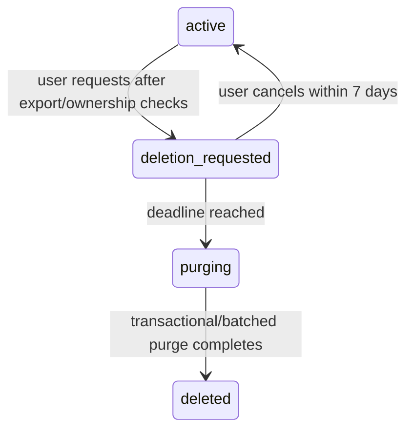

# Campaign Hub data lifecycle

> **Status:** Current behavior plus approved Phase 6 policy
> **Last verified:** 2026-09-02
> **Owner:** Campaign Hub maintainers

## Data inventory

| Data | Purpose | Visibility | Current retention |
|---|---|---|---|
| Internal account id/display name/status | Identity and UI | account; campaign members see display name | account lifetime |
| GitHub provider subject | Stable login binding | BFF/store only | account lifetime |
| Session token hash/user agent/timestamps | Authentication/device diagnostics | account/BFF only | expiry/revoke; automated 30-day technical cleanup pending |
| Campaign/member/role | Authorization and campaign roster | active campaign members | campaign/account lifecycle |
| Invite token hash/role/usage/expiry | Join authorization | creator/authority; raw token returned at creation | expiry/revoke; automated 30-day cleanup pending |
| Raw invite token in browser | Share/redeem invite and survive OAuth round-trip | visible in creator output/link; recipient URL fragment then `sessionStorage["hub-pending-invite"]` until redemption attempt completes | cleared from URL immediately and from sessionStorage after success or failure |
| Character document | Player state, including notes/backstory | owner and campaign DM/co-DM full; other members receive the owner's chosen peer profile | owner lifetime/export/archive/deletion |
| Character sharing policy | Owner's projection choices | owner only; DMs see its computed result, never the raw policy | character lifetime |
| Campaign brew/rules versions | Shared campaign content/policy | campaign members | campaign lifetime |
| Private DM workspace | DM Board | owning DM membership only | membership/campaign/account lifecycle |
| Roll/action/transfer history | Campaign play history | event visibility rules | retained until campaign/account deletion |
| Party inventory | Shared assets | campaign members; mutations role/ownership controlled | campaign lifetime |
| Audit entries | Security/admin evidence | BFF/operators; no public API | retained; actor/campaign refs nullable |
| Domain events | Ordered replay/history | visibility-filtered | retained until campaign/account deletion |
| Character Sheet realtime delivery | Ordered metadata/lifecycle handoff for the open owned character | current authenticated campaign page only | memory only; fenced and discarded on switch/detach/access loss/logout/unload |
| Outbox rows | Technical delivery | BFF/operators | published 7-day cleanup approved, not implemented |
| Command receipts | Idempotent retry | BFF/store | 24 hours |
| Semantic operations/commands | Effect lifecycle, stable exactly-once replay, resulting revision/event linkage | authorized participants; BFF/store command records | campaign/account lifecycle; not pruned as technical receipts |
| Character target references/watermarks | Opaque peer targeting and owner/DM replay reconciliation | target ref only in authorized profiles/truth; watermark owner/DM truth only | character lifetime; target ref rotates on detach/move/archive/reactivation |
| Encrypted backup archives | Recovery | operators | nightly/off-machine policy; must age deleted data out |
| Operational runs | Maintenance/backup/restore evidence | operators/metrics; no user content | bounded retention policy finalized with provider scheduling |

## Privacy boundary

- DMs/co-DMs can read the complete sheet, including notes and backstory, plus the exact `peerPreview` other
  members receive. They do not receive the owner's raw sharing configuration.
- Other members receive one recipient-independent peer profile built from the versioned catalog in
  `server/src/character-projection.js` and filtered by the owner's policy
  ([ADR 0011](adr/0011-authorization-scoped-character-projections.md)). Existing characters default to the
  `table` preset.
- Peer values are derived into a typed view model, never copied from the source document; `ownerAccountId`,
  raw policy, internal item ids, document paths and omitted truth are not peer fields.
- A policy that cannot be validated fails closed: peers receive no data fields — indistinguishable from the
  `private` preset — while owner/DM management receives `PROJECTION_POLICY_INVALID`.
- Owner attribution on the roster is campaign metadata carrying a membership id, gated on the character's
  identity being peer-visible; a character with hidden identity is not peer-targetable.
- Shared events carry no owner association for a character whose identity is hidden. Payload stripping alone is
  insufficient because the envelope names the actor beside the aggregate id, so `character.created` and the
  privacy-setting invalidation itself are actor-redacted for peers. Attribution survives wherever it is
  independently authorized — the actor, the owner, a DM, or once identity is peer-visible and the roster
  already carries the association.
- Derived `abilities`, `saves`, `skills` and `ac` are produced by loading the document into a real
  `CharacterSheetState` (`server/src/character-derived-stats.js`) and reading the same methods the owner's sheet
  displays. Earlier revisions hand-ported that math and three review rounds each found a different term missing
  — proficiency-bonus items, Blood Hunter Dark Augmentation, TGTT Linguistics, dynamic feature modifiers — so
  the port was replaced by the authority itself. Parity is enforced by
  `test/jest/hub/HubProjectionSheetParity.test.js`, whose fixtures are authored through the sheet's own API:
  `customModifiers` is a cache the sheet rebuilds on load, so a fixture that writes it directly asserts a state
  no reader ever sees.
- Projected statistics are the character's **baseline**: what it is, not what it is doing this round. Active
  states, combat stances and ability substitutions are stripped from the document *before* it reaches the sheet
  calculation, so a live Rage or Bless cannot move a projected save, skill or AC.

  This is a product boundary, not a technical limitation. Those toggles *are* persisted — the sheet calls
  `_saveCurrentCharacter()`, the repository patches the diff, and the server emits an invalidation like any
  other change — so they could be projected. They are excluded because a Rage or Bless bonus describes a moment
  in an encounter rather than the character a peer is looking up, and because a roster that flickered with
  every toggle would be noise. See ADR 0011.
- When the sheet cannot read a document, `saves` and `skills` are omitted rather than approximated: a modifier
  the projection cannot stand behind would silently disagree with the sheet the owner reads.
- Derivation runs with the console silenced. The sheet is browser code that warns about, for example,
  unresolvable named modifiers — quoting the modifier's name and raw value, private character data that has not
  passed the projection boundary and would otherwise reach operational logs on every derivation.
- Shared event visibility fails closed when the character row is absent. Account purge hard-deletes the
  character while retaining the campaign's domain events, and a deleted row cannot demonstrate that its owner
  ever chose to share an identity, so deleting an account must not retroactively publish rows that were
  suppressed while it existed. DMs retain the audit trail.
- A private DM workspace belongs to one membership, not all campaign DMs.
- Explicit-account events still include all campaign DMs/co-DMs by policy.
- Applied semantic-operation details are explicit-recipient data. Peer projections and peer resync refs never
  carry `operationWatermark`; shared projection invalidations remain metadata-only.
- Browser cache/service worker must never cache authenticated API/auth responses.
- The Character Sheet realtime coordinator keeps no durable event queue or payload cache. It passes only the
  open target's projection metadata and explicit-recipient semantic-operation lifecycle payloads through
  ephemeral callbacks serialized behind saves. Payloads are not written to local/session storage, recovery
  artifacts, telemetry, or logs.

The private pilot must disclose DM full-sheet access and account/export/deletion behavior before users upload
characters.

## Creation and update

### Account/session

OAuth creates or updates one account by immutable provider subject. Successful reauthentication creates a new
session and revokes the prior browser session discovered during callback. Session tokens exist only in
cookies; PostgreSQL stores hashes.

### Campaign

Campaign creation creates owner membership, audit, first ordered event, outbox row, and receipt
transactionally.

### Character

Import/claim validates and sanitizes the whole document, applies the 1.5 MB post-sanitize quota, and scopes
`client_import_id` by owner/campaign. Repeating the same scoped import returns/reactivates rather than
duplicating. Clone creates independent identity. Move preserves character identity but clears
`client_import_id`; re-uploading the same original local sheet in the target campaign is therefore a new
claim rather than deduplication against the moved row.

### Content

Brew/rules versions are append-only. Activation changes the campaign pointer. Rollback means reactivating a
prior immutable version; it never rewinds character state.

## Archive and detachment

Character archive preserves the owned document and removes it from active listing. Campaign archive:

- blocks while a reserved transfer exists;
- cancels proposed actions;
- terminalizes proposed semantic operations with minimized explicit-recipient events;
- releases character leases;
- detaches characters by setting campaign to null and clearing scoped import id;
- preserves player ownership;
- marks the campaign archived.

Archive is not hard deletion.

Archived campaigns remain readable through current campaign/list endpoints but are mutation-closed:
transactional membership lookup requires `campaigns.status = 'active'`, so later campaign mutations report
`CAMPAIGN_NOT_FOUND` rather than a special read-only error.

## Current deletion behavior

Database constraints and migration 0002 support the implemented seven-day deletion workflow. A naive account
delete remains forbidden:

- campaigns and characters reference owner accounts without cascade;
- identities, sessions, memberships, and receipts cascade after dependencies are resolved;
- audit/domain actor references can become null;
- campaign deletion cascades campaign-owned children but characters must be detached first.

Direct `DELETE FROM hub.accounts` is not an approved operational procedure; use the request/cancel flow and
bounded `hub:purge-accounts` processor.

## Account-deletion lifecycle

Implemented policy:

1. Offer export first.
2. Block while the account owns an active campaign.
3. Require ownership transfer or campaign archive.
4. Set request/deadline; revoke ordinary sessions and freeze mutations.
5. Allow restricted reauthentication for export/cancellation during grace.
6. Once purge starts, cancellation is forbidden.
7. Purge identities, sessions, memberships, private workspaces, owned characters, and personal data.
8. Null/anonymize actor references that must remain for tenant audit integrity.
9. Record purge evidence without copying deleted data.
10. Return both purged and blocked account ids so operators can detect an overdue ownership conflict.
11. Document the date by which PITR/backup retention can no longer restore deleted content.

## Retention policy

Approved private-V1 policy:

- user-visible campaign history: campaign/account deletion;
- ordinary command receipts: 24 hours;
- semantic command/operation replay records: campaign/account lifecycle, so stable command/operation/event
  identity survives receipt cleanup;
- published outbox rows: 7 days;
- expired/revoked sessions and invites: 30 days;
- leases: revoked with sessions/member removal; expired rows may be reused immediately; old-row cleanup is Phase 6E;
- backups: managed PITR + nightly encrypted portable backup, with rotation chosen to meet RPO <=24h and
  RTO <=4h while documenting deletion aging.

The portable backup uses AES-256-GCM, a random IV, authenticated envelope, mode-0600 output, and no retained
plaintext temporary file. The encryption key is stored separately from the archive. Success/failure evidence
uses a dedicated database role limited to `operational_runs`.

Only technical cleanup is automatic. Do not prune roll/action/domain history under the technical policy.

## Exports

Current account export includes:

- account;
- the account's memberships;
- campaigns reachable through those memberships;
- all owned characters;
- audit entries where the account is actor.

It does not export another user's full character or another DM's private workspace. Lifecycle reviews must
compare the export against the deletion/privacy disclosure and add any newly introduced user-owned data.

## Backup and restore

- Portable backups use custom-format `pg_dump`.
- Restore uses `--clean --if-exists --single-transaction`.
- Credentials are passed through libpq environment fields, not process argument URLs.
- Restores are performed only into an isolated drill database.
- Oracle intentionally has no managed PITR. Encrypted backup, off-machine copy, and restore tooling exist; their
  scheduled target-environment proof remains V1-G1 in the [living roadmap](roadmap.md).

## Reserved fields without active lifecycle

Semantic proposals advance to `expired` once after their bounded 24-hour deadline when listed/resolved or by
lifecycle processing. Transfer expiry and several deleting/deleted statuses remain reserved. Membership
removed/left and account deletion_requested are active behavior.
