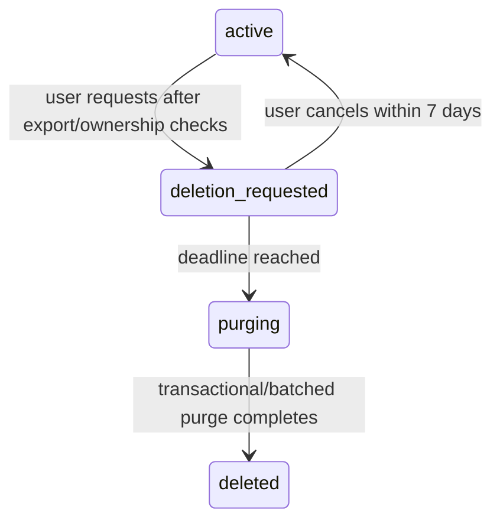

# Campaign Hub data lifecycle

> **Status:** Current behavior plus approved Phase 6 policy
> **Last verified:** 2026-08-24
> **Owner:** Campaign Hub maintainers

## Data inventory

| Data | Purpose | Visibility | Current retention |
|---|---|---|---|
| Internal account id/display name/status | Identity and UI | account; campaign members see display name | account lifetime |
| GitHub provider subject | Stable login binding | BFF/store only | account lifetime |
| Session token hash/user agent/timestamps | Authentication/device diagnostics | account/BFF only | expiry/revoke; automated 30-day technical cleanup pending |
| Campaign/member/role | Authorization and campaign roster | active campaign members | campaign/account lifecycle |
| Invite token hash/role/usage/expiry | Join authorization | creator/authority; raw token returned at creation | expiry/revoke; automated 30-day cleanup pending |
| Raw invite token in browser | Share/redeem invite and survive OAuth round-trip | visible in creator output/link; recipient URL fragment then `sessionStorage["hub-pending-invite"]` until redemption attempt completes | cleared from URL immediately and from sessionStorage after success or failure |
| Character document | Player state, including notes/backstory | owner and campaign DM/co-DM full; other players fixed projection | owner lifetime/export/archive/deletion |
| Campaign brew/rules versions | Shared campaign content/policy | campaign members | campaign lifetime |
| Private DM workspace | DM Board | owning DM membership only | membership/campaign/account lifecycle |
| Roll/action/transfer history | Campaign play history | event visibility rules | retained until campaign/account deletion |
| Party inventory | Shared assets | campaign members; mutations role/ownership controlled | campaign lifetime |
| Audit entries | Security/admin evidence | BFF/operators; no public API | retained; actor/campaign refs nullable |
| Domain events | Ordered replay/history | visibility-filtered | retained until campaign/account deletion |
| Outbox rows | Technical delivery | BFF/operators | published 7-day cleanup approved, not implemented |
| Command receipts | Idempotent retry | BFF/store | 24 hours |
| Backup archives/PITR | Recovery | operators/provider | policy pending Phase 6E; must age deleted data out |
| Operational runs | Maintenance/backup/restore evidence | operators/metrics; no user content | bounded retention policy finalized with provider scheduling |

## Privacy boundary

- DMs/co-DMs can read the complete sheet, including notes and backstory.
- Other players receive only keys allowlisted by `projectCharacterForPlayer`.
- A private DM workspace belongs to one membership, not all campaign DMs.
- Explicit-account events still include all campaign DMs/co-DMs by policy.
- Browser cache/service worker must never cache authenticated API/auth responses.

The private pilot must disclose DM full-sheet access and account/export/deletion behavior before users upload
characters.

## Creation and update

### Account/session

OAuth creates or updates one account by immutable provider subject. Successful reauthentication creates a new
session and revokes the prior browser session discovered during callback. Session tokens exist only in
cookies; PostgreSQL stores hashes.

### Campaign

Campaign creation creates owner membership, audit, first ordered event, outbox row, and receipt
transactionally.

### Character

Import/claim validates and sanitizes the whole document, applies the 1.5 MB post-sanitize quota, and scopes
`client_import_id` by owner/campaign. Repeating the same scoped import returns/reactivates rather than
duplicating. Clone creates independent identity. Move preserves character identity but clears
`client_import_id`; re-uploading the same original local sheet in the target campaign is therefore a new
claim rather than deduplication against the moved row.

### Content

Brew/rules versions are append-only. Activation changes the campaign pointer. Rollback means reactivating a
prior immutable version; it never rewinds character state.

## Archive and detachment

Character archive preserves the owned document and removes it from active listing. Campaign archive:

- blocks while a reserved transfer exists;
- cancels proposed actions;
- releases character leases;
- detaches characters by setting campaign to null and clearing scoped import id;
- preserves player ownership;
- marks the campaign archived.

Archive is not hard deletion.

Archived campaigns remain readable through current campaign/list endpoints but are mutation-closed:
transactional membership lookup requires `campaigns.status = 'active'`, so later campaign mutations report
`CAMPAIGN_NOT_FOUND` rather than a special read-only error.

## Current deletion behavior

Database constraints and migration 0002 support the implemented seven-day deletion workflow. A naive account
delete remains forbidden:

- campaigns and characters reference owner accounts without cascade;
- identities, sessions, memberships, and receipts cascade after dependencies are resolved;
- audit/domain actor references can become null;
- campaign deletion cascades campaign-owned children but characters must be detached first.

Direct `DELETE FROM hub.accounts` is not an approved operational procedure; use the request/cancel flow and
bounded `hub:purge-accounts` processor.

## Account-deletion lifecycle

Implemented policy:

1. Offer export first.
2. Block while the account owns an active campaign.
3. Require ownership transfer or campaign archive.
4. Set request/deadline; revoke ordinary sessions and freeze mutations.
5. Allow restricted reauthentication for export/cancellation during grace.
6. Once purge starts, cancellation is forbidden.
7. Purge identities, sessions, memberships, private workspaces, owned characters, and personal data.
8. Null/anonymize actor references that must remain for tenant audit integrity.
9. Record purge evidence without copying deleted data.
10. Return both purged and blocked account ids so operators can detect an overdue ownership conflict.
11. Document the date by which PITR/backup retention can no longer restore deleted content.

## Retention policy

Approved private-V1 policy:

- user-visible campaign history: campaign/account deletion;
- command receipts: 24 hours;
- published outbox rows: 7 days;
- expired/revoked sessions and invites: 30 days;
- leases: revoked with sessions/member removal; expired rows may be reused immediately; old-row cleanup is Phase 6E;
- backups: managed PITR + nightly encrypted portable backup, with rotation chosen to meet RPO <=24h and
  RTO <=4h while documenting deletion aging.

The portable backup uses AES-256-GCM, a random IV, authenticated envelope, mode-0600 output, and no retained
plaintext temporary file. The encryption key is stored separately from the archive. Success/failure evidence
uses a dedicated database role limited to `operational_runs`.

Only technical cleanup is automatic. Do not prune roll/action/domain history under the technical policy.

## Exports

Current account export includes:

- account;
- the account's memberships;
- campaigns reachable through those memberships;
- all owned characters;
- audit entries where the account is actor.

It does not export another user's full character or another DM's private workspace. Phase 6B must review the
export against the deletion/privacy disclosure and add any user-owned data needed for completeness.

## Backup and restore

- Portable backups use custom-format `pg_dump`.
- Restore uses `--clean --if-exists --single-transaction`.
- Credentials are passed through libpq environment fields, not process argument URLs.
- Restores are performed only into an isolated drill database.
- Managed-provider PITR and scheduled encrypted backup export are not yet configured.

## Reserved fields without active lifecycle

The schema permits action/transfer expiry and several deleting/deleted statuses, but current authority does
not advance those automatically. Membership removed/left and account deletion_requested are active behavior.
