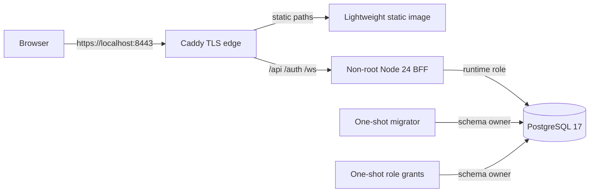

# Campaign Hub portable deployment

> **Status:** OCI/Compose reference implemented and locally verified
> **Last verified:** 2026-08-25
> **Owner:** Campaign Hub maintainers

## Purpose

The reference stack proves the provider-independent runtime contract. It is suitable for local/staging
verification. Production should use managed PostgreSQL/PITR and provider secret/network/observability
services while preserving the same service boundaries.

## Topology



Startup order:

1. PostgreSQL initializes UTF-8 data and creates `hub_runtime`/`hub_backup` login roles.
2. Database health passes.
3. Migrator applies 0001/0002 under the owner credential.
4. Role grant job idempotently creates any newly introduced login role when supplied its password, then
   assigns runtime DML, backup read-only, and operations-evidence privileges/defaults.
5. BFF starts under `hub_runtime`, passes `/api/live` and `/api/ready`.
6. Edge starts and publishes one host port.

## Images

### BFF

`server/Dockerfile`:

- pinned Node `24.7.0-bookworm-slim`;
- multi-stage deterministic production-only `npm ci`;
- configurable `NPM_REGISTRY` build argument, public registry by default;
- retry policy for transient registry failures;
- only package metadata, `server/`, and shared `hub-json-patch.js`;
- UID/GID 10001;
- OCI source/revision/version labels;
- `/api/live` health check;
- compatible with read-only root filesystem and bounded `/tmp`.

Locally verified size: approximately 85 MB.

### Static site

The existing root `Dockerfile` remains the upstream/static release image and is not changed in purpose. The
portable reference uses `deploy/hub/static.Dockerfile`, a small Caddy file-server image over the existing
static `.dockerignore` context. This avoids inheriting the multi-gigabyte upstream image solely for staging.

Locally verified reference size: approximately 70 MB.

## Local reference stack

```bash
cp server/.env.compose.example .env.hub
# Replace every placeholder. .env.hub is gitignored.

docker compose --env-file .env.hub -f compose.hub.yml config --quiet
docker compose --env-file .env.hub -f compose.hub.yml up --build -d

curl --fail --insecure https://localhost:8443/api/live
curl --fail --insecure https://localhost:8443/api/ready
curl --fail --insecure https://localhost:8443/api/session
open https://localhost:8443/hub.html
```

If the environment cannot reach `registry.npmjs.org`, set `HUB_NPM_REGISTRY` to the approved package proxy.
Do not edit the Dockerfile or lockfile to embed a company/private registry.

Stop and remove local data:

```bash
docker compose --env-file .env.hub -f compose.hub.yml down -v --remove-orphans
```

`-v` destroys the local reference database. Never use that command against a production-managed database.

## Services

| Service | Credential | Filesystem/network | Health/restart |
|---|---|---|---|
| `db` | local owner/runtime/backup role passwords | persistent volume; private network only | `pg_isready`, unless-stopped |
| `migrate` | schema owner | private network; one-shot | must exit 0 before grants |
| `grant-roles` | schema owner | private network; one-shot | must exit 0 before BFF |
| `bff` | runtime role + OAuth/cookie/CSRF secrets | read-only root, tmpfs, private DB network + egress bridge; no published port | image liveness + app readiness, unless-stopped |
| `static` | none | static build context, private network | unless-stopped |
| `edge` | local Caddy CA/certificate | fixed private address + public bridge, Caddyfile read-only, persistent CA data | published `8443`, unless-stopped |

Database and static services remain only on `hub-private` (`internal: true`). BFF joins a dedicated
`hub-egress` bridge for outbound GitHub OAuth API calls but publishes no port. Edge joins `hub-public` for its
host port. Edge and BFF share only `hub-private`, forcing Caddy's `bff` DNS/upstream traffic through the edge's
fixed private address `172.30.0.10`; BFF trusts exactly that address for forwarded-client IP/rate-limit
resolution.

## Environment contract

| Variable | Service | Sensitive | Meaning |
|---|---|---:|---|
| `HUB_APP_ORIGIN` | BFF | No | Exact browser origin; production HTTPS, no path |
| `HUB_HOST` / `HUB_PORT` | BFF | No | Container bind address/port |
| `DATABASE_URL` | migrator/grants/BFF | Yes | Owner for jobs; runtime for BFF |
| `HUB_DATABASE_SSL` | all DB clients | No | False only inside local private Compose |
| `HUB_COOKIE_SECRET` | BFF | Yes | Cookie signing; independent 32+ chars |
| `HUB_CSRF_SECRET` | BFF | Yes | CSRF and deterministic invite derivation |
| `HUB_METRICS_TOKEN` | BFF/monitor | Yes | Independent bearer for `/api/metrics` |
| `HUB_LOG_LEVEL` | BFF | No | Structured log threshold |
| `GITHUB_CLIENT_ID` / `GITHUB_CLIENT_SECRET` | BFF | Secret (client secret) | OAuth application |
| `HUB_ALLOWED_OAUTH_SUBJECTS` | BFF | Operationally sensitive | Comma-separated `github:<numeric id>` |
| `HUB_TRUST_PROXY` | BFF | No | Exact trusted proxy IP/CIDR; local reference uses `172.30.0.10` |
| `HUB_CLIENT_IP_HEADER` | BFF | No | Optional provider-set client address; only `do-connecting-ip` is accepted and it is mutually exclusive with `HUB_TRUST_PROXY` |
| `HUB_POSTGRES_PASSWORD` | Compose DB/jobs | Yes | Local schema owner |
| `HUB_RUNTIME_DB_PASSWORD` | Compose DB/BFF | Yes | Local runtime role |
| `HUB_BACKUP_DB_PASSWORD` | Compose DB | Yes | Local read-only backup role |
| `HUB_OPERATIONS_DB_PASSWORD` | Compose DB/backup | Yes | Can select/insert only operational evidence |
| `HUB_BACKUP_ENCRYPTION_KEY` | Backup/restore | Yes | Base64 for exactly 32 random bytes |
| `HUB_IMAGE_VERSION` / `HUB_VCS_REF` | build | No | OCI provenance |
| `HUB_NPM_REGISTRY` | build | No | Approved package registry/proxy |

Reference passwords must be URL-safe because Compose interpolates them into local PostgreSQL URLs. Managed
deployment should inject provider-generated, correctly encoded connection URLs directly.

## Edge contract

The edge must:

- serve static/API/auth/WebSocket through one public origin;
- preserve WebSocket upgrades and long-lived connections;
- forward `/api/*`, `/auth/*`, and `/ws/*` to the BFF;
- forward all other paths to the static service;
- replace, not append untrusted, forwarded headers;
- use exact trusted proxy CIDRs in BFF configuration;
- preserve BFF no-store/security headers;
- support at least the BFF's 2 MB body cap and appropriate WebSocket idle timeout.

The portable Caddy stack uses `HUB_TRUST_PROXY`. The proposed DigitalOcean deployment leaves that value
empty and uses `HUB_CLIENT_IP_HEADER=do-connecting-ip`. The authority rejects enabling both mechanisms. The
provider header is parsed as one IP address and used consistently for structured logs, HTTP rate-limit keys,
and WebSocket connection context; missing, malformed, array, or comma-separated values fall back to the
socket peer.

The local Caddy reference uses `tls internal` and persists its local CA under `hub-caddy-data`. Trust that CA
on a development machine before browser/OAuth testing; `curl --insecure` is acceptable only for local probes.
The secure origin is required because browsers reject `__Host-` cookies without `Secure`. Production uses a
publicly trusted certificate and a separate OAuth application whose callback is
`<HUB_APP_ORIGIN>/auth/github/callback`.

The database health check explicitly probes TCP (`127.0.0.1`) with a 30-second start period. A Unix-socket
probe can report the temporary initialization server healthy before init-role scripts finish.

Role creation is not dependent on `initdb`: the owner-run grant job creates a missing validated role
transactionally when its password is supplied. This is required when upgrading an existing volume to a phase
that introduces a new role.

## Health and shutdown

- `/api/live`: process/event-loop liveness; does not query auth/database.
- `/api/ready` and compatibility `/api/health`: database connectivity + migration ledger/version readiness.
- Cookie-bearing health probes bypass authentication and still report readiness failure as 503.
- SIGTERM closes Fastify, WebSockets/outbox dispatcher, and PostgreSQL pool before exit.

Verified locally:

- one-shot migration/grant jobs;
- BFF runtime role readiness;
- edge static/API/auth/WebSocket routing;
- BFF outbound GitHub reachability without publishing the BFF port;
- secure `__Host-` cookie-compatible local origin and fixed trusted proxy;
- unauthenticated WebSocket upgrade reaches BFF and returns `AUTH_REQUIRED`;
- read-only BFF filesystem;
- graceful container restart and post-restart readiness.

## Production deviations

Do not lift the local Compose database into production unchanged.

Production Phase 6G must provide:

- managed PostgreSQL 17 with PITR/private network/TLS;
- separate migration/runtime/backup credentials in a secret manager;
- immutable image digest promotion;
- provider-native HTTPS/custom domain;
- exact proxy trust;
- scheduled maintenance and nightly encrypted backup export;
- logs/metrics/alerts and isolated restore drill;
- provider scheduler invokes maintenance and encrypted backup profiles;
- no host-published database/BFF/static ports.
- exactly one active BFF replica; shared realtime fanout is not implemented for horizontal scale.

## CI artifact promotion

Phase 6F exports the already-scanned production image as `hub-bff-image.tar` and records its SHA-256,
source/lockfile SHAs, versions, and SBOMs in `hub-ci-provenance.json`. Phase 6G must import that archive,
push it without rebuilding, record the resulting provider registry digest, and deploy by that digest. The
archive SHA-256 is not labeled as an OCI digest. CI also loads this archive, derives the test-auth layer from
it, and separately requires the unmodified image's production entry point to become healthy. See [CI and
provenance](ci-and-provenance.md).
