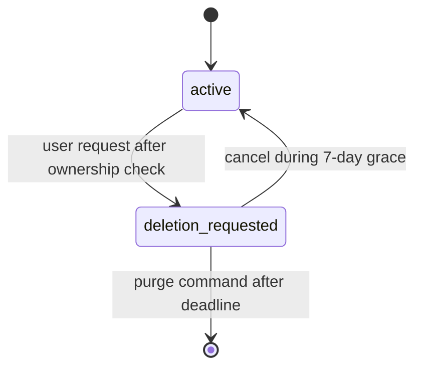
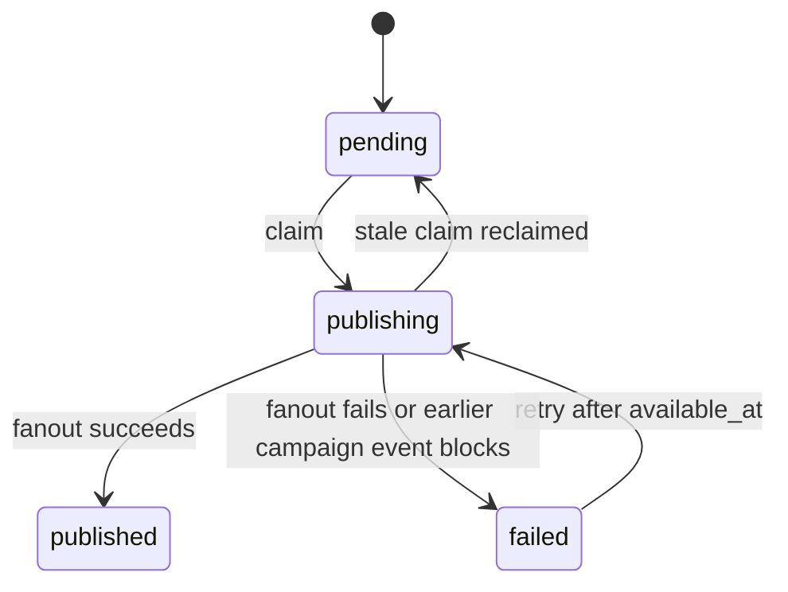

# Campaign Hub domain model

> **Status:** Current schema and authority behavior
> **Last verified:** 2026-08-24
> **Owner:** Campaign Hub maintainers

The authoritative schema is `server/migrations/0001_hub_core.sql`. The PostgreSQL authority is
`server/src/postgres-hub-store.js`; `MemoryHubStore` is a deterministic test double, not a production
security boundary.

## Identity and tenancy

- Internal ids are UUIDs.
- External identity is `(provider, provider_subject)`, where GitHub subject is the immutable numeric user id.
- Username/login is display metadata and is never authorization identity.
- Campaign-owned rows carry `campaign_id`.
- Membership is unique per `(campaign_id, account_id)`.
- Composite foreign keys/triggers enforce that campaign-owned child rows reference objects in the same
  campaign at write time.
- Historical rows may remain after a character is detached/moved; tenant triggers intentionally protect new
  writes rather than making later character moves impossible.

## Tables

| Table | Aggregate/purpose | Important invariants | Current use |
|---|---|---|---|
| `accounts` | Internal user | display name 1-100; active/suspended/deletion_requested/deleted; paired deletion timestamps | Seven-day request/cancel/purge implemented |
| `external_identities` | OAuth link | unique provider+subject; cascade with account | GitHub only in private V1 |
| `sessions` | Browser session | unique token hash; expiry after creation; optional revoke | Hash-only server sessions |
| `campaigns` | Campaign root | owner account; active/archived/deleting; monotonic next event sequence | active and archived used; deleting reserved |
| `memberships` | Account role in campaign | unique campaign+account; dm/co_dm/player/spectator | active, removed, and left used; reinvite reuses row |
| `invites` | Redeemable role grant | hash-only token, expiry, max/use count, optional revoke | create/list/redeem/revoke/expiry/max-use used |
| `brew_bundle_versions` | Immutable campaign brew | campaign version and content hash unique; creator membership | content stored in JSONB; `object_key` reserved |
| `rules_versions` | Immutable typed campaign rules | campaign version unique; schema version | create/activate used |
| `characters` | Canonical character document | owner, optional campaign, schema version, revision, lease epoch, JSON data | active/archive/reactivate/clone/move |
| `character_leases` | One active editor | one row/character; session; epoch; expiry | acquired/taken over/reused; expired rows are passive |
| `dm_workspaces` | Private DM Board document | one per owner membership/campaign; revision/epoch; archive timestamp | archived on removal and restored on reinvite/access |
| `dm_workspace_leases` | One workspace editor | one row/workspace; session; epoch; expiry | same fencing model as character |
| `party_inventories` | Shared campaign container | one per campaign; revision; denomination JSON currency | lazily created |
| `inventory_entries` | Relational party inventory rows and future character-entry model | exactly one character/party parent; quantity >0; metadata JSON | current store writes party rows; character inventory remains embedded JSON |
| `pending_actions` | Structured effect workflow | actor, optional target character, status, payload, optional expiry | proposed -> applied/rejected/cancelled; accepted/expired reserved |
| `transfers` | Escrowed asset workflow | exactly one source and target container, status, escrow payload | created directly as reserved -> committed/rejected/cancelled; proposed/accepted/expired reserved |
| `domain_events` | Ordered client-visible history | unique campaign sequence; visibility and explicit-recipient constraint | replay/live fanout |
| `audit_entries` | Security/admin history | nullable campaign/account/session refs; details JSON | mutations append relevant audit |
| `command_receipts` | Payload-aware idempotency | account+key primary key; request hash; 24h expiry | character payload compacted to reference |
| `outbox_entries` | Transactional delivery queue | one row/event; pending/publishing/published/failed; claim token | claimed/retried/published by dispatcher |

## Aggregate boundaries

### Account

Owns external identities, sessions, characters, memberships, receipts, and authored actions. Campaign ownership
is a blocking dependency. Account export exists; deletion lifecycle is Phase 6B.

### Campaign

Owns memberships, invites, content versions, DM workspaces, party inventory, actions, transfers, ordered
events, and outbox. Audit rows retain history with nullable campaign reference.

### Character

Canonical data remains one JSONB document. `revision` orders accepted state; `lease_epoch` fences devices.
Character inventory/currency currently live inside `data`, not `inventory_entries`. The relational
`character_id` inventory path is schema groundwork and must not be documented as an active dual-write model.

### DM workspace

One canonical Board JSONB document per DM membership. Membership id, not merely campaign id, is the privacy
boundary.

### Party inventory

Currency lives on `party_inventories`; item rows live in `inventory_entries`. The store rewrites party rows
transactionally from the normalized container.

### Action

Contains a structured effect proposal and target. Applying a proposal is a semantic character mutation in the
same transaction as action status, audit, event, outbox, and receipt.

### Transfer

Reservation removes source assets into `payload.escrow`. Resolution writes either target (commit) or source
(restore) and then changes transfer status. Source/target aggregate locks are acquired in sorted id order.

## State machines

### Campaign

```mermaid
stateDiagram-v2
  [*] --> active
  active --> archived: owner archives
  archived --> [*]
  active --> deleting: reserved; not implemented
```

Archive:

- owner only;
- refuses any reserved transfer;
- cancels proposed actions;
- removes active character leases;
- detaches characters to personal ownership and increments revision;
- marks campaign archived and emits audit/event/outbox.

Archived campaigns remain readable but are mutation-closed. Store mutation helpers require an active
campaign, so a later mutation returns `CAMPAIGN_NOT_FOUND` rather than a dedicated read-only error.

### Account

Deletion request revokes sessions and freezes ordinary routes. Reauthentication is intentionally permitted
for export/cancellation. Purge detaches memberships, resolves pending work, deletes owned characters and owned
archived campaigns, anonymizes retained actor references, and reports blocked accounts.

### Membership

```mermaid
stateDiagram-v2
  [*] --> active: campaign owner or invite redemption
  active --> removed: owner/co-DM removal
  active --> left: non-owner leaves or account purge
  [*] --> invited: reserved; not currently persisted
```

Current implementation creates active memberships directly. Removal/leave resolves reserved transfers,
cancels pending actions, releases leases, archives the private workspace, detaches owned campaign characters,
and emits audit/events before making membership inactive.

### Character

```mermaid
stateDiagram-v2
  [*] --> active
  active --> archived: archive
  archived --> active: re-upload same scoped import
  active --> active: patch / clone result / move
  active --> deleted: reserved; not implemented
```

Move changes campaign in place and emits `moved_out` in the source plus `moved` in the target. Clone creates a
new id/document. Archive preserves owner data.

### Pending action

```mermaid
stateDiagram-v2
  [*] --> proposed
  proposed --> applied: accept
  proposed --> rejected: reject
  proposed --> cancelled: target lifecycle change
  proposed --> expired: reserved; not implemented
  proposed --> accepted: reserved intermediate; not used
```

### Transfer

```mermaid
stateDiagram-v2
  [*] --> reserved: source moved to escrow
  reserved --> committed: target accepts
  reserved --> rejected: target rejects; source restored
  reserved --> cancelled: lifecycle cancellation; source restored
  reserved --> expired: reserved; not implemented
```

`proposed` and `accepted` are allowed schema states but current API/store does not persist them.

### Outbox

## Concurrency and locks

| Seed | Lock identity | Purpose |
|---:|---|---|
| 0 | account + idempotency key | serialize command receipt lookup/create |
| 1 | provider + provider subject | serialize first OAuth identity creation |
| 2 | aggregate/container UUID | character mutations and sorted transfer source/target locks |
| 3 | account + client import id | serialize claim/reactivation |
| 4 | campaign id | serialize party inventory creation/write |
| 6 | campaign id | membership/campaign lifecycle serialization |

These seeds are implementation allocations, not a public API. New lock classes must avoid accidental overlap
and document ordering.

## Character inventory invariant

Whole-item transfer is refused if removal would require Character Sheet recalculation:

- equipped or attuned;
- contains items or is inside a container;
- hosts Ioun items or is seated in a host;
- selected/tracked ammunition;
- source of named modifiers, AC formulas, defensive traits;
- referenced by an active state.

Partial stack transfer is allowed because the source wrapper remains. Cross-container commit resets
ownership-local equipped/attuned/starred state and mints a new id unless full wrapper metadata is merge
compatible. Restore preserves source identity/index.

## Known domain gaps

- active enforcement of pending-action/transfer `expires_at`;
- relational character inventory migration/dual-write (not required for current V1 behavior);
- `campaigns.deleting`, `characters.deleted`, membership non-active statuses;
- object storage path for brew `object_key`;
- technical retention worker (account purge exists as a one-shot command).

These gaps are tracked in the private-V1 roadmap and must not be inferred from reserved schema fields.
