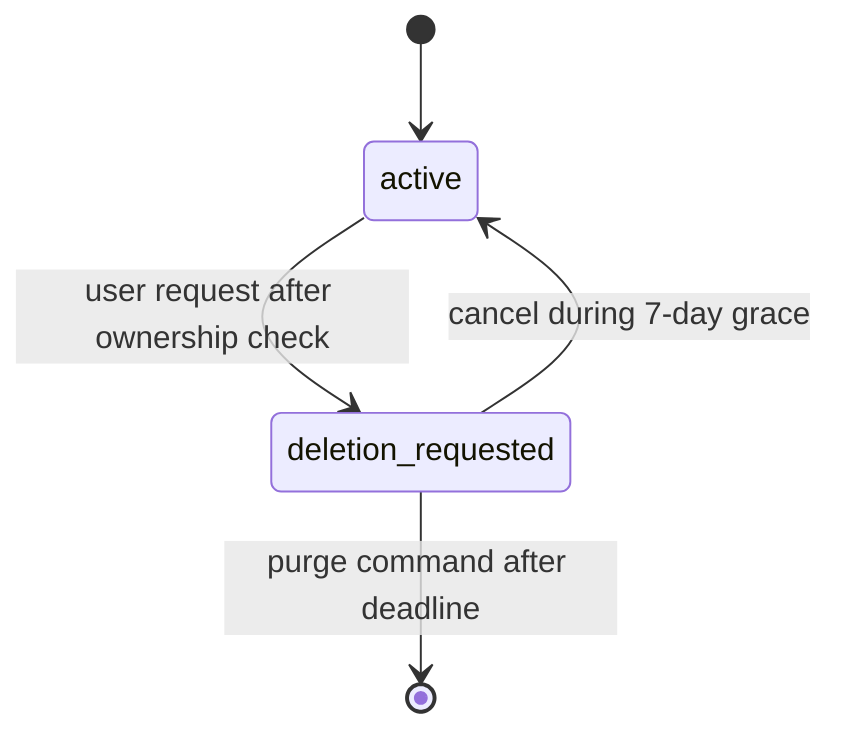
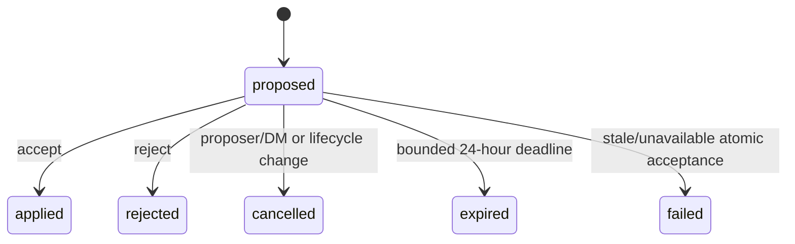
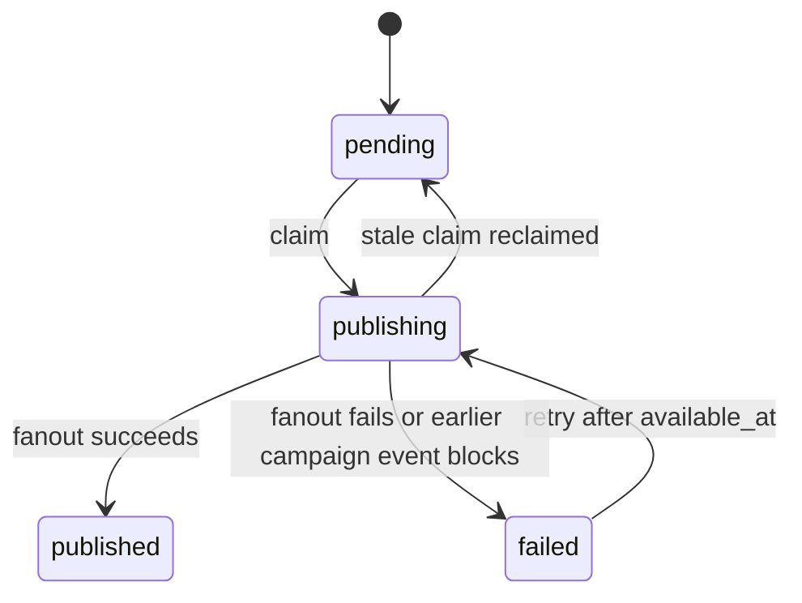

# Campaign Hub domain model

> **Status:** Current schema and authority behavior
> **Last verified:** 2026-09-03
> **Owner:** Campaign Hub maintainers

The authoritative schema is `server/migrations/0001_hub_core.sql` plus immutable migrations through 0009. The PostgreSQL authority is
`server/src/postgres-hub-store.js`; `MemoryHubStore` is a deterministic test double, not a production
security boundary.

## Identity and tenancy

- Internal ids are UUIDs.
- External identity is `(provider, provider_subject)`. GitHub uses its immutable numeric user id; later adapters
  must define their own immutable subject normalization.
- Email, username/login, handle, and display name are metadata and are never authorization or account-selection
  identity.
- Every non-deleted account must retain at least one external identity at transaction commit.
- Campaign-owned rows carry `campaign_id`.
- Membership is unique per `(campaign_id, account_id)`.
- Composite foreign keys/triggers enforce that campaign-owned child rows reference objects in the same
  campaign at write time.
- Historical rows may remain after a character is detached/moved; tenant triggers intentionally protect new
  writes rather than making later character moves impossible.

## Tables

| Table | Aggregate/purpose | Important invariants | Current use |
|---|---|---|---|
| `accounts` | Internal user | display name 1-100; active/suspended/deletion_requested/deleted; paired deletion timestamps | Seven-day request/cancel/purge implemented |
| `external_identities` | OAuth link | unique provider+subject; bounded metadata; account+identity key; deferred last-identity protection; cascade with account | Registry-ready; GitHub only |
| `sessions` | Browser session | unique token hash; expiry after creation; optional revoke; same-account identity provenance; recent-reauthentication slot | Hash-only server sessions |
| `oauth_transactions` | Short-lived OAuth correlation | hash-only one-time state; concrete provider/operation/redirect; optional account/session, invite context, PKCE verifier, OIDC nonce; <=10 minutes | State-selected transaction-specific-cookie start/callback; later reauth/link-ready |
| `invite_contexts` | First-access admission | one invite, hash-only retry handle, <=5 minutes, one unique OAuth transaction binding, terminal account/session/membership ids only after commit | Default-off r9 first-account admission and existing-account atomic invite join |
| `account_entitlements` | Provider-neutral creator/operator authority | active `campaign:create`/`platform:operate`; account cascade; actor FKs set null; one active row/account/type; deferred last-operator protection | Capability-gated campaign creation and hidden operator administration |
| `campaigns` | Campaign root | owner account; active/archived/deleting; monotonic next event sequence | active and archived used; deleting reserved |
| `memberships` | Account role in campaign | unique campaign+account; dm/co_dm/player/spectator | active, removed, and left used; reinvite reuses row |
| `invites` | Redeemable role grant | hash-only token, expiry, max/use count, optional revoke | create/list/redeem/revoke/expiry/max-use used |
| `brew_bundle_versions` | Immutable campaign brew | campaign version and content hash unique; creator membership | content stored in JSONB; `object_key` reserved |
| `rules_versions` | Immutable typed campaign rules/policy | campaign version unique; schema version; schema-v1 settings remain readable; schema-v2 closed-catalog policy stored in existing JSONB | legacy create/activate plus capability-gated atomic publish/rollback |
| `characters` | Canonical character document | owner, optional campaign, schema version, revision, lease epoch, JSON data, random target ref, operation watermark | active/archive/reactivate/clone/move |
| `character_leases` | One active editor | one row/character; session; epoch; expiry | acquired/taken over/reused; expired rows are passive |
| `dm_workspaces` | Private DM Board document | one per owner membership/campaign; revision/epoch; archive timestamp | archived on removal and restored on reinvite/access |
| `dm_workspace_leases` | One workspace editor | one row/workspace; session; epoch; expiry | same fencing model as character |
| `party_inventories` | Shared campaign container | one per campaign; revision; denomination JSON currency | lazily created |
| `inventory_entries` | Relational party inventory rows and future character-entry model | exactly one character/party parent; quantity >0; metadata JSON | current store writes party rows; character inventory remains embedded JSON |
| `pending_actions` | Legacy pre-v3 structured effect workflow | actor, optional target character, status, payload, optional expiry | legacy history only; migration 0005 cancels arbitrary proposed rows |
| `semantic_operations` | Versioned character intent lifecycle | one target, optional source, pinned template/choice/rules/content, optional closed source cost and deterministic seed, source/target result linkage, <=24h proposal expiry | direct applied operation or proposed -> applied/rejected/cancelled/expired/failed |
| `semantic_operation_commands` | Persistent exactly-once command result | global command id, actor/body hash, operation, command type, response/event ids | create/resolve replay and mutated-body rejection |
| `transfers` | Asset-transfer workflow | exactly one source and target container, status, escrow/request payload | direct authority is created as committed; approval-bound escrow is reserved -> committed/rejected/cancelled; player stash withdrawal is proposed -> committed/rejected/cancelled |
| `domain_events` | Ordered client-visible history | unique campaign sequence; visibility and explicit-recipient constraint | replay/live fanout |
| `audit_entries` | Security/admin history | nullable campaign/account/session refs; details JSON | mutations append relevant audit |
| `command_receipts` | Payload-aware idempotency | account+key primary key; request hash; 24h expiry | character payload compacted to reference |
| `outbox_entries` | Transactional delivery queue | one row/event; pending/publishing/published/failed; claim token | claimed/retried/published by dispatcher |
| `operational_runs` | Bounded operator evidence | maintenance/backup/restore_drill; running/succeeded/failed; non-sensitive JSON | metrics and recovery evidence |

## Aggregate boundaries

### Account

Owns external identities, sessions, characters, memberships, receipts, and authored actions. Campaign ownership
is a blocking dependency. Active account entitlements are account-scoped and independent of provider identity
or campaign role. Account export includes the caller's entitlements; deletion lifecycle is Phase 6B.

### Campaign

Owns memberships, invites, content versions, DM workspaces, party inventory, actions, transfers, ordered
events, and outbox. Audit rows retain history with nullable campaign reference.

Rules versions are append-only. Schema-v2 publication locks the campaign, compares the expected active version,
inserts the validated policy, advances the campaign pointer, and writes audit/event/outbox/idempotency evidence in
one commit. Rollback changes only the active pointer to an existing version. Public context projects either schema
to the legacy flat settings object and a bounded summary; the full schema-v2 policy is management-only.

### Character

Canonical data remains one JSONB document. `revision` orders accepted state; `lease_epoch` fences devices.
Character inventory/currency currently live inside `data`, not `inventory_entries`. The relational
`character_id` inventory path is schema groundwork and must not be documented as an active dual-write model.

`data.hp` carries two maxima with different roles. `hp.max` is the Character Sheet's cached base maximum and
is a round-trip input. `hp.effectiveMax` is persisted authority metadata: the applicable maximum the sheet
shows the player, materialised deterministically by `toJson()` from `getMaxHp()` and stripped again on load,
so it is never a calculation input. Semantic operations clamp against it (see ADR 0012) and carry it through
unchanged; the server never derives or recomputes it.

### DM workspace

One canonical Board JSONB document per DM membership. Membership id, not merely campaign id, is the privacy
boundary.

### Party inventory

Currency lives on `party_inventories`; item rows live in `inventory_entries`. The store rewrites party rows
transactionally from the normalized container.

### Semantic operation

Contains a closed version-1 operation and target. DM/co-DM creation applies immediately. A source-derived peer
proposal additionally pins source character/entity/template/choice and requires later explicit target-owner
acceptance. Application commits operation status, target revision, audit, lifecycle event, projection
invalidation, watermark, outbox, and persistent command result in one transaction. Source and target lock in
stable character-id order; supported initial peer templates have no source reservation/mutation.
A target document that cannot supply a positive hit-point maximum fails the whole transaction with
`HP_MAX_UNAVAILABLE` rather than clamping a heal to zero.

### Transfer

Direct DM/co-DM and same-owner character transfers validate and write source, target, terminal transfer, audit,
event, outbox, and receipt in one command. Approval-bound reservation removes source assets into
`payload.escrow`; resolution writes either target (commit) or source (restore) and then changes transfer status.
Source/target aggregate locks are acquired in sorted id order for both paths.

## State machines

### Campaign

```mermaid
stateDiagram-v2
  [*] --> active
  active --> archived: owner archives
  archived --> [*]
  active --> deleting: reserved; not implemented
```

Archive:

- owner only;
- refuses any reserved transfer;
- cancels proposed actions;
- removes active character leases;
- detaches characters to personal ownership and increments revision;
- marks campaign archived and emits audit/event/outbox.

Archived campaigns remain readable but are mutation-closed. Store mutation helpers require an active
campaign, so a later mutation returns `CAMPAIGN_NOT_FOUND` rather than a dedicated read-only error.

### Account

Deletion request revokes sessions and freezes ordinary routes. Reauthentication is intentionally permitted
for export/cancellation. Purge detaches memberships, resolves pending work, deletes owned characters and owned
archived campaigns, anonymizes retained actor references, and reports blocked accounts.

### Membership

```mermaid
stateDiagram-v2
  [*] --> active: campaign owner or invite redemption
  active --> removed: owner/co-DM removal
  active --> left: non-owner leaves or account purge
  [*] --> invited: reserved; not currently persisted
```

Current implementation creates active memberships directly. Removal/leave resolves reserved transfers,
cancels pending actions, releases leases, archives the private workspace, detaches owned campaign characters,
and emits audit/events before making membership inactive.

### Character

```mermaid
stateDiagram-v2
  [*] --> active
  active --> archived: archive
  archived --> active: re-upload same scoped import
  active --> active: patch / clone result / move
  active --> deleted: reserved; not implemented
```

Move changes campaign in place and emits `moved_out` in the source plus `moved` in the target. Clone creates a
new id/document. Archive preserves owner data.

### Pending action

Direct DM/co-DM commands begin and end at `applied`; they do not create a `proposed` row. Acceptance has a
distinct command id but retains the proposal's operation id. Reject/cancel/expire/failed are terminal. A
cost-bearing acceptance changes source and target together, or neither; self-targeting writes one combined
revision.

### Transfer

```mermaid
stateDiagram-v2
  [*] --> proposed: player requests party item; stash unchanged
  proposed --> committed: DM approves; source and target change atomically
  proposed --> rejected: DM declines or requester cancels; stash unchanged
  proposed --> cancelled: lifecycle cancellation; stash unchanged
  [*] --> committed: server-authorized DM/co-DM or same-owner move
  [*] --> reserved: source moved to escrow
  reserved --> committed: target accepts
  reserved --> rejected: target rejects; source restored
  reserved --> cancelled: lifecycle cancellation; source restored
  reserved --> expired: reserved; not implemented
```

`proposed` is persisted only for a player request from party inventory to that player's own character. The
request stores normalized quantities and a server-derived preview, but the shared source remains untouched
until a DM/co-DM accepts. Acceptance locks both participants, rechecks the live source, and transfers the
fresh canonical escrow in one transaction; `TRANSFER_INSUFFICIENT` leaves the request proposed. `accepted`
remains an unused schema state. The direct path has no `reserved` state visible to a recipient: authority is
derived from trusted membership role and target ownership, and the initial idempotent proposal either commits
both containers or changes neither.

### Outbox

## Concurrency and locks

| Seed | Lock identity | Purpose |
|---:|---|---|
| 0 | account + idempotency key | serialize command receipt lookup/create |
| 1 | provider + provider subject | serialize first OAuth identity creation |
| 2 | aggregate/container UUID | character mutations and sorted transfer source/target locks |
| 3 | account + client import id | serialize claim/reactivation |
| 4 | campaign id | serialize party inventory creation/write |
| 6 | campaign id | membership/campaign lifecycle serialization |
| 7 | platform operator namespace | serialize operator grant/revoke/deletion checks before entitlement/account rows |

These seeds are implementation allocations, not a public API. New lock classes must avoid accidental overlap
and document ordering.

OAuth state consumption additionally uses the transaction row's unique state hash and row lock. Account,
identity, and session creation for an unknown admitted sign-in commit together, so a failed session insert
cannot leave an orphan identity/account.

Account-entitlement commands acquire locks in this total order: idempotency advisory, operator namespace,
entitlement row, account row, identities, sessions, leases, then any later campaign/invite authority. Campaign
creation checks `campaign:create` before acquiring campaign authority or writing a receipt. Entitlement commands
append account audit only and never campaign events or outbox rows.

Invite authority uses identity/account locking first when a callback has identity, then campaign advisory lock
seed 6, campaign row, and invite row. Other invite mutations use the same campaign-row-invite order. OAuth first
access adds session/membership work only after complete revalidation. The invite context is the
pre-account bootstrap command identity; it records a complete terminal account/session/membership outcome or
remains unconsumed.

## Character inventory invariant

Whole-item transfer is refused if removal would require Character Sheet recalculation:

- equipped or attuned;
- contains items or is inside a container;
- hosts Ioun items or is seated in a host;
- selected/tracked ammunition;
- source of named modifiers, AC formulas, defensive traits;
- referenced by an active state.

Partial stack transfer is allowed because the source wrapper remains. Cross-container commit resets
ownership-local equipped/attuned/starred state and mints a new id unless full wrapper metadata is merge
compatible. Comparison removes only deterministic Character Sheet aliases and empty composition defaults;
spent charges, non-empty upgrades/gemstones, custom metadata, provenance, and other semantic differences remain
stack-separating. Restore preserves source identity/index.

Open-sheet authoritative reconciliation uses the same deterministic-alias and immutable-repair-catalog
comparison as post-save reconciliation. Trusted hydration is limited to non-custom official UIDs, and
comparison patches take add/replace values from the raw local candidate before applying to raw canonical truth.
Semantically identical local/server candidates therefore converge without deleting either player metadata or
canonical item metadata. An ordinary recovery conflict clears automatically only when the overlap is gone and
every draft discarded by an earlier authoritative rebase is semantically represented by a surviving
base/local/server candidate. Unique local intent remains exportable behind explicit conflict recovery, and
live-operation conflicts are never cleared through this shortcut. A failed-write recovery marker is removed
only when its draft is already represented by canonical truth; disjoint unsaved edits retain their retry and
reload recovery state. Ordered browser recovery commands carrying one-shot activity have a persisted absolute
23-hour replay deadline. Expired activity, missing deadline proof, or a stable non-recoverable failed head blocks
later saves behind one complete export/use-server choice. Transactional `POLICY_VERSION_STALE` rejection is
recoverable only after canonical refetch and stale derived carry removal; the changed request is durably persisted
under a new key before retry. Revision conflict proves no successful receipt matched, so an activity-bearing
command retains its semantic activity after rebase even when the document patch becomes empty.

## Atomic item-award invariant

A DM/co-DM award is one command for an ordered unique target set. Every target receives the same whole-number
quantity, or no target changes. A stash-backed award locks and debits the selected authoritative stack once for
the full `quantity * target count`, preserves transferable stack metadata through the existing inventory
normalization, and commits that debit with every destination write. Catalog-like command bodies and
`item.granted` events carry only bounded safe summary metadata, but the authority resolves `name|source` from
the generated site catalog or active campaign brew and stores the complete trusted item. New events retain
their resolved site/campaign authority; legacy Recent identity may resolve only when exactly one authority owns
the UID. Stash-derived grants remain selectable only through the live authoritative party stack rather than a
Recent `name|source` projection. A campaign item cannot shadow a site UID. Unknown, source-kind-mismatched, duplicate, or cross-authority
ambiguous identities fail; browser metadata never becomes canonical merely because it is present in the summary.
Simple campaign `_copy` resolution also removes the generic/item parent-only publication fields that the site
copy system preserves only by explicit request. All destination inventory changes delete derived `data.carry`
authority instead of recomputing it without a Character Sheet.

When a legacy summary-only inventory row is opened in the Character Sheet, item identity is repaired from an
exact `name|source` match in an immutable repository-owned site/variant repair projection. Before enhanced item
loading begins, the sheet snapshots only the authoritative repair-sensitive fields needed for that decision.
The corresponding broad repair match comes from a separate enhanced site-plus-variant authority, so a mutable
catalog collision cannot borrow the pristine identity and inject other fields. Mutable prerelease or brew
catalogs cannot retroactively supply an old summary's entries/effects without exact
historical provenance. Authored site metadata therefore survives save and later stack comparison while
cross-authority substitutions, injected render caches, and publication hints remain excluded. Hub characters
also bypass the local-save catalog effect hydrator, so complete or typeless authoritative inventory is not
rewritten when the current client brew changes.

## Known domain gaps

- active enforcement of pending-action/transfer `expires_at`;
- relational character inventory migration/dual-write (not required for current V1 behavior);
- `campaigns.deleting`, `characters.deleted`, membership non-active statuses;
- object storage path for brew `object_key`;
- provider scheduling/alerting for the implemented maintenance/backup commands.

These gaps are tracked in the [living roadmap](roadmap.md) and must not be inferred from reserved schema fields.
