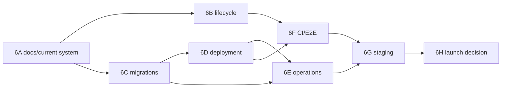

# Campaign Hub private-V1 launch roadmap

> **Status:** Approved continuation plan
> **Current phase:** Phase 6F CI and real-stack integration testing
> **Last reviewed:** 2026-08-24
> **Owner:** Campaign Hub maintainers

## Scope

This roadmap finishes private invite-only V1 deployment/readiness. It does not commit the post-V1 features in
[post-v1-roadmap.md](post-v1-roadmap.md).

Decisions:

- provider-portable OCI/Compose contract before provider selection;
- existing root Dockerfile remains static-site only;
- managed PITR plus nightly encrypted portable backup;
- RPO <=24 hours and RTO <=4 hours;
- user-visible campaign history retained until campaign/account deletion;
- technical records pruned on short schedules;
- user-requested account deletion with ownership checks and 7-day grace;
- semi-public onboarding remains disabled.

## Phase 6A — current-system handoff

Deliver:

- current system, architecture, domain, API, realtime, event, data-lifecycle, implementation-history,
  traceability, risks, testing, staging, troubleshooting, contributor, runbook-index, and post-V1 references;
- ADRs 0004-0008;
- documentation contract tests;
- explicit labels for current, planned, deferred, and rejected behavior;
- deliberate checkpoint/PR strategy for the Phase 0-5 working tree.

Exit:

- a new contributor can navigate requirement -> decision -> implementation -> test -> runbook;
- no repository documentation depends on session/chat history;
- old proof documents point to current references.

## Phase 6B — lifecycle administration (implemented)

Deliver:

- invite listing/revocation;
- member role change/removal with owner/last-DM protection;
- session/device list and revoke-one/revoke-others;
- user deletion request, export, ownership gate, seven-day grace, cancellation, purge, audit anonymization;
- transactional resolution of leases, sockets, actions, transfers, workspaces, and character detachment.

Exit:

- ordinary admin/recovery does not need manual database edits;
- authorization, idempotency, lifecycle, and PostgreSQL tests cover every transition;
- removal cannot delete a player's character or strand escrow.

## Phase 6C — migration management (implemented through 0002)

Deliver:

- immutable 0001 baseline;
- checksummed `schema_migrations` ledger;
- advisory-locked `status`, `plan`, and `apply`;
- fresh and verified pre-ledger baselining;
- migration 0002 for lifecycle changes;
- migration/runtime/backup roles;
- migration-aware readiness;
- forward-only/restore rollback policy.

Exit:

- fresh, baseline, upgrade, current, concurrent, checksum-failure, failed-migration, and restore paths pass;
- runtime role cannot alter schema;
- app/database version skew fails readiness.

## Phase 6D — portable deployment (implemented locally)

Deliver:

- separate Node 24 non-root BFF image;
- Dockerfile-specific context rules;
- PostgreSQL/migrator/BFF/static/edge/maintenance reference Compose stack;
- same-origin HTTPS/WebSocket proxy contract;
- live versus ready probes;
- graceful drain and clean-machine smoke;
- complete environment/secret reference.

Exit:

- one documented command path starts a clean reference stack;
- migrations precede readiness exactly once;
- no image/log/config contains secrets;
- root static image remains unchanged in purpose.

## Phase 6E — operations and observability (portable foundation implemented)

Deliver:

- singleton bounded maintenance;
- receipt/outbox/session/invite cleanup and deletion purge;
- redacted structured logs/correlation ids;
- portable metrics, SLOs, and alerts;
- build/protocol/migration metadata;
- PITR, nightly encrypted backup, isolated restore evidence;
- deploy/rollback/outage/outbox/backup/restore/compromise/rotation/incident runbooks.

Exit:

- technical cleanup cannot delete user-visible history;
- induced failures are visible without content leakage;
- restore demonstrates RPO/RTO;
- a second operator can use the runbooks without undocumented knowledge.

## Phase 6F — CI and real integration

Deliver:

- Node 24/PostgreSQL 17 Hub PR workflow;
- deterministic install, lint, affected suites, migration matrix, PWA/docs checks;
- OCI/Compose smoke;
- secret/dependency/image scan, SBOM, immutable provenance;
- disposable real-stack Playwright with test-only auth impossible in production;
- multi-context, load, contention, reconnect, restart, and outbox failure coverage.

Exit:

- critical path runs unattended against PostgreSQL;
- one digest ties source, SBOM, migration, tests, and staging promotion;
- existing local Character Sheet/DM Screen paths remain green.

## Phase 6G — managed staging

Deliver:

- provider comparison and selection ADR;
- isolated staging DB/OAuth/secrets/domain;
- least-privilege roles;
- exact trusted proxy and same-origin routing;
- PITR/backup/maintenance/monitoring/alerts;
- immutable digest deployment;
- synthetic staging data and destroy/recreate procedure;
- cost and scaling record.

Exit:

- provider behavior matches the portable contract or deviations are documented and tested;
- OAuth, cookies, WebSockets, migrations, backups, alerts, and restore all work.

## Phase 6H — game day and launch decision

Deliver:

- all automated gates;
- real GitHub OAuth across DM/two-player/multi-device/two-campaign scenarios;
- lifecycle, privacy, content, workspace, realtime, action/grant/transfer, service-worker, and local-mode checks;
- BFF/DB/network/outbox/session/lease/rollback/restore failure drills;
- evidence, issue resolution, privacy disclosure, operator assignment, and explicit go/no-go.

Rollout:

1. one DM and two players;
2. observe errors, outbox, database, backup, restore, and user feedback;
3. expand only after review;
4. keep registration allowlisted and campaigns private.

## Dependencies

## Definition of done

Every phase must include:

- memory/PostgreSQL parity where applicable;
- authorization/tenant tests;
- failure/retry/idempotency/concurrency/lifecycle tests;
- unchanged local mode;
- migration and recovery behavior;
- observability without private-content logging;
- updated ADR/reference/traceability/risk/runbook/status;
- exact evidence;
- blocker-clean review.
