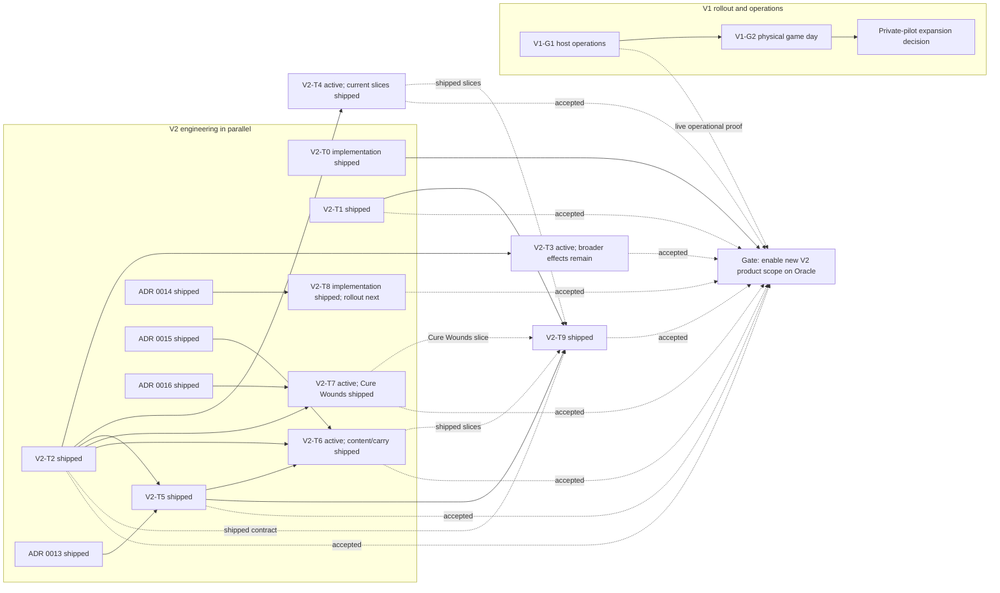

# Campaign Hub living roadmap

> **Status:** Authoritative living roadmap
> **Last reviewed:** 2026-09-21
> **Owner:** Campaign Hub maintainers

This is the single source of truth for Campaign Hub delivery status, sequencing, dependencies, and acceptance
gates. [Implementation status](implementation-status.md) records what exists, while
[implementation history](implementation-history.md), the [private-V1 snapshot](private-v1-roadmap.md), and the
[post-V1 snapshot](post-v1-roadmap.md) preserve how earlier plans and decisions evolved.

## Status labels

| Label | Meaning |
|---|---|
| **shipped** | Implemented, merged, and supported by the train's recorded code/contract evidence |
| **active** | Approved work currently required for the next release decision |
| **next** | Approved and sequenced, but not started or not yet enabled |
| **deferred** | Explicitly outside the approved release trains; requires a new decision before implementation |

Labels apply to the scope named by each row or heading. A train may mark its implementation **shipped** while
an explicitly separate target-environment rollout gate remains **active**; that distinction must be stated
rather than inferring deployment or enablement from merged code.

## Current baseline

| Status | Milestone | Evidence or remaining decision |
|---|---|---|
| **shipped** | Private invite-only Hub implementation through Phase 6F | Server, browser, Character Sheet, DM Screen, lifecycle, migration, operations, CI, and real-stack evidence are summarized in [implementation status](implementation-status.md) |
| **shipped** | Phase 6G Oracle deployment | Annotated release `hub-staging-2026-09-10-r7` at `77d955c053dcdfe949235620db93f7eba477af34` is deployed to the private Hub-only Oracle Always Free environment; HTTPS, GitHub OAuth, PostgreSQL, static, BFF, API, and WebSocket checks pass |
| **shipped** | V2-T0 release automation and live promotion | [PR #219](https://github.com/TrueMichato/ThelemarTools/pull/219) implemented the release path; the r7 dry-run/promotion, immutable evidence, image preservation, and non-disruptive rollback prerequisites were proven on Oracle |
| **shipped** | V2-T1 legible activity history | [PR #218](https://github.com/TrueMichato/ThelemarTools/pull/218) merged semantic titles, privacy-safe display-name snapshots, historical fallback, and lifecycle coverage |
| **shipped** | Coordinated implementation closeout | All 59 planned implementation todos are complete. [PR #241](https://github.com/TrueMichato/ThelemarTools/pull/241) merged carry/encumbrance enforcement as `de5acaabfa6cc64ce804bb43b94b74ccf3bc2714`; [PR #242](https://github.com/TrueMichato/ThelemarTools/pull/242) integrated source/species/edition content enforcement as `168d6e9ac36c11e2c938f21a4324b803f3f2fb61`; [PR #243](https://github.com/TrueMichato/ThelemarTools/pull/243) merged the role-adaptive Campaign Overview and authority hardening as `b8d31d3416b934cc9275b859b5932db050005351` |
| **shipped** | V2-T2 projection/privacy foundation | Authorization-scoped projection storage, fetch, invalidation, sharing controls, and privacy tests are implemented |
| **shipped** | V2-T5 whole-site campaign context | Device-scoped selection, cross-tab convergence, temporary rules/brew activation, and ordered teardown are implemented |
| **shipped** | V2-T9 Campaign Overview redesign | The pinned session brief, role-specific continuation action, preserved workbench, responsive/accessibility coverage, and authority hardening are merged in PR #243 |
| **shipped** | V1 external Oracle host-operations proof | Manual and genuine scheduled maintenance/backup, five-minute external monitoring, off-machine backup, authenticated isolated restore, RPO/RTO, exact-r6 rollback, exact-r7 return, cleanup, and zero-disruption identity checks passed by 2026-09-13 |
| **active** | V1 physical game day | V1-G1 is complete; execute the [one-DM/two-player runbook](runbooks/private-game-day.md) on physical devices and record the go/no-go |
| **active** | V2-T4 party inventory, carry, and item awards | Player stash/direct-transfer and DM atomic-award slices are implemented, with shared carry summaries and enforced carry/content boundaries; broader unified party/DM inventory UX remains |
| **active** | V2-T6 campaign policy | Source/species/edition and carry/encumbrance enforcement are implemented; `tgtt.enabled`, exhaustion, jumping, linguistics, and critical-roll behavior remain Advisory |
| **active** | V2-T7 player targeting | The one-player PHB/XPHB Cure Wounds slice is implemented; broader spells, abilities, resources, party/multi-target, and NPC/monster targeting remain |
| **next** | Wave A0 multi-target operation model | [ADR 0020](adr/0020-consented-multi-target-operations.md) is accepted as a design/proof contract; implementation and capability remain absent/default-off, and this draft is held pending the physical game-day GO/NO-GO |
| **active** | Remaining V2 scope | V2-T3 still requires broader Character Sheet effect implementation and enablement; the remaining T4/T7 scope and V2-T8 provider rollout retain their own acceptance gates |
| **active** | r9 invite-gated identity | ADR 0018/migration 0008 foundation, ADR 0019/migration 0009 provider-neutral entitlements, and ADR 0014 account link/unlink implementation are complete; entitlement, identity-linking, new-account-admission, and Discord/Google enablement switches remain default-off until their separate release preflights |
| **deferred** | Horizons A-F and other exclusions | Retained under [Deferred horizons](#deferred-horizons-a-f) and [Explicitly deferred](#explicitly-deferred) |

Oracle runs annotated release `hub-staging-2026-09-10-r7` at
`77d955c053dcdfe949235620db93f7eba477af34`, deployed by PR #253's hardened release path. Later repository
changes are not target-environment evidence until separately reviewed, tagged, approved, and promoted.

## V1 launch closeout

Phase 6G and V1-G1 are complete. V1 has one remaining launch gate: the physical game day and explicit
private-launch go/no-go. This rollout gate proceeds in parallel with V2 engineering and gates expansion of the
private pilot, not implementation or merging of independently safe V2 work.

### V1-G1 — host-operations proof (**complete 2026-09-13**)

Scope:

- install, enable, and observe the checked-in maintenance, backup, and host-monitor timers;
- pull an encrypted backup to a second trusted machine without granting the staging host write access;
- restore that backup to an isolated target and prove representative Hub workflows within RPO <=24 hours and
  RTO <=4 hours;
- dry-run and deliberately promote a verified release;
- prove release operations remain confined to the named Hub Compose services and never use destructive
  environment or volume teardown;
- rehearse rollback to the prior exact release, including application,
  migration-compatibility, readiness, and WebSocket recovery checks.

Acceptance:

- timer status and bounded operational-run evidence show successful scheduled execution;
- the off-machine archive hash matches and no plaintext database backup leaves the host;
- the isolated restore is readable, migration-current, and completes within the recovery objectives;
- rollback follows the repository runbooks and restores a healthy exact-release service without ad hoc database
  edits;
- release evidence shows only Hub services were recreated or stopped, with no Compose `down`, service-wide
  cleanup, or volume deletion;
- evidence records timestamps, release, migration version, operator, duration, outcome, and follow-up issues
  without secrets or private campaign content.

Evidence completed on 2026-09-12:

- r7 deployed from annotated tag `hub-staging-2026-09-10-r7`;
- systemd maintenance, backup, and five-minute monitor timers installed and enabled from hash-matched files;
- manual maintenance and backup succeeded; Healthchecks.io failure and recovery signals were observed;
- encrypted archive `hub-20260912T092100Z.dump.enc` copied off-machine with matching SHA-256;
- authenticated isolated restore passed with RPO 3,865 seconds and continuous RTO 6,772 seconds;
- exact preserved-r6 application reads passed on schema `0007`, followed by exact-r7 return;
- every disposable recovery resource and temporary credential was removed without changing production identities.

Final scheduled evidence completed on 2026-09-13:

- the maintenance timer triggered at `01:22:40Z`; one non-skipped service invocation produced one succeeded
  operational row at `01:22:41.800835Z`;
- the backup timer triggered at `02:28:07Z`; one service invocation produced one succeeded operational row and
  `hub-20260913T022807Z.dump.enc`;
- the archive is 139,953 bytes, mode `0600`, owned by `ubuntu:ubuntu`, starts with `HUBENC1`, and has SHA-256
  `997c70f3c67e762422764203a3ab73582c2e6782a5b23ec2c4e5d51b7ca90816`;
- the next daily timer schedules were present, Healthchecks monitoring succeeded, migrations remained exactly
  `0001`-`0007`, and the exact r7 DB/BFF/static/edge containers remained running with zero restarts.

V1-G1 is complete. Continue normal scheduled observation; do not treat this evidence as permission to skip
future failures or freshness policies.

### V1-G2 — physical one-DM/two-player game day (**active**)

Dependency: V1-G1 passed on 2026-09-13, so this gate is unblocked. Execute
[the private game-day runbook](runbooks/private-game-day.md); its existence is not evidence that V1-G2 has run.

Scope:

- one DM and two players use real GitHub OAuth on physical desktop/mobile devices;
- exercise invitations, campaign context, character copy/attach/move, DM workspace, realtime projection,
  structured effects, grants, party inventory, transfers, reconnect, lease takeover, and local-mode isolation;
- observe service-worker behavior, privacy/role boundaries, operational signals, and participant-facing failure
  recovery during a real table session.

Acceptance:

- no unresolved P0/P1 defect, tenant leak, private-field leak, lost/duplicated asset, or unexplained stale state;
- DM and player tasks are understandable without developer guidance or database edits;
- the deployed release remains healthy through disconnect/reconnect and at least one rehearsed operator recovery;
- participant feedback, defects, metrics, backup age, and outbox/database health are recorded;
- maintainers record an explicit private-V1 go/no-go. Expansion remains invite-gated and private.

## V2 delivery rules

Each train below is independently releasable once its listed architecture dependencies and acceptance criteria
pass. V2 engineering does not wait for V1-G1, V1-G2, or the V1 go/no-go. A train must not wait for unrelated
V2 work, and merging a train does not silently enable it.

V2-T0's implementation is shipped and remains the first operational foundation. Its live Oracle
dry-run/release and induced-failure evidence passed during r7 qualification. Genuine scheduled daily
maintenance and backup executions passed on 2026-09-13, completing V1-G1. V2 product enablement remains
subject to each train's own acceptance criteria and the private-launch go/no-go; independently safe feature
code can still be reviewed and merged behind disabled capability gates.

Every train must:

- preserve signed-out/local-only behavior;
- define authorization, projection/privacy, idempotency, failure, reconnect, migration, rollback, telemetry, and
  accessibility behavior where applicable;
- add server-advertised capability/version metadata and fail closed when a required capability is absent;
- default new campaign capabilities off until their acceptance evidence is recorded;
- hide or explain unavailable UI and reject disabled API commands authoritatively;
- keep old clients readable where possible and require an explicit protocol upgrade where correctness or privacy
  cannot be preserved;
- update implementation status, traceability, risks, tests, runbooks, and this roadmap in the same release.

The approved decision-record sequence has landed:

| ADR | Decision | Primary trains |
|---|---|---|
| [ADR 0011](adr/0011-authorization-scoped-character-projections.md) | Authorization-scoped projections and privacy | V2-T2, T7 |
| [ADR 0012](adr/0012-idempotent-semantic-character-operations.md) | Semantic operations and reconciliation | V2-T3, T4, T7 |
| [ADR 0013](adr/0013-device-scoped-active-campaign-context.md) | Device-scoped campaign context | V2-T5 |
| [ADR 0014](adr/0014-multi-provider-identity.md) | Identity-provider registry | V2-T8 |
| [ADR 0015](adr/0015-campaign-rules-policy.md) | Campaign rules policy | V2-T6 |
| [ADR 0016](adr/0016-atomic-peer-source-costs.md) | Atomic peer source costs | V2-T7 |
| [ADR 0018](adr/0018-invite-gated-first-access.md) | Invite-gated first account access and future creator entitlement boundary | r9 identity |
| [ADR 0019](adr/0019-provider-neutral-account-entitlements.md) | Provider-neutral account entitlements and reauthentication | r9 identity |

## Approved V2 release trains

### V2-T0 — release automation (**shipped — implementation and r7 live promotion proven**)

Purpose: make the exact source-to-Oracle promotion and rollback path repeatable before increasing product scope.

Implementation shipped in [PR #219](https://github.com/TrueMichato/ThelemarTools/pull/219). The live Oracle
path subsequently promoted annotated r7, preserved the prior exact application images, and produced redacted
release evidence. Genuine daily maintenance/backup timer observations completed V1-G1 on 2026-09-13.

Deliver:

- protected, auditable promotion of an exact reviewed release artifact/tag;
- deliberate deployment initiated by an authenticated, authorized operator after review; merge/tag creation
  alone never changes the target environment;
- automated migration plan/apply, readiness, smoke, provenance, backup-age, and rollback-precondition checks;
- release evidence tying source, build, protocol, migration, tests, SBOM/provenance, deployment, and operator
  approval together;
- application auto-rollback only when the deployed and prior application versions are both compatible with the
  current schema;
- expand/contract migration sequencing for future schema changes;
- a dry-run path and a documented manual break-glass path.

Acceptance:

- one approved invocation promotes the exact reviewed release without rebuilding untracked code on the host;
- failed preconditions stop before traffic changes; partial deployment fails visibly and is recoverable;
- rollback target and migration compatibility are proven before promotion; an unhealthy schema-compatible
  application rollout may return automatically to the prior application;
- automation never reverses a migration and never restores a backup over the production/staging database;
  incompatible recovery stops mutations and requires the explicit isolated-restore/runbook decision;
- future migrations prove the expand/deploy/contract sequence, with contraction occurring only after every
  supported application version has stopped using the old shape;
- secrets are neither printed nor embedded in artifacts, commands, logs, or evidence.

### V2-T1 — legible activity log (**shipped**)

Purpose: turn durable events into a player- and DM-readable campaign history.

[PR #218](https://github.com/TrueMichato/ThelemarTools/pull/218) shipped the semantic presentation,
display-name snapshot, historical fallback, lifecycle, and production-packaging implementation.

Deliver:

- plain-language actor, action, subject, target, outcome, and time for supported campaign events;
- character display-name snapshots on every new character-related event so history survives rename, detach, and
  deletion;
- old-event fallback that uses the best authorized current name when available and a stable neutral label when
  it is not;
- `detail.title` as the primary rendered event title when present, falling back to roll category only when the
  semantic title is absent;
- role-filtered detail, pagination, reconnect-safe ordering, empty/error states, and accessible filtering;
- stable semantic event presentation rather than raw internal ids or payload dumps.

Acceptance:

- common invite, membership, character, effect, grant, inventory, transfer, and policy events are understandable
  without inspecting JSON;
- rename, detach, and deletion do not rewrite or erase the display name captured by a new event, while historical
  events without snapshots still render an explicit fallback;
- a roll with `detail.title` displays that title rather than the generic roll category;
- unauthorized/private fields never appear, including through pagination, replay, or stale clients;
- reconnect/replay produces no duplicate, missing, or reordered visible entries;
- desktop/mobile and keyboard/screen-reader checks pass.

### V2-T2 — projection and privacy foundation (**shipped**)

Purpose: establish the versioned contract all richer live campaign features use.

Shipped as [ADR 0011](adr/0011-authorization-scoped-character-projections.md): `server/src/character-projection.js`
holds the versioned catalog, presets and overrides; migration `0004` persists per-character policy;
the T2 rollout introduced protocol 2 and the current implementation has since advanced to protocol 5;
`character.projection.updated` is replaced by metadata-only
`character.projection.invalidated`; resync carries a cursor and cache-invalidation refs only; and owners
configure sharing from the Character Sheet campaign panel against a server-computed preview.

Deliver:

- realtime character events containing only character id/revision invalidation, never character fields or a
  projection payload;
- authorization-scoped projection fetches after invalidation, using one authorization path for initial load,
  refresh, and resync;
- an owner view that is canonical truth;
- a DM/co-DM view that exposes canonical truth plus an exact preview of what peers share;
- one shared peer profile for all peer viewers, rather than viewer-specific ad hoc documents;
- reviewed presets plus fixed, type-safe per-field `share`, `hide`, and `replace` overrides;
- versioned projection schemas, field-level privacy tests, safe unknown-version behavior, and a documented
  boundary between canonical private documents and derived live views.

Acceptance:

- every projected field has an owner, audience, purpose, and test;
- WebSocket payloads reveal no character data beyond the authorized character id/revision invalidation;
- owner fetches equal canonical truth, DM/co-DM fetches include truth plus the peer preview, and every peer sees
  the same shared peer profile;
- presets and fixed overrides cannot introduce unknown fields, invalid replacement types, or an audience wider
  than their declared contract;
- HTTP reads, WebSocket invalidations, logs, Party Tracker rows, targeting selectors, carry summaries, and
  inventory summaries leak no hidden/replaced field or inferable private value;
- unknown projection versions and revoked access fail closed while loaded private data is removed or made
  inaccessible;
- projection generation cannot mutate or persist the canonical character/Board document.

### V2-T3 — live semantic effects on the Character Sheet (**active — Wave A1 six-kind immediate lane complete in held implementation; broader Character Sheet effects remain**)

Dependency: V2-T2.

Deliver:

- DM/co-DM semantic effects auto-apply through typed Character Sheet state operations and notify the character
  owner;
- peer-originated effects derive from an actual ability/spell the peer can use and require target approval before
  application;
- stable operation ids shared across proposal, acceptance, server mutation, realtime invalidation, and local
  reconciliation;
- accepted semantic damage, healing, condition, resource, and supported modifier effects update derived sheet
  UI live and survive save/reload/reconnect;
- reconciliation that applies effect `E` to the player's current local state while advancing the accepted base
  to the server canonical state, preserving unrelated local edits;
- unsupported/custom effects remain explicit player work rather than guessed mutations;
- explicit handling for an in-flight save, reconnect/resync, lease fencing, stale editors, and access/session
  revocation;
- dedicated semantic-operation recovery when automatic reconciliation is unsafe, never blind reuse of the
  current revision-conflict modal.

Acceptance:

- each supported effect changes the authoritative state and every affected derived display exactly once;
- DM/co-DM effects apply and notify without target approval; peer effects cannot be created from arbitrary text
  or apply before the target accepts;
- duplicate delivery, refresh, reconnect, stale retries, and replayed approval cannot reapply a stable operation
  id;
- applying `E` during unsaved local work preserves those local changes and advances the accepted base to the
  canonical server result, so the next save cannot revert `E`;
- in-flight save, reconnect/resync, fencing, takeover, and revocation scenarios end in an explicit consistent
  state without opening the generic revision-conflict modal as a catch-all;
- unsupported or policy-forbidden effects do not partially mutate a character;
- local sheets and campaigns without the capability retain current behavior.

Wave A1 completes the existing immediate DM/co-DM lane for the six version-1 operations without enabling
protocol-6 multi-target authority. Valid canonical no-ops are auditable and replayable, omit projection
invalidation, and use a revision-only ordering point because migration 0005 requires a unique applied revision
and migration 0011 remains reserved for ADR 0020. This implementation remains held as a draft descendant of
PR #285 pending the physical r10 game-day GO/NO-GO.

### V2-T4 — party inventory, carry, and item awards (**active — player stash/transfer/carry and DM award slices shipped**)

Dependency: V2-T2. It reuses the existing authoritative party inventory, grant, and transfer primitives.

Deliver:

- a first-class player/DM party-inventory experience;
- rules-aware party and character carry summaries without creating a second inventory ledger;
- targeted item awards to a character or the party, with source/metadata identity preserved;
- atomic move, split, merge, accept/reject/cancel, capacity-warning, and recovery flows.

Acceptance:

- displayed quantities, denominations, weight, capacity, and ownership match authoritative state after every
  terminal outcome;
- no award or transfer duplicates, loses, or silently rewrites item metadata;
- carry rules identify their campaign policy/edition and warnings explain unsupported/custom cases;
- permission, contention, near-limit, reconnect, rollback, and mobile-accessibility tests pass.

Implemented slice:

- owned cloud Character Sheets render the authoritative party stash, support privacy-safe direct-pass
  destinations and escrow-backed partial transfers, and reconcile character truth after terminal outcomes;
- one atomic idempotent DM/co-DM batch from catalog, recent awards, campaign items, or the authoritative stash;
- ordered multi-character grants, one conserved stash debit, strict safe item summaries, bounded notes, and carry
  invalidation;
- shared eligibility/weight summaries, policy-version-fenced carry writes, and privacy-safe
  known/lower-bound/unavailable preview states;
- source/species/edition content admission is enforced for grants, awards, and accepted transfers into characters;
- memory/PostgreSQL parity, authorization/idempotency/contention/event ordering, rendered UI, and real-stack
  coverage.

Remaining T4 scope includes a unified first-class DM/party inventory experience and policy-complete
capacity-warning/recovery UX across every future move and award path. The shipped character/stash transfer and DM
award slices do not claim that broader experience is complete.

### V2-T5 — whole-site campaign context per browser/device (**shipped**)

Dependency: V2-T2 for privacy-safe context summaries.

Deliver:

- an explicit active-campaign context available across the site, scoped to one browser profile/device;
- select, switch, clear, expired-access, deep-link, and multi-tab behavior;
- early rules/homebrew/projection activation without writing campaign identity into local character data.

Acceptance:

- two devices can intentionally hold different active campaigns for the same account;
- switching or losing access clears prior campaign overlays and private projections before new page data loads;
- signed-out/local-only pages remain unchanged and never inherit stale campaign state;
- tabs converge safely within a browser profile, while explicit campaign deep links remain deterministic.

Implemented slice:

- one account-bound, device-local selection coordinator shared by Hub, ordinary navigation, Character Sheet, and
  DM Screen, with `BroadcastChannel`/storage convergence and explicit `?local=1` routes;
- lightweight accessible switchers on Hub and shared navigation without importing the heavy data/render graph
  into Hub-owned shells;
- pre-data temporary brew/rules/policy activation, complete ordered teardown, generation/abort fencing, and
  capability gate `campaign.active_context.v1`;
- authorized bare Character Sheet/DM Screen defaults, deterministic pinned resources, access-loss concealment,
  BFCache/reconnect revalidation, production-stack Chromium coverage, and four killed high-risk mutants.
V2-T5 owns context transport and teardown; ADR 0015/V2-T6 now consumes that metadata for content enforcement.

### V2-T6 — enforced campaign rules/source/species/edition policy (**active — content and carry enforcement shipped; other non-content rules remain advisory**)

Dependencies: V2-T2 and V2-T5.

Deliver:

- versioned DM-configured rules, source, species, and edition policy;
- authoritative enforcement at create/import, attach/move, award, and relevant mutation boundaries;
- grandfather warnings for existing content that becomes noncompliant;
- explainable policy summaries and migration previews.

Acceptance:

- new violations are rejected consistently by API and UI with actionable reasons;
- existing characters/items are never silently deleted or rewritten; they remain usable only according to the
  documented grandfather rules and display warnings;
- policy changes identify affected entities before activation and are auditable/reversible by version;
- stale clients cannot bypass current policy.

Implemented rules slice:

- a closed, versioned catalog exposes stable rule ids, applicability, parameters, defaults, and truthful
  **Enforced**, **Advisory**, or **Planned** lifecycle labels;
- DM/co-DM management supports search/filter, before/after review, atomic immutable publication, stale-base
  fencing, and activation of an earlier version without rewriting history;
- schema-v1 TGTT/exhaustion/carry versions remain readable and project to the same legacy settings shape;
- players receive a bounded read-only summary, while authored notes and complete policy bodies stay on the
  DM management path;
- one pure browser/server evaluator capability-, protocol-, schema-, catalog-, rule-version-, surface-, and
  active-policy-pin gates effective TGTT/exhaustion settings;
- Character Sheet runtime/build flows and DM Party Tracker consume only the transient evaluated projection;
  activation, teardown, rollback, reconnect, and realtime replacement never persist campaign settings;
- policy-sensitive carry summaries are fenced by the active immutable rules-version identity in both stores.

Implemented content-policy slice:

- DM/co-DM source, species/race identity, and 2014-only/2024-only/mixed edition controls are selectable and
  published as typed content-policy version 1 inside immutable rules versions;
- campaign and personal-brew availability are separate: active campaign brew augments campaign pages without
  mutating personal brew, while absent personal sources cannot widen the campaign;
- Builder, Quick Build, Level Up, Respec, spell/feat/item/class/species candidate projection, imports, clone/
  attach/move admission, direct character deltas, grants/awards, and accepted transfers into characters fail
  closed on newly disallowed or unknown identities;
- existing campaign characters remain playable and receive bounded grandfather warnings; unrelated edits and
  removals remain valid, and policy activation/rollback never rewrites character data;
- exact active rules-version fencing, memory/PostgreSQL parity, privacy-shaped events/summaries, reconnect/
  rollback/campaign-switch teardown, production-stack Chromium, and mutation tests cover authority boundaries.

Carry-weight and encumbrance-tier settings are also **Enforced** (calculation/projection plus policy-fenced
carry writes on their proven surfaces); remaining non-content house-rule behavior (`tgtt.enabled`, exhaustion,
jumping, linguistics, and critical rolls) stays advisory.

### V2-T7 — player targeting (**first one-to-one player slice implemented; broader targeting active**)

Dependency: V2-T2. Integrations with V2-T3/T4 activate only when those capabilities are also enabled.

Implemented first slice:

- from an authenticated campaign Character Sheet, cast PHB/XPHB Cure Wounds using one selected standard spell
  slot from one player-owned source character against one privacy-visible player-owned campaign character;
- explicit target-owner accept/reject, proposer cancel, bounded expiry, lifecycle cancellation, outgoing status,
  reconnect/resync recovery, and audience-scoped activity;
- [ADR 0016](adr/0016-atomic-peer-source-costs.md) acceptance atomically consumes the source slot and applies the
  deterministic healing exactly once; self-targeting uses one combined character revision/operation leg;
- protocol/capability mismatch, stale membership/rules/character state, unavailable cost, and inapplicable healing
  fail closed without partial mutation or hidden-state disclosure.

Still to deliver before the whole track is shipped:

- multi-target and party resolution, NPC/monster targets, broader player abilities/spells and source-resource
  kinds, and supported DM target-set workflows;
- partial-resolution semantics for target sets larger than one.

Wave A0 now accepts the narrower [ADR 0020](adr/0020-consented-multi-target-operations.md) contract for the first
multi-target implementation. Protocol-6 version 1 caps the immutable proposal at 1-8 ordered unique
player-character targets because every leg has independent consent, event, lock, lifecycle, and reconciliation
work; a future measured contract version may raise that limit. Each target owner responds through a unique
opaque invitation id. Source-owned legs use source finalization as consent and remain deselectable. After all
responses are terminal or collection closes, the source submits one exact ordered approved/current subset.
Empty selection is explicit cancellation. One source cost and every selected leg then commit atomically, or none.
Reviewed healing templates may set `allowTargetNoOp=true`: a selected full-HP target records an applied no-op
without revealing that target state to the source, while the single source cost is still consumed.

Protocol-6 v1 also caps live work transactionally at 3 collections/source character, 5/source account,
50/campaign, and 20 pending invitations/target owner, with explicit mutation throttles and oldest-pending cursor
pagination. Protocol 3/4/5 fails closed on every multi-target mutation, read, WebSocket, resync, and replay
surface. DM/co-DM receive bounded workflow projections intentionally for support, abuse moderation, lifecycle
diagnosis, and audit; a target owner never sees co-target identity or decisions.

Global source-account and target-owner caps are serialized across campaigns by dedicated seed-10 quota locks
acquired in ascending account UUID order before campaign authority.

This is **planned, not implemented**. Migration 0011, protocol 6, routes, both stores, events, capability
advertisement, Character Sheet UX, and templates remain future A1-A5 work. The sequence is:

1. **A1:** DM typed effects.
2. **A2:** generalized source-cost authority.
3. **A3:** normalized migration 0011 and server state machine.
4. **A4:** Character Sheet proposal/response/finalization UX and per-leg reconciliation.
5. **A5:** Healing Word and Mass Healing Word templates.

NPC/monster targets, arbitrary prose, damage combat resolution, offline writes, repeated partial commits,
per-target costs, and post-proposal target additions remain deferred. Wave A0 may be reviewed as a draft but is
held from merge until the coordinator records the physical game-day GO/NO-GO.

Migration 0011 is additive before use. The first accepted multi-target proposal permanently inserts an
FK-independent usage marker which normal cleanup never deletes. Once that marker exists, rollback to a true
pre-0011 binary is forbidden; rollback must use a bridge/r10+ release which understands child history/cleanup
and the marker. A pre-0011 rollback target requires the marker to be absent or a separately reviewed destructive
history/event/outbox/recovery export/purge process, with marker deletion last, outside normal rollback.

Acceptance:

- only authorized targets see private requests or details;
- target sets are fixed and auditable for each command, with explicit behavior when membership changes;
- retries cannot duplicate work and partial completion is visible and recoverable;
- the implemented Cure Wounds slice does not mark all of V2-T7 **shipped**;
- at least one peer ability/spell with a slot, charge, or use cost commits the source cost and target effect
  atomically exactly once;
- reject, cancel, and expiry consume no source cost; concurrent or unavailable cost fails without any target
  mutation;
- source-cost and target failures remain privacy-preserving and non-enumerating;
- disabled downstream capabilities cannot be targeted through API or stale UI.

### V2-T8 — Discord and Google identity-provider framework (**active — implementation complete; rollout incomplete**)

Deliver:

- a provider-neutral OAuth/OIDC adapter contract, stable external-subject identities, and account-linking model;
- Discord and Google implementations with provider-specific configuration and claims validation;
- linking only from an authenticated Hub session after fresh reauthentication;
- safe link, unlink, collision, recovery, invite admission, session-revocation, audit, export, and deletion
  behavior across every linked identity.

Implemented:

- provider-neutral identity/session provenance, durable one-time OAuth transactions, and the validated provider
  registry;
- bounded Discord OAuth and Google OIDC adapters with provider-specific claim, PKCE/nonce, JWKS, and failure
  validation;
- capability-gated identity listing, fresh-reauth link intent/callback, different-identity unlink, last-identity
  and required-provider retention, account-level security UI, and all-session/lease/socket rotation;
- paired first-enable acceptance of successful sign-in or linked outcomes and optional-legacy-allowlist rollback
  preflight;
- deterministic memory/PostgreSQL/production-stack coverage while normal production configuration remains
  GitHub-only.

Still to deliver:

- separately approved capability and paired-provider production rollout.

Acceptance:

- signing in through a linked provider reaches the same Hub account without duplicating ownership or membership;
- linking without both an authenticated session and successful reauthentication is rejected;
- a provider subject already owned by another Hub account can never be linked, transferred, or auto-merged;
- unlinked matching email/login strings never auto-merge accounts;
- state, PKCE/nonce where applicable, redirect, token, issuer/audience, subject, and session-rotation tests pass;
- losing one provider does not strand an account that retains another verified sign-in path;
- invite-gated admission, invite redemption, session/device revocation, audit attribution, account export, and deletion
  behave consistently regardless of which linked identity established the session;
- provider rollout is separately gated and GitHub remains available until migration evidence supports a change.

### V2-T9 — Campaign Overview critique and redesign (**shipped**)

Shipped in [PR #243](https://github.com/TrueMichato/ThelemarTools/pull/243), merged as
`b8d31d3416b934cc9275b859b5932db050005351` from final PR head
`c8d5f0333d1bd8f7867b91c7ecb7170a9838671b`. The implementation consumes the accepted T1/T2/T4/T5/T6/T7
surfaces without claiming the unfinished portions of T3, T4, T7, or T8.

Design evidence and decisions: [Campaign Overview redesign brief](campaign-overview-redesign-brief.md).

Deliver:

1. an Impeccable review of task hierarchy, information architecture, privacy cues, responsive behavior,
   accessibility, failure states, and cognitive load;
2. an evidence-backed redesign of Campaign Overview around DM/player jobs, the legible activity log, live
   capabilities, policy, inventory, targeting, and context;
3. a one-surface rollout that preserves incumbent task access and compares the redesigned route against the
   existing capability, role, state, responsive, and accessibility contracts.

Acceptance:

- critique findings map to explicit design decisions or documented deferrals before implementation;
- primary DM/player tasks require no internal ids or developer vocabulary and expose capability/policy state;
- keyboard, screen-reader, contrast, 390 px portrait, mobile landscape, loading/empty/error/offline, and long-data
  states pass;
- redesign does not weaken authorization, privacy, local mode, or operational observability.

Implemented:

- a role-adaptive pinned session brief leads with campaign identity, party readiness, attention, recent activity,
  and one role-specific next action;
- existing effects, transfers, XP, item awards, membership, homebrew, and rules capabilities remain available
  through progressive disclosure;
- zero/one/many-character launch behavior is explicit, spectators and archived campaigns remain read-only, and
  desktop/mobile day/night states retain accessible hierarchy;
- historical role replay is fenced against current authority, archived bootstrap and event parity remain readable,
  archived mutations are closed in both stores, and PostgreSQL cursor/snapshot authority is transactionally
  consistent.
- The earlier dual-surface/coexistence comparison criterion is superseded: PR #243 replaced the same
  `campaign.html` route without introducing a second implementation or feature flag. Equivalence evidence comes
  from preserved incumbent controls, static page contracts, role/launch/read-only state coverage, and
  production-stack desktop/mobile day/night screenshots. No simultaneous old/new UI or user task-completion study
  occurred or is claimed.

## Dependencies and release order

V1-G1/G2 intentionally have no dependency edge into V2 engineering. They gate private-pilot expansion, not
implementation or merge. V2-T0, T1, T2, T5, and T9 are shipped. T4 has shipped player-stash/transfer/carry and
DM-award slices; T6 has shipped content/carry enforcement while its other non-content rules remain Advisory; T7 has
shipped only the narrow Cure Wounds slice. T8's provider adapters/framework exist, but account linking and rollout
remain incomplete. T0 plus V1-G1's live operational proof gate promotion of the merged head and any newly merged V2
product scope on Oracle.

## Deferred horizons A-F

These horizons are preserved from the approved post-V1 planning record. They are **deferred**, not silently
cancelled, and require discovery, threat modeling, data-model review, an ADR, and explicit approval before
implementation. Approved V2 trains take precedence where they overlap.

### Horizon A — private-campaign usability (**deferred**)

- campaign templates and guided onboarding;
- configurable retention/export packages;
- richer notifications without exposing private event content;
- support tooling that remains audited and avoids silent impersonation.

### Horizon B — encounter/NPC interactions (**deferred**)

Create a first-class encounter/NPC aggregate before targeting monsters. It must define identity, DM ownership,
hidden information, HP/condition/resource updates, undo, audit, and encounter-scoped visibility. Directly
mutating initiative-tracker blobs is rejected.

### Horizon C — offline player mutations (**deferred**)

Research an operation queue that distinguishes safe commutative edits from resource-spending commands. Queued
writes require authorization expiry, lease/fence handling, per-operation bases, explicit conflict UI, and
downloadable recovery. Blind stale snapshot replay remains forbidden.

### Horizon D — collaborative editing (**deferred**)

Evaluate bounded field ownership, semantic commands, CRDT/OT, and feature locks on a small document first.
One-editor leases remain default until collaboration is demonstrably more correct and recoverable.

### Horizon E — transport consolidation (**deferred**)

Replace remaining PeerJS initiative/player-viewer paths only after Hub transport has feature, latency, offline,
privacy, and compatibility parity. Preserve a staged coexistence window.

### Horizon F — semi-public/public service (**deferred**)

Requires registration/recovery, moderation/reporting/takedown, quotas and cost controls, privacy/terms/data
processing review, deletion SLA, support operations, tenant-scale load tests, vulnerability response, and a
fresh security assessment. Private invite-gated admission remains until every gate has an owner and evidence.

## Explicitly deferred

The approved V2 program does not include:

- structured monster/NPC actions before Horizon B's aggregate exists;
- offline cloud mutations or blind stale snapshot replay;
- simultaneous character/Board co-editing or removal of lease fencing;
- replacement of remaining PeerJS paths before transport-parity evidence;
- open registration, public campaigns, moderation, billing, public-service legal/privacy publication, or
  multi-tenant support operations;
- multi-replica BFF/high availability before shared realtime fanout and a new topology decision;
- automatic expiry of pending private-V1 actions/transfers without a separately approved lifecycle policy;
- campaign brew raw HTML or persistent blocklists;
- silent conversion, deletion, or rewriting of grandfathered characters/items when policy changes.

Moving a deferred item into an active train requires a roadmap update that records its decision, dependencies,
capability gate, acceptance criteria, migration/recovery plan, and owner.
