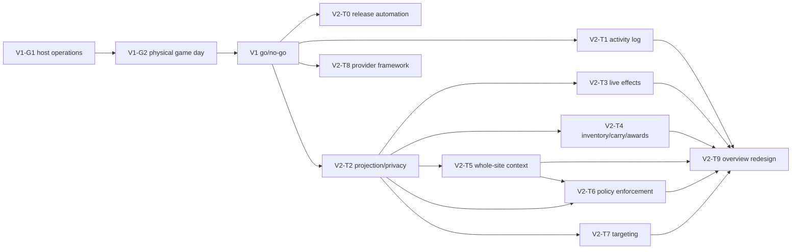

# Campaign Hub living roadmap

> **Status:** Authoritative living roadmap
> **Last reviewed:** 2026-09-01
> **Owner:** Campaign Hub maintainers

This is the single source of truth for Campaign Hub delivery status, sequencing, dependencies, and acceptance
gates. [Implementation status](implementation-status.md) records what exists, while
[implementation history](implementation-history.md), the [private-V1 snapshot](private-v1-roadmap.md), and the
[post-V1 snapshot](post-v1-roadmap.md) preserve how earlier plans and decisions evolved.

## Status labels

| Label | Meaning |
|---|---|
| **shipped** | Implemented, deployed where required, and supported by recorded evidence |
| **active** | Approved work currently required for the next release decision |
| **next** | Approved and sequenced, but not started or not yet enabled |
| **deferred** | Explicitly outside the approved release trains; requires a new decision before implementation |

Labels apply to capabilities, not merely merged code. A capability is not **shipped** until its acceptance
criteria pass in the target environment and its release/campaign gate is intentionally enabled.

## Current baseline

| Status | Milestone | Evidence or remaining decision |
|---|---|---|
| **shipped** | Private invite-only Hub implementation through Phase 6F | Server, browser, Character Sheet, DM Screen, lifecycle, migration, operations, CI, and real-stack evidence are summarized in [implementation status](implementation-status.md) |
| **shipped** | Phase 6G Oracle deployment | Release `hub-staging-2026-09-01` at `8f181712` is deployed to the private Oracle Always Free environment; HTTPS, GitHub OAuth, PostgreSQL, static, BFF, API, and WebSocket smoke checks pass |
| **active** | V1 host-operations proof | Prove scheduled timers, encrypted off-machine backup, isolated restore, and exact-release rollback |
| **active** | V1 physical game day | Complete the one-DM/two-player session on physical devices and record the go/no-go evidence |
| **next** | Approved V2 program | Ship the release trains below independently, respecting their dependencies and capability gates |
| **deferred** | Horizons A-F and other exclusions | Retained under [Deferred horizons](#deferred-horizons-a-f) and [Explicitly deferred](#explicitly-deferred) |

## V1 launch closeout

Phase 6G is complete. V1 has exactly two remaining launch gates; neither is an implementation phase.

### V1-G1 — host-operations proof (**active**)

Scope:

- install, enable, and observe the checked-in maintenance, backup, and host-monitor timers;
- pull an encrypted backup to a second trusted machine without granting the staging host write access;
- restore that backup to an isolated target and prove representative Hub workflows within RPO <=24 hours and
  RTO <=4 hours;
- rehearse rollback against release `hub-staging-2026-09-01` at `8f181712`, including application,
  migration-compatibility, readiness, and WebSocket recovery checks.

Acceptance:

- timer status and bounded operational-run evidence show successful scheduled execution;
- the off-machine archive hash matches and no plaintext database backup leaves the host;
- the isolated restore is readable, migration-current, and completes within the recovery objectives;
- rollback follows the repository runbooks and restores a healthy exact-release service without ad hoc database
  edits;
- evidence records timestamps, release, migration version, operator, duration, outcome, and follow-up issues
  without secrets or private campaign content.

### V1-G2 — physical one-DM/two-player game day (**active**)

Dependency: V1-G1 must pass first so the session is protected by proven recovery procedures.

Scope:

- one DM and two players use real GitHub OAuth on physical desktop/mobile devices;
- exercise invitations, campaign context, character copy/attach/move, DM workspace, realtime projection,
  structured effects, grants, party inventory, transfers, reconnect, lease takeover, and local-mode isolation;
- observe service-worker behavior, privacy/role boundaries, operational signals, and participant-facing failure
  recovery during a real table session.

Acceptance:

- no unresolved P0/P1 defect, tenant leak, private-field leak, lost/duplicated asset, or unexplained stale state;
- DM and player tasks are understandable without developer guidance or database edits;
- the deployed release remains healthy through disconnect/reconnect and at least one rehearsed operator recovery;
- participant feedback, defects, metrics, backup age, and outbox/database health are recorded;
- maintainers record an explicit private-V1 go/no-go. Expansion remains allowlisted and private.

## V2 delivery rules

Each train below is independently releasable once its listed dependencies and acceptance criteria pass. A train
must not wait for unrelated V2 work, and merging a train does not silently enable it.

Every train must:

- preserve signed-out/local-only behavior;
- define authorization, projection/privacy, idempotency, failure, reconnect, migration, rollback, telemetry, and
  accessibility behavior where applicable;
- add server-advertised capability/version metadata and fail closed when a required capability is absent;
- default new campaign capabilities off until their acceptance evidence is recorded;
- hide or explain unavailable UI and reject disabled API commands authoritatively;
- keep old clients readable where possible and require an explicit protocol upgrade where correctness or privacy
  cannot be preserved;
- update implementation status, traceability, risks, tests, runbooks, and this roadmap in the same release.

The approved decision-record sequence is coordinated as follows. The numbers are reserved references until the
corresponding ADR files land; add links when they do.

| ADR | Decision | Primary trains |
|---|---|---|
| ADR 0011 | Authorization-scoped projections and privacy | V2-T2, T7 |
| ADR 0012 | Semantic operations and reconciliation | V2-T3, T4, T7 |
| ADR 0013 | Device-scoped campaign context | V2-T5 |
| ADR 0014 | Identity-provider registry | V2-T8 |
| ADR 0015 | Campaign rules policy | V2-T6 |

## Approved V2 release trains

### V2-T0 — release automation (**next**)

Purpose: make the exact source-to-Oracle promotion and rollback path repeatable before increasing product scope.

Deliver:

- protected, auditable promotion of an exact reviewed release artifact/tag;
- automated migration plan/apply, readiness, smoke, provenance, backup-age, and rollback-precondition checks;
- release evidence tying source, build, protocol, migration, tests, SBOM/provenance, deployment, and operator
  approval together;
- a dry-run path and a documented manual break-glass path.

Acceptance:

- one approved invocation promotes the exact reviewed release without rebuilding untracked code on the host;
- failed preconditions stop before traffic changes; partial deployment fails visibly and is recoverable;
- rollback target and migration compatibility are proven before promotion;
- secrets are neither printed nor embedded in artifacts, commands, logs, or evidence.

### V2-T1 — legible activity log (**next**)

Purpose: turn durable events into a player- and DM-readable campaign history.

Deliver:

- plain-language actor, action, subject, target, outcome, and time for supported campaign events;
- role-filtered detail, pagination, reconnect-safe ordering, empty/error states, and accessible filtering;
- stable semantic event presentation rather than raw internal ids or payload dumps.

Acceptance:

- common invite, membership, character, effect, grant, inventory, transfer, and policy events are understandable
  without inspecting JSON;
- unauthorized/private fields never appear, including through pagination, replay, or stale clients;
- reconnect/replay produces no duplicate, missing, or reordered visible entries;
- desktop/mobile and keyboard/screen-reader checks pass.

### V2-T2 — projection and privacy foundation (**next**)

Purpose: establish the versioned contract all richer live campaign features use.

Deliver:

- explicit allowlisted projections by viewer role, capability, and semantic entity;
- versioned projection/event schemas with one authorization path for snapshots, realtime, and refresh;
- field-level privacy tests and safe unknown-version behavior;
- a documented boundary between canonical private documents and derived live views.

Acceptance:

- every projected field has an owner, audience, purpose, and test;
- snapshots, replay, realtime, and direct reads expose the same authorized shape;
- unknown projection versions and revoked access fail closed while loaded private data is removed or made
  inaccessible;
- projection generation cannot mutate or persist the canonical character/Board document.

### V2-T3 — live semantic effects on the Character Sheet (**next**)

Dependency: V2-T2.

Deliver:

- approved semantic damage, healing, condition, resource, and supported modifier effects apply through typed
  Character Sheet state operations;
- accepted effects update derived sheet UI live and survive save/reload/reconnect;
- unsupported/custom effects remain explicit player work rather than guessed mutations;
- audit, idempotency, conflict, stale-editor, and recovery behavior.

Acceptance:

- each supported effect changes the authoritative state and every affected derived display exactly once;
- duplicate delivery, refresh, reconnect, and stale retries cannot reapply an effect;
- unsupported or policy-forbidden effects do not partially mutate a character;
- local sheets and campaigns without the capability retain current behavior.

### V2-T4 — party inventory, carry, and item awards (**next**)

Dependency: V2-T2. It reuses the existing authoritative party inventory, grant, and transfer primitives.

Deliver:

- a first-class player/DM party-inventory experience;
- rules-aware party and character carry summaries without creating a second inventory ledger;
- targeted item awards to a character or the party, with source/metadata identity preserved;
- atomic move, split, merge, accept/reject/cancel, capacity-warning, and recovery flows.

Acceptance:

- displayed quantities, denominations, weight, capacity, and ownership match authoritative state after every
  terminal outcome;
- no award or transfer duplicates, loses, or silently rewrites item metadata;
- carry rules identify their campaign policy/edition and warnings explain unsupported/custom cases;
- permission, contention, near-limit, reconnect, rollback, and mobile-accessibility tests pass.

### V2-T5 — whole-site campaign context per browser/device (**next**)

Dependency: V2-T2 for privacy-safe context summaries.

Deliver:

- an explicit active-campaign context available across the site, scoped to one browser profile/device;
- select, switch, clear, expired-access, deep-link, and multi-tab behavior;
- early rules/homebrew/projection activation without writing campaign identity into local character data.

Acceptance:

- two devices can intentionally hold different active campaigns for the same account;
- switching or losing access clears prior campaign overlays and private projections before new page data loads;
- signed-out/local-only pages remain unchanged and never inherit stale campaign state;
- tabs converge safely within a browser profile, while explicit campaign deep links remain deterministic.

### V2-T6 — enforced campaign rules/source/species/edition policy (**next**)

Dependencies: V2-T2 and V2-T5.

Deliver:

- versioned DM-configured rules, source, species, and edition policy;
- authoritative enforcement at create/import, attach/move, award, and relevant mutation boundaries;
- grandfather warnings for existing content that becomes noncompliant;
- explainable policy summaries and migration previews.

Acceptance:

- new violations are rejected consistently by API and UI with actionable reasons;
- existing characters/items are never silently deleted or rewritten; they remain usable only according to the
  documented grandfather rules and display warnings;
- policy changes identify affected entities before activation and are auditable/reversible by version;
- stale clients cannot bypass current policy.

### V2-T7 — player targeting (**next**)

Dependency: V2-T2. Integrations with V2-T3/T4 activate only when those capabilities are also enabled.

Deliver:

- explicit single-player, multi-player, character, and party targeting for supported DM actions;
- audience-aware realtime/inbox/activity behavior and recipient confirmation;
- online/offline, membership-change, cancellation, and partial-resolution semantics.

Acceptance:

- only authorized targets see private requests or details;
- target sets are fixed and auditable for each command, with explicit behavior when membership changes;
- retries cannot duplicate work and partial completion is visible and recoverable;
- disabled downstream capabilities cannot be targeted through API or stale UI.

### V2-T8 — Discord and Google identity-provider framework (**next**)

Deliver:

- a provider-neutral OAuth/OIDC adapter contract, stable external-subject identities, and account-linking model;
- Discord and Google implementations with provider-specific configuration and claims validation;
- safe link, unlink, collision, recovery, allowlist, session, audit, and deletion behavior.

Acceptance:

- signing in through a linked provider reaches the same Hub account without duplicating ownership or membership;
- unlinked matching email/login strings never auto-merge accounts;
- state, PKCE/nonce where applicable, redirect, token, issuer/audience, subject, and session-rotation tests pass;
- losing one provider does not strand an account that retains another verified sign-in path;
- provider rollout is separately gated and GitHub remains available until migration evidence supports a change.

### V2-T9 — Campaign Overview critique and redesign (**next**)

Dependencies: V2-T1 through V2-T7 should have stable user-facing contracts before the final redesign; the critique
may begin earlier but must be refreshed against the accepted capabilities.

Deliver:

1. an Impeccable review of task hierarchy, information architecture, privacy cues, responsive behavior,
   accessibility, failure states, and cognitive load;
2. an evidence-backed redesign of Campaign Overview around DM/player jobs, the legible activity log, live
   capabilities, policy, inventory, targeting, and context;
3. staged rollout with old/new task completion and regression comparison.

Acceptance:

- critique findings map to explicit design decisions or documented deferrals before implementation;
- primary DM/player tasks require no internal ids or developer vocabulary and expose capability/policy state;
- keyboard, screen-reader, contrast, 390 px portrait, mobile landscape, loading/empty/error/offline, and long-data
  states pass;
- redesign does not weaken authorization, privacy, local mode, or operational observability.

## Dependencies and release order

V2-T0, T1, T2, and T8 can proceed independently after the V1 decision. V2-T3, T4, T5, and T7 can ship
independently after T2. T6 requires both T2 and T5. T9's critique can start earlier, but the final redesign
follows the stable product contracts to avoid designing around temporary screens.

## Deferred horizons A-F

These horizons are preserved from the approved post-V1 planning record. They are **deferred**, not silently
cancelled, and require discovery, threat modeling, data-model review, an ADR, and explicit approval before
implementation. Approved V2 trains take precedence where they overlap.

### Horizon A — private-campaign usability (**deferred**)

- campaign templates and guided onboarding;
- configurable retention/export packages;
- richer notifications without exposing private event content;
- support tooling that remains audited and avoids silent impersonation.

### Horizon B — encounter/NPC interactions (**deferred**)

Create a first-class encounter/NPC aggregate before targeting monsters. It must define identity, DM ownership,
hidden information, HP/condition/resource updates, undo, audit, and encounter-scoped visibility. Directly
mutating initiative-tracker blobs is rejected.

### Horizon C — offline player mutations (**deferred**)

Research an operation queue that distinguishes safe commutative edits from resource-spending commands. Queued
writes require authorization expiry, lease/fence handling, per-operation bases, explicit conflict UI, and
downloadable recovery. Blind stale snapshot replay remains forbidden.

### Horizon D — collaborative editing (**deferred**)

Evaluate bounded field ownership, semantic commands, CRDT/OT, and feature locks on a small document first.
One-editor leases remain default until collaboration is demonstrably more correct and recoverable.

### Horizon E — transport consolidation (**deferred**)

Replace remaining PeerJS initiative/player-viewer paths only after Hub transport has feature, latency, offline,
privacy, and compatibility parity. Preserve a staged coexistence window.

### Horizon F — semi-public/public service (**deferred**)

Requires registration/recovery, moderation/reporting/takedown, quotas and cost controls, privacy/terms/data
processing review, deletion SLA, support operations, tenant-scale load tests, vulnerability response, and a
fresh security assessment. Private allowlisting remains enabled until every gate has an owner and evidence.

## Explicitly deferred

The approved V2 program does not include:

- structured monster/NPC actions before Horizon B's aggregate exists;
- offline cloud mutations or blind stale snapshot replay;
- simultaneous character/Board co-editing or removal of lease fencing;
- replacement of remaining PeerJS paths before transport-parity evidence;
- open registration, public campaigns, moderation, billing, public-service legal/privacy publication, or
  multi-tenant support operations;
- multi-replica BFF/high availability before shared realtime fanout and a new topology decision;
- automatic expiry of pending private-V1 actions/transfers without a separately approved lifecycle policy;
- campaign brew raw HTML or persistent blocklists;
- silent conversion, deletion, or rewriting of grandfathered characters/items when policy changes.

Moving a deferred item into an active train requires a roadmap update that records its decision, dependencies,
capability gate, acceptance criteria, migration/recovery plan, and owner.
